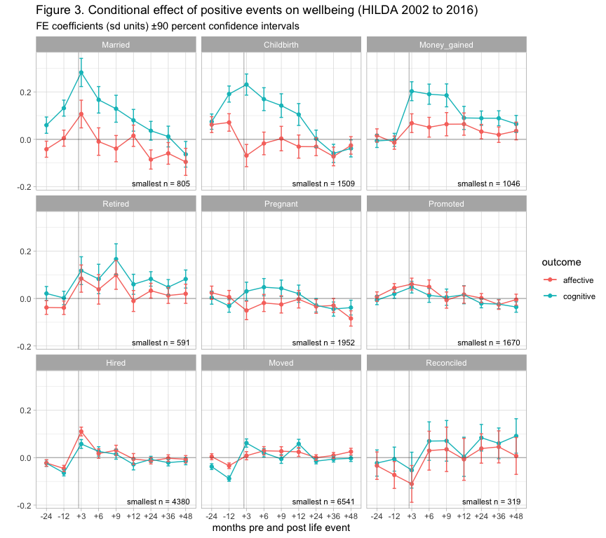
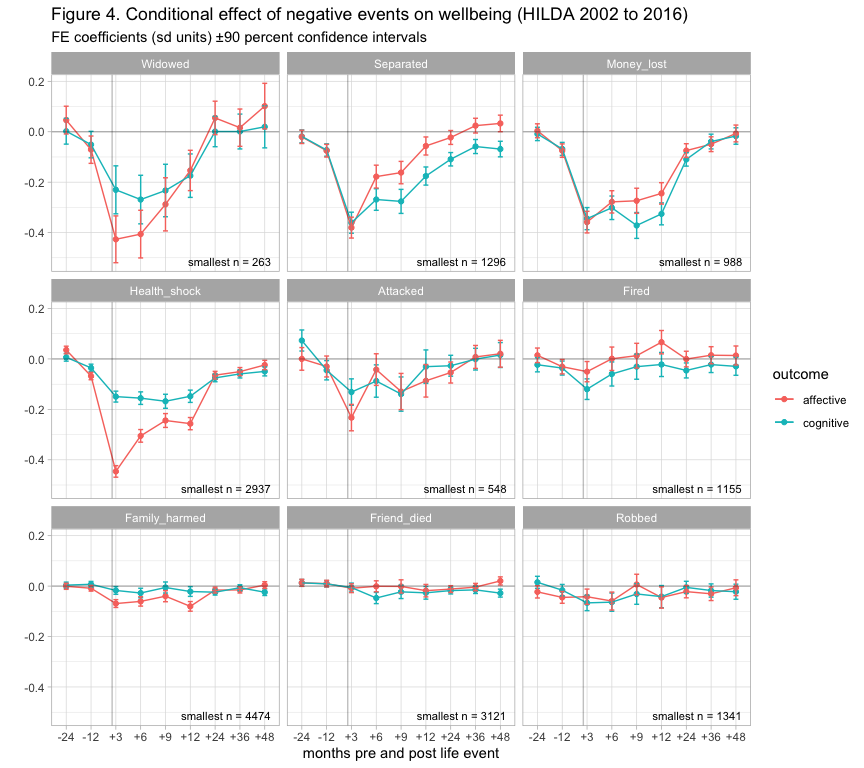

The Comparative Impact of Major Life Events on Cognitive and Affective
Wellbeing
================

   

N. Kettlewell1,2,3, R.W. Morris4,5, N.
Ho6, D.A. Cobb-Clark1,2,3, S.Cripps4 &
N.Glozier5,6

1.  School of Economics, University of Sydney, NSW, Australia
2.  ARC Centre of Excellence for Children and Families over the Life
    Course, University of Queensland, QLD, Australia
3.  Institute of Labor Economics (IZA), Bonn, Germany
4.  Centre for Translational Data Science, University of Sydney, NSW,
    Australia
5.  Central Clinical School, Faculty of Medicine and Health, University
    of Sydney, NSW, Australia
6.  Brain and Mind Centre, University of Sydney, NSW, Australia

 

**Corresponding author:**  
Professor Nick Glozier  
Faculty of Medicine and Health,  
University of Sydney,  
NSW 2050,  
Australia  
email: <nick.glozier@sydney.edu.au>

 

Draft: 07 May, 2019  
Word count: 3760 (max 4000)  
Tables: 2  
Figures: 5

**keywords:** Epidemiology, life events, subjective wellbeing

 

# Abstract

**Aims:** Major life events such as getting married, death of a loved
one, retirement or job loss have a substantial impact on our health and
wellbeing. Epidemiological studies rarely assess the comparative impact
of, often contemporaneous, positive and negative events; and often
assume they are equivalent in both amplitude and duration of impact. We
address this by evaluating the comparative impact of 18 different life
events on the two main components of wellbeing (affective and cognitive)
in a large population-based cohort.  
**Methods:** Data from the Household Income and Labour Dynamics in
Australia (HILDA) survey from 2001 to 2016 were used. The SF-36 mental
component score and life satisfaction measure were used to assess
affective and cognitive wellbeing respectively. The effects of nine
positive and nine negative major life-events were evaluated over a ±3
year time-window using fixed-effect regression models to distinguish the
independent impact of events on wellbeing within individuals.  
**Results:** The comparative size and duration of impact of different
life events on wellbeing varied substantially, and the impact of many
substantially diminished by accouting for concurrent events. Some events
had a profound impact (e.g., financial loss, birth of a child). Others
had relatively little impact (e.g., injury to a relative, being robbed).
In general, negative events had a similar impact on both affective and
cognitive wellbeing, while positive events had a larger impact on
cognitive wellbeing, with only small and short lived effects on
affective wellbeing. Few events had an impact on either type of
wellbeing beyond two years, but exceptions existed (e.g., separation,
retirement).  
**Conclusions:** Not all life events are equal. Treating them as such
masks substantially different effects on wellbeing, in terms of both
amplitude and duration. The impact of some events is negligible when the
impact of concurrent events is accounted for. The differential impact of
events on the components of affective and cognitive wellbeing supports
their distinction as separate constructs, although both show hedonic
adaptation. Describing the independent impact of different life events
may help clinicians, economists and policy-makers understand how
external events and interventions can affect wellbeing, but it appears
that for individuals at least hoping for happiness from positive events
appears misplaced. (359 words)

## Introduction

-----

The observation that major life events, such as marriage, death of a
child or spouse, bankruptcy or lottery winnings have a substantial
impact on our wellbeing is widely appreciated and self-apparent. While
such colloquial observations confirm our universal experience, they do
not tell us anything about either the relative impact of different
events on wellbeing, or the duration of any impact. For instance, is the
death of one’s spouse worse than separation or divorce? Does the
positive benefit of marriage last longer than a major financial
windfall?

A partial answer to these questions has been provided by research on
hedonic adaptation, which suggests that wellbeing ultimately returns to
a set baseline (Gilbert, 2009). Early cross-sectional studies claimed
that people adapt to events, both good and bad, over time (Brickman et
al., 1978); however cross-sectional designs cannot tell us how
individuals’ wellbeing changes over time. Large scale longitudinal
studies that follow individuals over time indicate that the amount of
adaptation varies by event (Clark et al., 2008; Frijters et al., 2011;
Lucas, 2007, 2005). Clinical studies tell us that in some cases an
individual’s wellbeing does not return to baseline after a significant
life event, or may take many years. However such studies generally
assess the impact through checklists that treat life-events as equal
(Dohrenwend, 2006; Gray et al., 2004; Wethington et al., 1997); or are
restricted to the impact of a small set of life events on a single
measure of wellbeing (Luhmann et al., 2012)

Subjective wellbeing is not a unitary entity (Diener et al., 2017), and
different components of wellbeing may respond differently to life
events. The facets of subjective wellbeing are separable by factor
analysis and have distinct associations with other variables (Busseri
and Sadava, 2011; Diener, 1984; Schimmack, 2008). In particular,
cognitive and affective components have been distinguished; where the
cognitive component refers to a deliberate, goal-directed evaluation of
life satisfaction (global or domain-specific) while the affective
component refers to the frequency and intensity of positive and negative
emotional responses to events and current moods. As such, it has been
proposed that they differ in their stability over time, as well as in
their reaction to life events. However the two different components of
wellbeing have only been distinguished in a single meta-analysis which
found distinct temporal dynamics of cognitive and affective components
to events such as unemployment, bereavement and childbirth, but only
when comparing across different studies (Luhmann et al., 2012).

An important confounder the meta-analysis found in many longitudinal
studies was the differential ascertainment and handling of other
concurrent life events, which obfuscates any direct comparison between
studies. For instance, losing one’s job may co-occur with moving home,
separation from a loved one or a change in socioeconomic status, any of
which may be the primary driver of changes in wellbeing. Few
longitudinal studies have compared the impact of life events on
wellbeing in the context of a wide range of other events; and none to
our knowledge have compared their impact on different components of
wellbeing over the same time period in the same sample.

We fill this gap by comparing the impact of a broad range of major life
events (18) on cognitive and affective components of wellbeing in a
single large population-representative cohort. The survey data spans
sixteen years (2001 to 2016), allowing us to track changes within
individuals over a sizeable time window around each event’s occurrence.
Frijters et al. (2011) examined the temporal dynamics of major life
events on subjective wellbeing using this dataset, but over a far
shorter time-period (six years) and using only a single-item measure of
wellbeing along with a narrower selection of events (i.e., ten).

## Methods

#### Data

The HILDA survey is a longitudinal, nationally representative study of
Australian households. The survey covers a range of dimensions including
social, demographic, health and economic conditions using a combination
of face-to-face interviews with trained interviewers and a
self-completion questionnaire. It began in 2001 with the survey of
13,969 persons in 7,682 households. Each year since interviews have been
conducted with all willing members of each household who are at least 15
years old at the time of the interview. The sample attrition is
comparable to other national longitudinal surveys such as the British
Household Panel Survey and the German Socio-Economic Panel Survey
(Watson and Wooden, 2006).

#### Wellbeing Measures

The cognitive and affective wellbeing measures were obtained from a
single-item question (life-satisfaction) and the mental component
summary score from the SF-36 (a 36-item questionnaire) respectively.

*Cognitive wellbeing*. Overall life satisfaction was obtained from the
annual face-to-face interview using the response to the question:

> “All things considered, how satisfied are you with your life?”

Respondents were asked to:

> “Pick a number between 0 and 10 to indicate how satisfied you are” and
> that “the more satisfied you are, the higher the number you should
> pick”.

*Affective wellbeing*. Each survey contains the SF-36, a widely used
self-completion measure of health status (Ware Jr, 2000). It comprises
36 items which are used to measure eight scales covering various aspects
of physical, emotional and mental health. The mental component summary
score (MCS) is weighted primarily by items that reflect both positive
affect (e.g “how often have you felt calm and peaceful?”) and negative
affect (“how often have you felt downhearted and blue?”). To calculate
the MCS, we followed standard procedures (McHorney et al., 1994, 1993;
Ware Jr and Sherbourne, 1992) and scoring algorithms were applied to
produce the MCS using the Australian norms (STATISTICS, 1997).

*Life events*. Details on life events are collected in the
self-completion questionnaire of HILDA and have been included since wave
2 (2002). This section is completed after the life satisfaction scores
and SF-36 questions, minimising the potential bias that respondent’s
recollection of the life events may have on their evaluation of the
wellbeing measures. For each event, respondents were asked whether the
event occurred in the last 12 months and how recently it occurred in
three-month intervals (i.e. quarters).

The life events include both good (“positive”“) and bad (”negative")
events shown in Table 1 below:

**Table 1.** List of 22 life events and their
description

| Event           | Description                                               |
| --------------- | --------------------------------------------------------- |
| Widowed         | death of a spouse or a child                              |
| Separated       | separated or divorced from a spouse or long-term partner  |
| Money lost      | major worsening in financial situation (e.g. bankruptcy)  |
| Jailed          | detained in jail / correctional facility                  |
| Attacked        | victim of physical violence (e.g. assault)                |
| Health shock    | serious personal injury or illness (e.g., disability)     |
| Reconciled      | reconciled with spouse/long-term partner after separation |
| Fired           | fired or made redundant by an employer                    |
| Family harmed   | serious injury or illness to a close family member        |
| Robbed          | victim of property crime (e.g. theft, house breaking)     |
| Friend died     | death of a close friend                                   |
| Relative died   | death of a close family member (e.g. parent or sibling)   |
| Relative jailed | jail for a close friend or relative                       |
| Home lost       | home destroyed in a natural disaster (2009 to 2016 only)  |
| Moved           | changed residence                                         |
| Hired           | changed jobs (i.e. employer)                              |
| Promoted        | promoted at work                                          |
| Retired         | retired from workforce                                    |
| Money gained    | major gain in finances (e.g., lottery win, inheritance)   |
| Pregnant        | you (or your partner) got pregnant                        |
| Married         | got married                                               |
| Childbirth      | birth (or adoption) of a child                            |
|                 |                                                           |

*Note*: *Widowed* includes deaths of children but we expect few such
deaths so we use the label for simplicity.

#### Model Design

Using the quarterly and annual indicators for an event, we modelled the
effect of life events on the current wellbeing score as a function of
time since the life event. To estimate these *within-subject* effects,
we estimated a series of linear fixed effects regression models.

Under this approach we have a linear model with \(N\) individuals and
\(T\) time-points:

\[
y_{it} = \beta X_{it} + \alpha_i + \epsilon_{it} \ \ \ for \ \
t = 1...T \ \ and \ \ i = 1...N \ \ \ \ \ \ \ \ \ \ \ \ \ \ \ \ (1)
\]

\(X_{it}\) is a matrix of control variables, that is, a set of dummy
variables representing lags and leads on the life event. For example,
*pre36* = 1 if wellbeing (the outcome) was measured 2-3 years before the
life event; *pre24* = 1 if wellbeing was measured 1-2 years before the
event;… *post24* = 1 if wellbeing was measured 2-3 years after the
event; and *post36* = 1 if wellbeing was measured 3-4 years after the
event. In total, we had seven dummy variables indicating the outcome
variable \(y_{it}\) was obtained after the life event (*post00*,
*post03*, *post06*, *post09*, *post12*, *post24*, *post36*), as well as
three dummy variables indicating \(y_{it}\) was obtained before the
event (*pre12*, *pre24*, *pre36*). Note that *pre36* acted as the
reference timepoint against which the effects of all other time-points
were expressed.

We estimated conditional models to determine the independent effect of
each life event in the context of other events which may be present for
an individual. Our conditional models included all other events as
potential channels in \(X_{it}\), as well as changes in socioeconomic
status (SEIFA index), education and age; features which change with time
along with the changes in wellbeing outcome (Table 2 below). Each
conditional model also included a set of year dummies in \(X_{it}\). We
estimated \((1)\) by OLS after taking a *within-subject* transformation
of each variable (such that \(\beta\) was identified by deviations in
\(X_{it}\) over time). This allows us to remove any time invariant
heterogeneity contained in \(\alpha_i\) (for example, if innately
unhappy people are more likely to divorce, and other potential selection
effects).

**Table 2.** List of covariates and their definition included in the
conditional
models

| Covariate       | Definition                                                                           |
| --------------- | ------------------------------------------------------------------------------------ |
| **Education**   | **Highest level of education achieved**                                              |
| Postgrad        | Highest qualification is postgraduate degree (PhD, Masters)                          |
| Graduate        | Highest qualification is university or graduate degree (Bachelors, Graduate diploma) |
| Certificate     | Highest qualification is Advanced diploma, diploma, Certificate III or IV            |
| Year 12         | Highest qualification is completing year 12                                          |
| High school     | Did not complete high school (Year 11 or below)                                      |
| **SEIFA index** | **Decile of relative socioeconomic disadvantage**                                    |
| 1 to 10         | Lowest decile (greatest disadvantage) to Highest decile (least disadvantage)         |
| **Age **        | **Age at June 30th year of interview**                                               |
| 15 to 101       | Years                                                                                |

We assumed that an individual can be affected simultaneously by more
than one occurrence of the same life event, which essentially allows for
an additive effect of multiple events on wellbeing. This is not of
particular concern for events that occur infrequently (e.g. death of
spouse or child) but may matter for more frequent events (e.g. moving
home). We also estimated models that assumed only the most proximate
event affected current wellbeing (similar to Frijters et al., 2011) as a
sensitivity check, and obtained similar results to those reported below.

Finally, when an event occurred in the last 12 months but the respondent
did not specify the quarter the event occurred (between 4.5%-31.7% of
cases depending on the event), we treated that year as a missing
observation (we do however use the fact that we know an event occurred
in that year to construct pre- and post-indicators for other years). In
a follow-up sensitivity analysis presented in the Supplementary Material
(*Uncontaminated Models*) we restricted our sample to only those
observed consistently for a six-year window around the life event.

The analysis was performed in *R* (version 3.5.1) (R Core Team, 2013),
using the tidyverse package (version 1.2.1) for data import and
wrangling (Wickham, 2017), the plm package (1.6-6) for fixed effects
estimates (Croissant and Millo, 2008), along with some custom helper
functions and wrappers for convenience (provided in `src/`).

#### Comparing the total impact of life events

In order to compare the total impact of life events, taking into account
both magnitude and duration of effect, we calculated the
area-under-the-curve (AUC) for each event in each model (as well as
variance). The AUC was calculated by: \[
AUC_{event} = \sum_{i=1}^{T} x_{\beta} \delta_t
\] Where \(x_{\beta}\) is a \(T\) length vector of beta coefficients for
each time-point, and \(\delta_t\) is the vector of time (months) between
each time-point.

The variance for each \(AUC\) was estimated by: \[
\sigma_{AUC} = \delta_t' \Sigma_t \delta_t'
\] Where \(\Sigma\) is the variance-covariance matrix from each model.

## Results

#### Subjective wellbeing

The mean levels of affective wellbeing (mental component score) and
cognitive wellbeing (life satisfaction score) in the HILDA dataset were
48.67 and 7.91 respectively. The mean level of wellbeing over years
(2001 to 2016) suggested that trends in affective wellbeing were not
matched by trends in cognitive wellbeing, as shown in Figure S1
(Supplementary materials). The *\(r^2\)* between cognitive and affective
wellbeing measures was *\(r^2\)* = 0.22, indicating they share less than
a quarter of variance.

#### Life events

The most widely experienced event (i.e., highest proportion of sample
experiencing it at least once) was *Moved*, while the least widely
experienced event was *Jailed* (Figure S2 Supplementary Material). The
four most frequent events, with a similar frequency, were *Family
harmed* (serious injury or illness of a close family member), *Hired*,
*Pregnant* and *Moved*, which occurred about once every 4.5 years on
average (Figure S3 Supplementary Material). The least frequent events
were *Widowed* and *Married*, which occurred once every nine years or
less. Figure S3 (Supplementary Material) shows the frequency of most
events was once every six years or less, indicating the occurrence of
multiple events in our time window was relatively infrequent. We
filtered out home destroyed by natural disaster (*Home lost*) and
*Jailed* events in the plots presented below as they were experienced by
a relatively small number of individuals or were not measured for the
entire 15 years. However they were still included as covariates in the
modeling below.

#### Effect of life events on subjective wellbeing

*Unconditional effect of life events*. Figures 1 & 2 below show the
effect of each life event on cognitive and affective wellbeing, ignoring
the effect of any other life events (or any other covariates apart from
year).

Positively- (good) and negatively- (bad) valenced events are arranged in
separate figures to facilitate comparison between events of the same
valence. The order reveals that *Married*, *Childbirth* and a major
financial gain (*Money gained*) produce the largest positive impact on
wellbeing, while *Widowed*, *Separated* and major financial loss (*Money
lost*) produced the largest negative impact on wellbeing. Negative
events tend to have a larger short term impact on affective wellbeing
while “positive” events generally have a larger impact on cognitive
wellbeing (with the exception of reconciled with partner, where the
initial impact is negative which possibly reflects the lag from the
separation).

<!-- -->

**Figure 1 legend.** Impact of positively-valenced (“good”) events on
affective and cognitive wellbeing. For each life event (panel),
coefficients are plotted with the time of the event relative to
measurement on the x-axis, and the amount of change in wellbeing (in
standard deviation units) produced by the event on the y-axis.
Differences from zero represent the marginal effect of the life event on
wellbeing. The panels in each figure are ordered by the magnitude change
in wellbeing (from large to small). Confidence intervals were calculated
using cluster-robust standard errors (on individuals).

<!-- -->

**Figure 2 legend.** Impact of negatively-valenced (“bad”) events on
affective and cognitive wellbeing. Coefficients are plotted across
months between event and measurement on the x-axis, and the marginal
effect on wellbeing (in standard deviation units) on the y-axis.
Confidence intervals were calculated using cluster-robust standard
errors (on individuals).

Sometimes the effect of a life event seems to precede the time of the
event (-24 or -12 on the x-axis). These anticipatory effects suggest the
life events are not completely unexpected or surprising.

*Conditional effect of life events*. Figures 3 & 4 show the results of a
model which includes all other life events as covariates, as well as
year, age, changes in education, and changes in a socioeconomic proxy
(i.e., SEIFA index). This model thus estimates effect of each event on
wellbeing independent of other events, time-varying observable
characteristics, and all time-invariant characteristics (observed and
unobservable).

<!-- -->

**Figure 3 legend.** Conditional effect of positively-valenced (“good”)
events on affective and cognitive wellbeing, after accounting for all 21
other events as well as changes in education, age, and SEIFA.
Coefficients are plotted across time on the x-axis, with the marginal
effect on the y-axis. Confidence intervals were calculated using
cluster-robust standard errors (on individuals).

<!-- -->

**Figure 4 legend.** Conditional effect of negatively-valenced (“bad”)
events on affective and cognitive wellbeing, after accounting for all 21
other events as well as changes in education, age, and SEIFA.
Coefficients are plotted across time on the x-axis, with the marginal
effect on the y-axis. Confidence intervals were calculated using
cluster-robust standard errors (on individuals).

The conditional effect of most life events on wellbeing revealed a
similar relative magnitude among events as the unconditional effect;
*Widowed*, *Separated* and *Money lost* are worst, while *Married*,
*Childbirth* and *Money gained* are best. Furthermore the differential
effect of positive events on cognitive over affective wellbeing is still
generally present. However conditioning on other events did change the
impact of some individual events. For instance, the conditional effect
of reconciliation with partner (*Reconciled*) on cognitive wellbeing is
more positive than the unconditional effect.

#### Total impact of life events

The combined magnitude and duration of life events, summarised by the
area-under-the-curve (AUC) of the wellbeing response to each event is
shown in Figure 5. Comparing the AUC from each unconditional model with
each conditional model will also indicate the strength of the
confounding by other events and time varying covariates. Each vertical
crossbar represents the AUC and the interval around the crossbar
represents 95 percent confidence intervals. As expected, the conditional
effects are generally closer to zero (i.e. smaller) than the
unconditional effects. However there are exceptions such as *Widowed*,
where the large negative impact is not affected by adjusting for other
life events. The differential impact of positive events on cognitive
wellbeing and affective wellbeing can also be clearly seen in this
figure. The impact of several positive events on cognitive wellbeing
(e.g., *Childbirth*, *Married*, *Money\_gained*, *Retired*) is much
greater than zero, but their effect on affective wellbeing is minimal.

<!-- -->

**Figure 5 legend.** Total impact (AUC) of life-events on affective
(left panel) and cognitive wellbeing (right panel), for unconditional
and conditional models in sd units. See equation (2) for formulaic
details.

## Discussion

The present study confirms what people know; that not all life events
are equal and many are concurrent with other events. In some respect,
this may seem to be a self-apparent conclusion to anyone who has ever
lived but epidemiological research often ignores this by using summed
checklists to assess impact, or just evalautes the impact of one event
(Dohrenwend, 2006; Gray et al., 2004; Wethington et al., 1997). Our
results also quantify the difference and allow us to infer the average
effect in the population. Other studies have noted differences between
events in the magnitude or duration of effect on wellbeing (Frijters et
al., 2011; Luhmann et al., 2012), however we focus on the total impact
(magnitude and duration). For example, previous longitudinal studies
which also followed individuals across time indicate the duration of
disability (Lucas, 2007), divorce (Lucas, 2005; Lucas et al., 2003), and
death of spouse (Lucas, 2005), all have long-term negative effects. The
evidence for long-term effects of marriage and unemployment is mixed,
with some studies showing that they continue to influence wellbeing long
after they have occurred (Lucas et al., 2004), while others report
adaption to these same events (Clark et al., 2008; Frijters et al.,
2011). Figure 5 provides a comparison of the total impact (magnitude and
duration) of each event on wellbeing. For instance, on average the total
impact of becoming widowed is substantially worse than separation or
divorce for affective wellbeing, while the opposite is true for
cognitive wellbeing. On the other hand, the total impact of a major
financial loss relative to separation or divorce is comparable on both
measures of wellbeing. This summary point also highlights a subtle
implication of the present results for the field. Treating life events
as comparable or not depends on the wellbeing outcome under
consideration. Failing to respect the potential for distinct effects on
multiple components of wellbeing may mask substantially different
effects in the population.

*The impact of some events is negligible after accounting for the impact
of concurrent events.* In general, the conditional effects of life
events were closer to zero than the unconditional effects, but for some
events this difference was large. Moving home had a substantial and
unconditional negative impact on affective wellbeing, however once other
concurrent events were accounted for, this impact was reduced to near
zero. This implies that other concurrent events were more likely
causative factors. Moving home is commonly cited in the press or surveys
as one of the most stressful life events, but our results suggest that
if true it is because of other linked events. This is consistent with
results from the few other studies where an attempt to compare relative
life event impacts has been made and in which moving home does not
figure as a major event (Hammond, 2014). Equally striking is the impact
of events which did not change once other events were included. For
instance, the conditional and unconditional impact of being widowed was
very similar (in both cognitive and affective components). The impact of
this event in particular seems to be unconditional of which other events
are present. However in general, most other life events occur within a
broader context of other events that are likely to co-occur and moderate
the impact of the particular event.

These results also challenge the notion of many life events as being
“stressful”, the implication of which is that they should have some
negative effect on wellbeing. Holmes and Rahe’s Social readjustment
scale (Holmes and Rahe, 1967) weights marriage as the sixth most
stressful event yet we found no negative impact on wellbeing on the two
years prior or even at the time. This suggest that if there is a
substantial negative effect it is either confined to a small minority of
the population or very short lived just prior to the event. Conversely
people’s wellbeing in the lead up to some positive events is impaired,
the most notable being reconciliation which demonstrates the effect of
relationship difficulties just prior to the event.

*The differential impact of events on the components of affective and
cognitive wellbeing supports their distinction as separate constructs,
although both show hedonic adaptation.* A novel aspect of the present
study is the comparison of the affective and cognitive wellbeing
response to positive events (*Childbirth*, *Married*, *Money gained*,
*Retired* and *Pregnant*). Although positive events have a substantial
positive impact on cognitive wellbeing, in general they have relatively
little impact on affective wellbeing. In contrast, negative events
tended to have comparable and untoward effects on both cognitive and
affective wellbeing. The differential impact of good events on the
components of affective and cognitive wellbeing supports the distinction
between wellbeing components and their treatment as separate constructs.
It also implies that, on average, hoping for happiness from positive
events appears misplaced.

#### Limitations

A few general issues are worth discussing in large, longitudinal models
of this kind. Our fixed effects models exclude anyone who didn’t
experience the event in the time window of interest. This means that in
any particular event, such as marriage, average differences in
subjective wellbeing between married people and unmarried people may be
present, however these *between-group* differences will not be revealed
by the fixed effects model as it estimates *within-subject* changes in
the sample of interest. As a result, the estimates produced may be
specific to the sample who experience the event rather than a wider
general population.

We used an unbalanced panel, which means a slightly different set of
individuals may contribute to the pre- and post-event coefficients
(although there is considerable overlap). A balanced approach (Clark et
al., 2008) only includes people with measurements before and after the
event, which ensures the same cohort is followed over time. However
balancing reduces efficiency and risks inducing potential selection
effects, so other researchers have taken a more liberal approach and
included anyone with more than one consecutive observation, regardless
of when those observations occurred (Frijters et al., 2011), which we
follow in this study. In a sensitivity analysis we restrict the sample
to a balanced panel observed pre- and post- event (see *Balanced Models*
in Supplementary Materials). This did not substantially change the
overall results.

We also note some causes of potentially non-random measurement error
inherent in any dynamic model of this sort. First, due to censoring
issues we do not know at time \(t = 1\) if a life event occurred before
that first year (e.g., 2002). Similarly, at time \(t = T\) we do not
know whether an event occurred after the final year (e.g., 2016). We do
not expect this to significantly bias our estimates since many events
occur infrequently and this only affects years close to the endpoints of
our data. A similar issue arises in the case of missing life event
information‚ either because the respondent did not complete that part of
the questionnaire or because they are missing from the sample in a
particular year. In both cases, we assumed no life event occurred in the
missing year when constructing pre- and post- indicators. Again, we
expect any bias to be small given that most life events are infrequent
and more than 65 percent of people are responding year-to-year (see
Table S2 in Supplementary Material). In a follow-up analysis
(*Uncontaminated Models* in Supplementary Materials), we excluded from
the sample any observations within three years of missing life event
data to estimate an uncontaminated (as well as balanced) model. This
means we only estimated effects for the years 2005-2012, and so after
balancing and de-contamination this was our most restricted sample. As a
result, our estimates became less precise and, while generally
qualitatively similar to the main results, some effects became
statistically insignificant (particularly for the positive events).

#### Summary

These results present for the first time the comparative anticipatory,
short- and medium- term effects of a wide range of life events on
people’s happiness (affective wellbeing) and life satisfaction
(cognitive wellbeing). Policy makers now focus on measuring wellbeing as
an indicator of success through such metrics as the OECD’s “Better Life
Index”, Gallup’s “Global Wellbeing Index” and the European Social
Survey. The Global Wellness Economy Monitor suggests this is now a $4.2
trillion dollar industry. Identifying whether there are life events, the
prevalence of which can be enhanced or reduced through health, family or
justice policies, that will affect these outcomes is likely to become
more important in the future.

#### Acknowledgements

This paper uses unit record data from the Household, Income and Labour
Dynamics in Australia (HILDA) survey. The HILDA project was initiated
and is funded by the Australian Government Department of Social Services
(DSS) and is managed by the Melbourne Institute of Applied Economic and
Social Research Melbourne Institute. The findings and views reported in
this paper, however, are those of the author and should not be
attributed to either DSS or the Melbourne Institute.

#### Financial Support

This research received no specific grant from any funding agency,
commercial or not-for-profit sectors.

#### Conflict of Interest

*None*.

#### Availability of Data and Materials

Data are available on application to the Australian Government
Department of Social Services. All code used to produce this report is
available on GitHub: <https://github.com/datarichard/shit-happens>.

# References

Brickman, P., Coates, D., Janoff-Bulman, R., 1978. Lottery winners and
accident victims: Is happiness relative? Journal of personality and
social psychology 36, 917.

Busseri, M.A., Sadava, S.W., 2011. A review of the tripartite structure
of subjective well-being: Implications for conceptualization,
operationalization, analysis, and synthesis. Personality and social
psychology review 15, 290–314.

Clark, A.E., Diener, E., Georgellis, Y., Lucas, R.E., 2008. Lags and
leads in life satisfaction: A test of the baseline hypothesis. The
Economic Journal 118, F222–F243.

Croissant, Y., Millo, G., 2008. Panel data econometrics with r. Journal
of Statistical Software 27, 1–43.

Diener, E., 1984. Subjective well-being. Psychological bulletin 95, 542.

Diener, E., Heintzelman, S.J., Kushlev, K., Tay, L., Wirtz, D., Lutes,
L.D., Oishi, S., 2017. Findings all psychologists should know from the
new science on subjective well-being. Canadian Psychology/psychologie
canadienne 58, 87.

Dohrenwend, B.P., 2006. Inventorying stressful life events as risk
factors for psychopathology: Toward resolution of the problem of
intracategory variability. Psychological bulletin 132, 477.

Frijters, P., Johnston, D.W., Shields, M.A., 2011. Life satisfaction
dynamics with quarterly life event data. Scandinavian Journal of
Economics 113, 190–211.

Gilbert, D., 2009. Stumbling on happiness. Vintage Canada.

Gray, M.J., Litz, B.T., Hsu, J.L., Lombardo, T.W., 2004. Psychometric
properties of the life events checklist. Assessment 11, 330–341.

Holmes, T.H., Rahe, R.H., 1967. The social readjustment rating scale.
Journal of psychosomatic research.

Lucas, R.E., 2005. Time does not heal all wounds: A longitudinal study
of reaction and adaptation to divorce. Psychological science 16,
945–950.

Lucas, R.E., 2007. Long-term disability is associated with lasting
changes in subjective well-being: Evidence from two nationally
representative longitudinal studies. Journal of personality and social
psychology 92, 717.

Lucas, R.E., Clark, A.E., Georgellis, Y., Diener, E., 2003. Reexamining
adaptation and the set point model of happiness: Reactions to changes in
marital status. Journal of personality and social psychology 84, 527.

Lucas, R.E., Clark, A.E., Georgellis, Y., Diener, E., 2004. Unemployment
alters the set point for life satisfaction. Psychological science 15,
8–13.

Luhmann, M., Hofmann, W., Eid, M., Lucas, R.E., 2012. Subjective
well-being and adaptation to life events: A meta-analysis. Journal of
personality and social psychology 102, 592.

McHorney, C.A., Ware Jr, J.E., Lu, J.R., Sherbourne, C.D., 1994. The mos
36-item short-form health survey (sf-36): III. Tests of data quality,
scaling assumptions, and reliability across diverse patient groups.
Medical care 40–66.

McHorney, C.A., Ware Jr, J.E., Raczek, A.E., 1993. The mos 36-item
short-form health survey (sf-36): II. Psychometric and clinical tests of
validity in measuring physical and mental health constructs. Medical
care 247–263.

R Core Team, 2013. R: A language and environment for statistical
computing. R Foundation for Statistical Computing, Vienna, Austria.

Schimmack, U., 2008. The structure of subjective well-being. The science
of subjective well-being 97–123.

STATISTICS, A.B.O., 1997. National health survey sf-36 population norms
australia. Australia, Australian Bureau of Statistics.

Ware Jr, J.E., 2000. SF-36 health survey update. Spine 25, 3130–3139.

Ware Jr, J.E., Sherbourne, C.D., 1992. The mos 36-item short-form health
survey (sf-36): I. Conceptual framework and item selection. Medical care
473–483.

Watson, N., Wooden, M., 2006. Modelling longitudinal survey response:
The experience of the hilda survey, in: ACSPRI Social Science
Methodology Conference. pp. 10–13.

Wethington, E., Brown, G.W., Kessler, R.C., 1997. Interview measurement
of stressful life events, in: Cohen, S., Kessler, R.C., Gordon, L.U.
(Eds.), Measuring Stress: A Guide for Health and Social Scientists.
Oxford University Press, Oxford, UK, pp. 59–79.

Wickham, H., 2017. Tidyverse: Easily install and load the ’tidyverse’.

