The Differential Impact of Major Life Events on Cognitive and Affective
Wellbeing
================
N. Kettlewell1,2,3, R.W. Morris4,5, N.
Ho6, D.A. Cobb-Clark1,2,3, S.Cripps4 &
N.Glozier5,6

Date compiled: 06 December, 2019

 

## Missingness

#### Missing Responses

The percent missing responses range from 11.61 percent for *Married* to
12.39 percent for home lost or destroyed by natural disaster (*Home
lost*).

*Table S1. Mean percentage of missing life event responses (HILDA 2002
to 2016)*

<table>

<thead>

<tr>

<th style="text-align:left;">

Event

</th>

<th style="text-align:right;">

%Missing

</th>

</tr>

</thead>

<tbody>

<tr>

<td style="text-align:left;">

Childbirth

</td>

<td style="text-align:right;">

11.88

</td>

</tr>

<tr>

<td style="text-align:left;">

Friend\_died

</td>

<td style="text-align:right;">

11.80

</td>

</tr>

<tr>

<td style="text-align:left;">

Home\_lost

</td>

<td style="text-align:right;">

12.39

</td>

</tr>

<tr>

<td style="text-align:left;">

Relative\_died

</td>

<td style="text-align:right;">

11.79

</td>

</tr>

<tr>

<td style="text-align:left;">

Widowed

</td>

<td style="text-align:right;">

11.84

</td>

</tr>

<tr>

<td style="text-align:left;">

Money\_gained

</td>

<td style="text-align:right;">

11.79

</td>

</tr>

<tr>

<td style="text-align:left;">

Money\_lost

</td>

<td style="text-align:right;">

11.78

</td>

</tr>

<tr>

<td style="text-align:left;">

Fired

</td>

<td style="text-align:right;">

11.84

</td>

</tr>

<tr>

<td style="text-align:left;">

Family\_harmed

</td>

<td style="text-align:right;">

11.93

</td>

</tr>

<tr>

<td style="text-align:left;">

Health\_shock

</td>

<td style="text-align:right;">

11.86

</td>

</tr>

<tr>

<td style="text-align:left;">

Relative\_jailed

</td>

<td style="text-align:right;">

11.73

</td>

</tr>

<tr>

<td style="text-align:left;">

Jailed

</td>

<td style="text-align:right;">

11.74

</td>

</tr>

<tr>

<td style="text-align:left;">

Hired

</td>

<td style="text-align:right;">

11.84

</td>

</tr>

<tr>

<td style="text-align:left;">

Married

</td>

<td style="text-align:right;">

11.61

</td>

</tr>

<tr>

<td style="text-align:left;">

Moved

</td>

<td style="text-align:right;">

11.73

</td>

</tr>

<tr>

<td style="text-align:left;">

Robbed

</td>

<td style="text-align:right;">

11.73

</td>

</tr>

<tr>

<td style="text-align:left;">

Pregnant

</td>

<td style="text-align:right;">

11.78

</td>

</tr>

<tr>

<td style="text-align:left;">

Promoted

</td>

<td style="text-align:right;">

12.10

</td>

</tr>

<tr>

<td style="text-align:left;">

Reconciled

</td>

<td style="text-align:right;">

11.83

</td>

</tr>

<tr>

<td style="text-align:left;">

Retired

</td>

<td style="text-align:right;">

11.77

</td>

</tr>

<tr>

<td style="text-align:left;">

Separated

</td>

<td style="text-align:right;">

11.83

</td>

</tr>

<tr>

<td style="text-align:left;">

Attacked

</td>

<td style="text-align:right;">

11.89

</td>

</tr>

</tbody>

</table>

 

#### Missing People

The percent of missing people range from 33.91 percent for home
destroyed by natural disaster (*Home lost*) to 34.58 for promotion at
work (*Promoted*).

*Table S2. Mean percentage of missing people (HILDA 2002 to 2016*

<table>

<thead>

<tr>

<th style="text-align:left;">

Event

</th>

<th style="text-align:right;">

%Missing People

</th>

</tr>

</thead>

<tbody>

<tr>

<td style="text-align:left;">

Childbirth

</td>

<td style="text-align:right;">

34.42

</td>

</tr>

<tr>

<td style="text-align:left;">

Friend\_died

</td>

<td style="text-align:right;">

34.36

</td>

</tr>

<tr>

<td style="text-align:left;">

Home\_lost

</td>

<td style="text-align:right;">

33.91

</td>

</tr>

<tr>

<td style="text-align:left;">

Relative\_died

</td>

<td style="text-align:right;">

34.35

</td>

</tr>

<tr>

<td style="text-align:left;">

Widowed

</td>

<td style="text-align:right;">

34.39

</td>

</tr>

<tr>

<td style="text-align:left;">

Money\_gained

</td>

<td style="text-align:right;">

34.35

</td>

</tr>

<tr>

<td style="text-align:left;">

Money\_lost

</td>

<td style="text-align:right;">

34.35

</td>

</tr>

<tr>

<td style="text-align:left;">

Fired

</td>

<td style="text-align:right;">

34.39

</td>

</tr>

<tr>

<td style="text-align:left;">

Family\_harmed

</td>

<td style="text-align:right;">

34.46

</td>

</tr>

<tr>

<td style="text-align:left;">

Health\_shock

</td>

<td style="text-align:right;">

34.40

</td>

</tr>

<tr>

<td style="text-align:left;">

Relative\_jailed

</td>

<td style="text-align:right;">

34.31

</td>

</tr>

<tr>

<td style="text-align:left;">

Jailed

</td>

<td style="text-align:right;">

34.32

</td>

</tr>

<tr>

<td style="text-align:left;">

Hired

</td>

<td style="text-align:right;">

34.39

</td>

</tr>

<tr>

<td style="text-align:left;">

Married

</td>

<td style="text-align:right;">

34.22

</td>

</tr>

<tr>

<td style="text-align:left;">

Moved

</td>

<td style="text-align:right;">

34.31

</td>

</tr>

<tr>

<td style="text-align:left;">

Robbed

</td>

<td style="text-align:right;">

34.31

</td>

</tr>

<tr>

<td style="text-align:left;">

Pregnant

</td>

<td style="text-align:right;">

34.35

</td>

</tr>

<tr>

<td style="text-align:left;">

Promoted

</td>

<td style="text-align:right;">

34.58

</td>

</tr>

<tr>

<td style="text-align:left;">

Reconciled

</td>

<td style="text-align:right;">

34.38

</td>

</tr>

<tr>

<td style="text-align:left;">

Retired

</td>

<td style="text-align:right;">

34.34

</td>

</tr>

<tr>

<td style="text-align:left;">

Separated

</td>

<td style="text-align:right;">

34.38

</td>

</tr>

<tr>

<td style="text-align:left;">

Attacked

</td>

<td style="text-align:right;">

34.43

</td>

</tr>

</tbody>

</table>

## Variables

#### Reliability of affective wellbeing

Affective wellbeing was calculated from the sum of the nine sub-items of
item 9 in the SF36 (9a -9i). Five sub-items measure negative aspects of
wellbeing, while four sub-itmes measure positive aspects. We reverse
scored items so higher scores indicated higher (better) wellbeing. To
describe the relationship between the total score (i.e., affective
wellbeing score) and the set of nine sub-items it was constructed from
(9a-9i), we present the average item-total correlation.

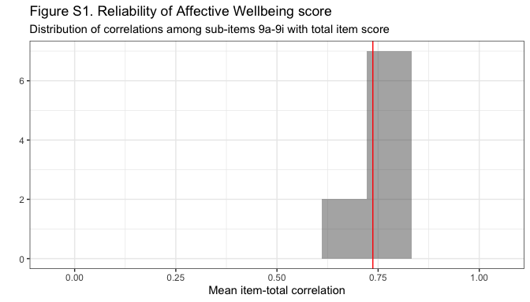<!-- -->

This shows that each sub-item (9a-9i) has a moderate to high correlation
with the total score (affective wellbeing), since all sub-items
correlate with the total score within a range of 0.6 to 0.8. The average
item-total correlation was 0.737, indicated by the red vertical line.

The Cronbach’s alpha for item 9 (9a-9i) was 0.894.

#### Wellbeing measures over time

The mean change in average wellbeing scores (along with 95 percent
confidence intervals) among all HILDA participants over time is shown in
Figure S2 below. The overall amount of change is very slight in both
cases, albeit with some small decrease in affective wellbeing after
2011.

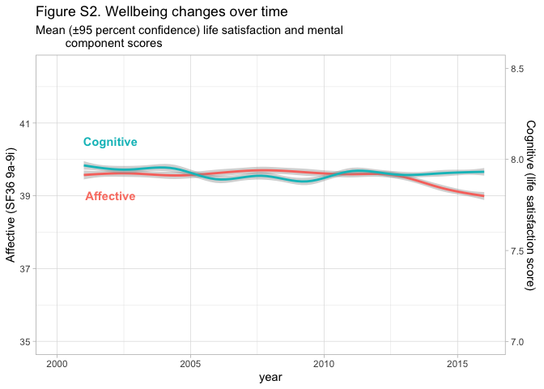<!-- -->

#### Life event frequencies

*a. Overall in the population*. As an expectation of sample size (n) for
each model, the number of people experiencing each life event at least
once in HILDA is shown below. The most commonly experienced event was
*Moved* and the least common event was spending time in jail (*Jailed*).

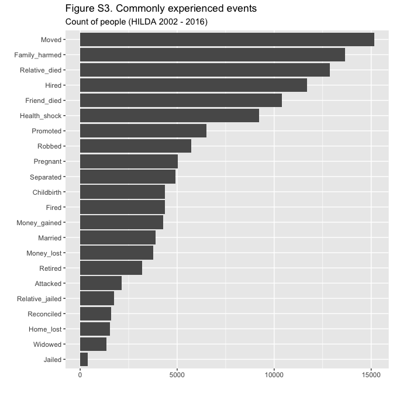<!-- -->

*b. Rate for each individual (per year)*. Because we included multiple
occurrences of the same event in our model, we also wished to determine
how often each life event occurred in the observed period for each
individual (i.e., the individual event rate). To answer this we
calculated the event rate per year for each year of observation for each
individual (removing the “censored” years ±3 within the beginning or end
of the observed data). We then calculated the average rate over the
observed time for each individual and present the average for each
event. The figure below shows the most frequent event experienced at an
individual level was injury/illness of a family member (*Family
harmed*), getting a new job (*Hired*) or getting pregnant (*Pregnant*).
The least frequent event was spouse or child dying (*Widowed*), getting
married (*Married*) or spending time in jail (*Jailed*).

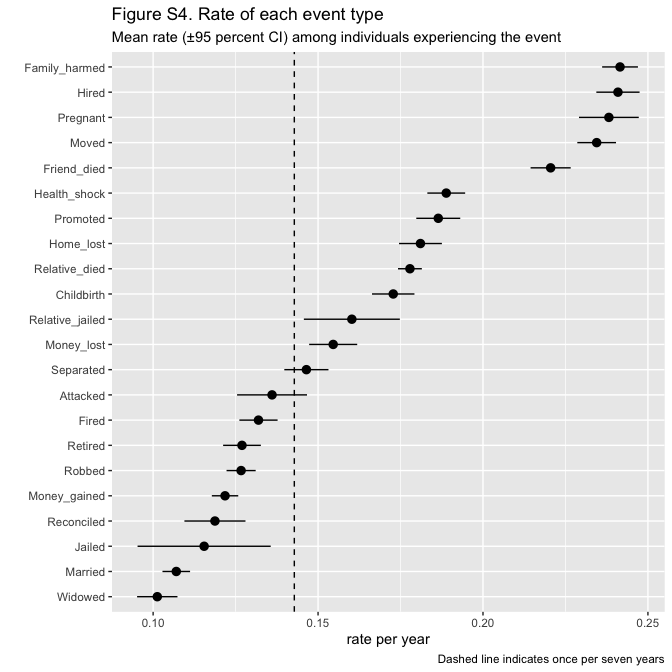<!-- -->

When the mean event rate falls to the right of the dashed line, then
that event is experienced more than once on average within our time
window (7 years). However a more important concern is how often our
post-event estimates (up to 4 years after the event) are likely to
reflect more than one event. In this case, there are very few events
that occur more than once every four years as all 95 percent confidence
intervals fall to the left of 0.25. Thus our post-event estimates (+3 to
+48 months) are very unlikely to reflect more than one event.

## Correlations

One of our aims is to observe differences in life satisfaction and
mental health in response to life events. One concern is that cognitive
wellbeing and affective wellbeing scores might be highly correlated, in
which case we are unlikely to observe differences between them. We can
also expect there will be correlations between the occurrence of life
events. For instance, getting pregnant and giving birth can be expected
to co-occur. If individuals who experience one type of life event are
likely to experience several others, then we would expect to see a
discrepancy between the unconditional and the conditional marginal
effects of these events. We present the correlations between life events
in Figure S5 below.

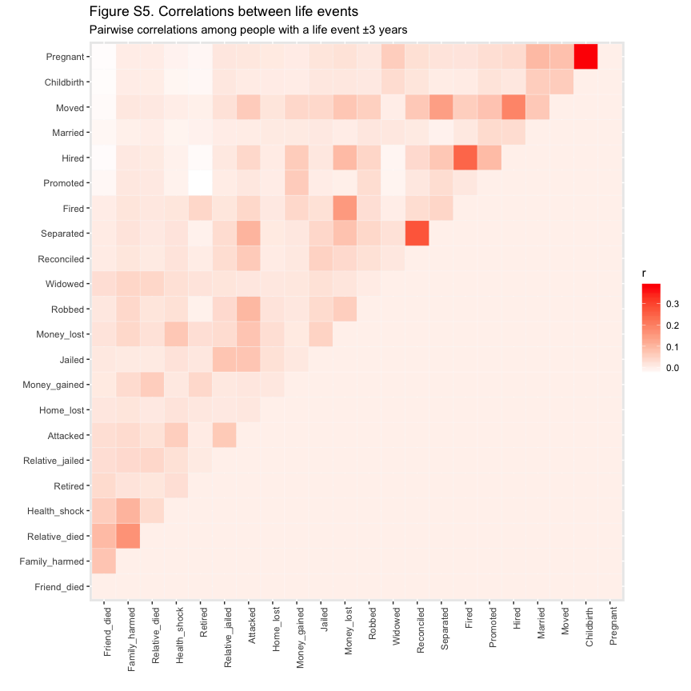<!-- -->

The well-being measures are only moderately associated with each other,
*\(r^2\)* = 0.23. Among life events, the correlations are moderate with
the largest correlation between *Pregnant* and *Childbirth*, where
*\(r\)* = 0.38. Other notable correlations occurred between *Separated*
and *Reconciled* (*\(r\)* = 0.27), losing a job (*Fired*) and starting a
new job (*Hired*) (*\(r\)* = 0.24), as well as moving home (*Moved*) and
starting a new job (*Hired*) (*\(r\)* = 0.19).

## Time-varying covariates

*Table S3. List of covariates and their definition included in the
conditional models*

<table class="table" style="margin-left: auto; margin-right: auto;">

<thead>

<tr>

<th style="text-align:left;">

Covariate

</th>

<th style="text-align:left;">

Definition

</th>

</tr>

</thead>

<tbody>

<tr>

<td style="text-align:left;">

Education

</td>

<td style="text-align:left;">

Highest level of education achieved

</td>

</tr>

<tr>

<td style="text-align:left; padding-left: 2em;" indentlevel="1">

Postgrad

</td>

<td style="text-align:left;">

Highest qualification is postgraduate degree (PhD, Masters)

</td>

</tr>

<tr>

<td style="text-align:left; padding-left: 2em;" indentlevel="1">

Graduate

</td>

<td style="text-align:left;">

Highest qualification is university or graduate degree (Bachelors,
Graduate diploma)

</td>

</tr>

<tr>

<td style="text-align:left; padding-left: 2em;" indentlevel="1">

Certificate

</td>

<td style="text-align:left;">

Highest qualification is Advanced diploma, diploma, Certificate III or
IV

</td>

</tr>

<tr>

<td style="text-align:left; padding-left: 2em;" indentlevel="1">

Year 12

</td>

<td style="text-align:left;">

Highest qualification is completing year 12

</td>

</tr>

<tr>

<td style="text-align:left; padding-left: 2em;" indentlevel="1">

High school

</td>

<td style="text-align:left;">

Did not complete high school (Year 11 or below)

</td>

</tr>

<tr>

<td style="text-align:left;">

SEIFA index

</td>

<td style="text-align:left;">

Decile of relative socioeconomic disadvantage

</td>

</tr>

<tr>

<td style="text-align:left; padding-left: 2em;" indentlevel="1">

1 to 10

</td>

<td style="text-align:left;">

Lowest decile (greatest disadvantage) to Highest decile (least
disadvantage)

</td>

</tr>

<tr>

<td style="text-align:left;">

Age

</td>

<td style="text-align:left;">

Age at June 30th year of interview

</td>

</tr>

<tr>

<td style="text-align:left; padding-left: 2em;" indentlevel="1">

1 to 10

</td>

<td style="text-align:left;">

Decade of life

</td>

</tr>

</tbody>

</table>

## Regression coefficients from main models

#### Cognitive Wellbeing Estimates

The estimates from each fixed effect model of the impact of life events
on cognitive wellbeing (life satisfaction) are shown below:

*Table S4. Estimates - Life Events on Cognitive
Wellbeing*

<table class="table" style="margin-left: auto; margin-right: auto;">

<thead>

<tr>

<th style="border-bottom:hidden" colspan="2">

</th>

<th style="border-bottom:hidden; padding-bottom:0; padding-left:3px;padding-right:3px;text-align: center; " colspan="3">

Unconditional

</th>

<th style="border-bottom:hidden; padding-bottom:0; padding-left:3px;padding-right:3px;text-align: center; " colspan="3">

Conditional

</th>

</tr>

<tr>

<th style="text-align:left;">

Code

</th>

<th style="text-align:left;">

Period

</th>

<th style="text-align:right;">

Coefficient

</th>

<th style="text-align:right;">

SE

</th>

<th style="text-align:right;">

n

</th>

<th style="text-align:right;">

Coefficient

</th>

<th style="text-align:right;">

SE

</th>

<th style="text-align:right;">

n

</th>

</tr>

</thead>

<tbody>

<tr>

<td style="text-align:left;vertical-align: top !important;" rowspan="9">

Attacked

</td>

<td style="text-align:left;">

pre24

</td>

<td style="text-align:right;">

0.054

</td>

<td style="text-align:right;">

0.031

</td>

<td style="text-align:right;">

2133

</td>

<td style="text-align:right;">

0.073

</td>

<td style="text-align:right;">

0.033

</td>

<td style="text-align:right;">

2133

</td>

</tr>

<tr>

<td style="text-align:left;">

pre12

</td>

<td style="text-align:right;">

\-0.092

</td>

<td style="text-align:right;">

0.028

</td>

<td style="text-align:right;">

2496

</td>

<td style="text-align:right;">

\-0.045

</td>

<td style="text-align:right;">

0.030

</td>

<td style="text-align:right;">

2496

</td>

</tr>

<tr>

<td style="text-align:left;">

post03

</td>

<td style="text-align:right;">

\-0.198

</td>

<td style="text-align:right;">

0.040

</td>

<td style="text-align:right;">

1046

</td>

<td style="text-align:right;">

\-0.131

</td>

<td style="text-align:right;">

0.041

</td>

<td style="text-align:right;">

1046

</td>

</tr>

<tr>

<td style="text-align:left;">

post06

</td>

<td style="text-align:right;">

\-0.179

</td>

<td style="text-align:right;">

0.050

</td>

<td style="text-align:right;">

646

</td>

<td style="text-align:right;">

\-0.088

</td>

<td style="text-align:right;">

0.050

</td>

<td style="text-align:right;">

646

</td>

</tr>

<tr>

<td style="text-align:left;">

post09

</td>

<td style="text-align:right;">

\-0.205

</td>

<td style="text-align:right;">

0.052

</td>

<td style="text-align:right;">

548

</td>

<td style="text-align:right;">

\-0.139

</td>

<td style="text-align:right;">

0.053

</td>

<td style="text-align:right;">

548

</td>

</tr>

<tr>

<td style="text-align:left;">

post12

</td>

<td style="text-align:right;">

\-0.115

</td>

<td style="text-align:right;">

0.052

</td>

<td style="text-align:right;">

640

</td>

<td style="text-align:right;">

\-0.031

</td>

<td style="text-align:right;">

0.052

</td>

<td style="text-align:right;">

640

</td>

</tr>

<tr>

<td style="text-align:left;">

post24

</td>

<td style="text-align:right;">

\-0.065

</td>

<td style="text-align:right;">

0.030

</td>

<td style="text-align:right;">

2626

</td>

<td style="text-align:right;">

\-0.027

</td>

<td style="text-align:right;">

0.032

</td>

<td style="text-align:right;">

2626

</td>

</tr>

<tr>

<td style="text-align:left;">

post36

</td>

<td style="text-align:right;">

\-0.010

</td>

<td style="text-align:right;">

0.032

</td>

<td style="text-align:right;">

2323

</td>

<td style="text-align:right;">

\-0.001

</td>

<td style="text-align:right;">

0.034

</td>

<td style="text-align:right;">

2323

</td>

</tr>

<tr>

<td style="text-align:left;">

post48

</td>

<td style="text-align:right;">

0.013

</td>

<td style="text-align:right;">

0.038

</td>

<td style="text-align:right;">

2050

</td>

<td style="text-align:right;">

0.015

</td>

<td style="text-align:right;">

0.039

</td>

<td style="text-align:right;">

2050

</td>

</tr>

<tr>

<td style="text-align:left;vertical-align: top !important;" rowspan="9">

Reconciled

</td>

<td style="text-align:left;">

pre24

</td>

<td style="text-align:right;">

\-0.031

</td>

<td style="text-align:right;">

0.039

</td>

<td style="text-align:right;">

1342

</td>

<td style="text-align:right;">

\-0.023

</td>

<td style="text-align:right;">

0.043

</td>

<td style="text-align:right;">

1342

</td>

</tr>

<tr>

<td style="text-align:left;">

pre12

</td>

<td style="text-align:right;">

\-0.058

</td>

<td style="text-align:right;">

0.036

</td>

<td style="text-align:right;">

1605

</td>

<td style="text-align:right;">

\-0.006

</td>

<td style="text-align:right;">

0.040

</td>

<td style="text-align:right;">

1605

</td>

</tr>

<tr>

<td style="text-align:left;">

post03

</td>

<td style="text-align:right;">

\-0.220

</td>

<td style="text-align:right;">

0.052

</td>

<td style="text-align:right;">

684

</td>

<td style="text-align:right;">

\-0.053

</td>

<td style="text-align:right;">

0.059

</td>

<td style="text-align:right;">

684

</td>

</tr>

<tr>

<td style="text-align:left;">

post06

</td>

<td style="text-align:right;">

\-0.055

</td>

<td style="text-align:right;">

0.059

</td>

<td style="text-align:right;">

482

</td>

<td style="text-align:right;">

0.070

</td>

<td style="text-align:right;">

0.063

</td>

<td style="text-align:right;">

482

</td>

</tr>

<tr>

<td style="text-align:left;">

post09

</td>

<td style="text-align:right;">

\-0.051

</td>

<td style="text-align:right;">

0.063

</td>

<td style="text-align:right;">

319

</td>

<td style="text-align:right;">

0.071

</td>

<td style="text-align:right;">

0.067

</td>

<td style="text-align:right;">

319

</td>

</tr>

<tr>

<td style="text-align:left;">

post12

</td>

<td style="text-align:right;">

\-0.060

</td>

<td style="text-align:right;">

0.063

</td>

<td style="text-align:right;">

367

</td>

<td style="text-align:right;">

0.003

</td>

<td style="text-align:right;">

0.064

</td>

<td style="text-align:right;">

367

</td>

</tr>

<tr>

<td style="text-align:left;">

post24

</td>

<td style="text-align:right;">

0.014

</td>

<td style="text-align:right;">

0.039

</td>

<td style="text-align:right;">

1717

</td>

<td style="text-align:right;">

0.084

</td>

<td style="text-align:right;">

0.044

</td>

<td style="text-align:right;">

1717

</td>

</tr>

<tr>

<td style="text-align:left;">

post36

</td>

<td style="text-align:right;">

0.014

</td>

<td style="text-align:right;">

0.045

</td>

<td style="text-align:right;">

1537

</td>

<td style="text-align:right;">

0.060

</td>

<td style="text-align:right;">

0.051

</td>

<td style="text-align:right;">

1537

</td>

</tr>

<tr>

<td style="text-align:left;">

post48

</td>

<td style="text-align:right;">

0.044

</td>

<td style="text-align:right;">

0.053

</td>

<td style="text-align:right;">

1325

</td>

<td style="text-align:right;">

0.091

</td>

<td style="text-align:right;">

0.057

</td>

<td style="text-align:right;">

1325

</td>

</tr>

<tr>

<td style="text-align:left;vertical-align: top !important;" rowspan="9">

Family\_harmed

</td>

<td style="text-align:left;">

pre24

</td>

<td style="text-align:right;">

0.005

</td>

<td style="text-align:right;">

0.009

</td>

<td style="text-align:right;">

23702

</td>

<td style="text-align:right;">

0.004

</td>

<td style="text-align:right;">

0.009

</td>

<td style="text-align:right;">

23702

</td>

</tr>

<tr>

<td style="text-align:left;">

pre12

</td>

<td style="text-align:right;">

\-0.003

</td>

<td style="text-align:right;">

0.009

</td>

<td style="text-align:right;">

26939

</td>

<td style="text-align:right;">

0.007

</td>

<td style="text-align:right;">

0.009

</td>

<td style="text-align:right;">

26939

</td>

</tr>

<tr>

<td style="text-align:left;">

post03

</td>

<td style="text-align:right;">

\-0.036

</td>

<td style="text-align:right;">

0.012

</td>

<td style="text-align:right;">

11077

</td>

<td style="text-align:right;">

\-0.017

</td>

<td style="text-align:right;">

0.012

</td>

<td style="text-align:right;">

11077

</td>

</tr>

<tr>

<td style="text-align:left;">

post06

</td>

<td style="text-align:right;">

\-0.056

</td>

<td style="text-align:right;">

0.015

</td>

<td style="text-align:right;">

6655

</td>

<td style="text-align:right;">

\-0.027

</td>

<td style="text-align:right;">

0.015

</td>

<td style="text-align:right;">

6655

</td>

</tr>

<tr>

<td style="text-align:left;">

post09

</td>

<td style="text-align:right;">

\-0.032

</td>

<td style="text-align:right;">

0.017

</td>

<td style="text-align:right;">

4474

</td>

<td style="text-align:right;">

\-0.006

</td>

<td style="text-align:right;">

0.017

</td>

<td style="text-align:right;">

4474

</td>

</tr>

<tr>

<td style="text-align:left;">

post12

</td>

<td style="text-align:right;">

\-0.040

</td>

<td style="text-align:right;">

0.015

</td>

<td style="text-align:right;">

6481

</td>

<td style="text-align:right;">

\-0.022

</td>

<td style="text-align:right;">

0.015

</td>

<td style="text-align:right;">

6481

</td>

</tr>

<tr>

<td style="text-align:left;">

post24

</td>

<td style="text-align:right;">

\-0.037

</td>

<td style="text-align:right;">

0.009

</td>

<td style="text-align:right;">

27192

</td>

<td style="text-align:right;">

\-0.024

</td>

<td style="text-align:right;">

0.009

</td>

<td style="text-align:right;">

27192

</td>

</tr>

<tr>

<td style="text-align:left;">

post36

</td>

<td style="text-align:right;">

\-0.016

</td>

<td style="text-align:right;">

0.009

</td>

<td style="text-align:right;">

24139

</td>

<td style="text-align:right;">

\-0.006

</td>

<td style="text-align:right;">

0.009

</td>

<td style="text-align:right;">

24139

</td>

</tr>

<tr>

<td style="text-align:left;">

post48

</td>

<td style="text-align:right;">

\-0.036

</td>

<td style="text-align:right;">

0.010

</td>

<td style="text-align:right;">

21347

</td>

<td style="text-align:right;">

\-0.024

</td>

<td style="text-align:right;">

0.010

</td>

<td style="text-align:right;">

21347

</td>

</tr>

<tr>

<td style="text-align:left;vertical-align: top !important;" rowspan="9">

Relative\_died

</td>

<td style="text-align:left;">

pre24

</td>

<td style="text-align:right;">

0.003

</td>

<td style="text-align:right;">

0.010

</td>

<td style="text-align:right;">

18103

</td>

<td style="text-align:right;">

0.012

</td>

<td style="text-align:right;">

0.011

</td>

<td style="text-align:right;">

18103

</td>

</tr>

<tr>

<td style="text-align:left;">

pre12

</td>

<td style="text-align:right;">

\-0.015

</td>

<td style="text-align:right;">

0.010

</td>

<td style="text-align:right;">

20298

</td>

<td style="text-align:right;">

\-0.002

</td>

<td style="text-align:right;">

0.010

</td>

<td style="text-align:right;">

20298

</td>

</tr>

<tr>

<td style="text-align:left;">

post03

</td>

<td style="text-align:right;">

\-0.021

</td>

<td style="text-align:right;">

0.015

</td>

<td style="text-align:right;">

7116

</td>

<td style="text-align:right;">

\-0.004

</td>

<td style="text-align:right;">

0.015

</td>

<td style="text-align:right;">

7116

</td>

</tr>

<tr>

<td style="text-align:left;">

post06

</td>

<td style="text-align:right;">

\-0.013

</td>

<td style="text-align:right;">

0.017

</td>

<td style="text-align:right;">

5143

</td>

<td style="text-align:right;">

\-0.003

</td>

<td style="text-align:right;">

0.017

</td>

<td style="text-align:right;">

5143

</td>

</tr>

<tr>

<td style="text-align:left;">

post09

</td>

<td style="text-align:right;">

\-0.031

</td>

<td style="text-align:right;">

0.019

</td>

<td style="text-align:right;">

3835

</td>

<td style="text-align:right;">

\-0.023

</td>

<td style="text-align:right;">

0.019

</td>

<td style="text-align:right;">

3835

</td>

</tr>

<tr>

<td style="text-align:left;">

post12

</td>

<td style="text-align:right;">

0.021

</td>

<td style="text-align:right;">

0.016

</td>

<td style="text-align:right;">

5243

</td>

<td style="text-align:right;">

0.039

</td>

<td style="text-align:right;">

0.017

</td>

<td style="text-align:right;">

5243

</td>

</tr>

<tr>

<td style="text-align:left;">

post24

</td>

<td style="text-align:right;">

\-0.001

</td>

<td style="text-align:right;">

0.010

</td>

<td style="text-align:right;">

19945

</td>

<td style="text-align:right;">

0.010

</td>

<td style="text-align:right;">

0.011

</td>

<td style="text-align:right;">

19945

</td>

</tr>

<tr>

<td style="text-align:left;">

post36

</td>

<td style="text-align:right;">

\-0.008

</td>

<td style="text-align:right;">

0.011

</td>

<td style="text-align:right;">

17469

</td>

<td style="text-align:right;">

\-0.002

</td>

<td style="text-align:right;">

0.011

</td>

<td style="text-align:right;">

17469

</td>

</tr>

<tr>

<td style="text-align:left;">

post48

</td>

<td style="text-align:right;">

\-0.005

</td>

<td style="text-align:right;">

0.012

</td>

<td style="text-align:right;">

15185

</td>

<td style="text-align:right;">

0.003

</td>

<td style="text-align:right;">

0.012

</td>

<td style="text-align:right;">

15185

</td>

</tr>

<tr>

<td style="text-align:left;vertical-align: top !important;" rowspan="9">

Home\_lost

</td>

<td style="text-align:left;">

pre24

</td>

<td style="text-align:right;">

\-0.035

</td>

<td style="text-align:right;">

0.047

</td>

<td style="text-align:right;">

1197

</td>

<td style="text-align:right;">

\-0.055

</td>

<td style="text-align:right;">

0.049

</td>

<td style="text-align:right;">

1197

</td>

</tr>

<tr>

<td style="text-align:left;">

pre12

</td>

<td style="text-align:right;">

0.040

</td>

<td style="text-align:right;">

0.046

</td>

<td style="text-align:right;">

1480

</td>

<td style="text-align:right;">

0.067

</td>

<td style="text-align:right;">

0.047

</td>

<td style="text-align:right;">

1480

</td>

</tr>

<tr>

<td style="text-align:left;">

post03

</td>

<td style="text-align:right;">

\-0.122

</td>

<td style="text-align:right;">

0.091

</td>

<td style="text-align:right;">

227

</td>

<td style="text-align:right;">

\-0.074

</td>

<td style="text-align:right;">

0.094

</td>

<td style="text-align:right;">

227

</td>

</tr>

<tr>

<td style="text-align:left;">

post06

</td>

<td style="text-align:right;">

\-0.050

</td>

<td style="text-align:right;">

0.070

</td>

<td style="text-align:right;">

441

</td>

<td style="text-align:right;">

\-0.059

</td>

<td style="text-align:right;">

0.072

</td>

<td style="text-align:right;">

441

</td>

</tr>

<tr>

<td style="text-align:left;">

post09

</td>

<td style="text-align:right;">

\-0.010

</td>

<td style="text-align:right;">

0.064

</td>

<td style="text-align:right;">

545

</td>

<td style="text-align:right;">

0.011

</td>

<td style="text-align:right;">

0.065

</td>

<td style="text-align:right;">

545

</td>

</tr>

<tr>

<td style="text-align:left;">

post12

</td>

<td style="text-align:right;">

\-0.012

</td>

<td style="text-align:right;">

0.079

</td>

<td style="text-align:right;">

295

</td>

<td style="text-align:right;">

\-0.001

</td>

<td style="text-align:right;">

0.080

</td>

<td style="text-align:right;">

295

</td>

</tr>

<tr>

<td style="text-align:left;">

post24

</td>

<td style="text-align:right;">

\-0.157

</td>

<td style="text-align:right;">

0.057

</td>

<td style="text-align:right;">

1557

</td>

<td style="text-align:right;">

\-0.151

</td>

<td style="text-align:right;">

0.058

</td>

<td style="text-align:right;">

1557

</td>

</tr>

<tr>

<td style="text-align:left;">

post36

</td>

<td style="text-align:right;">

\-0.153

</td>

<td style="text-align:right;">

0.066

</td>

<td style="text-align:right;">

1266

</td>

<td style="text-align:right;">

\-0.126

</td>

<td style="text-align:right;">

0.069

</td>

<td style="text-align:right;">

1266

</td>

</tr>

<tr>

<td style="text-align:left;">

post48

</td>

<td style="text-align:right;">

\-0.157

</td>

<td style="text-align:right;">

0.081

</td>

<td style="text-align:right;">

1130

</td>

<td style="text-align:right;">

\-0.135

</td>

<td style="text-align:right;">

0.083

</td>

<td style="text-align:right;">

1130

</td>

</tr>

<tr>

<td style="text-align:left;vertical-align: top !important;" rowspan="9">

Friend\_died

</td>

<td style="text-align:left;">

pre24

</td>

<td style="text-align:right;">

0.011

</td>

<td style="text-align:right;">

0.011

</td>

<td style="text-align:right;">

17622

</td>

<td style="text-align:right;">

0.013

</td>

<td style="text-align:right;">

0.011

</td>

<td style="text-align:right;">

17622

</td>

</tr>

<tr>

<td style="text-align:left;">

pre12

</td>

<td style="text-align:right;">

0.001

</td>

<td style="text-align:right;">

0.010

</td>

<td style="text-align:right;">

19719

</td>

<td style="text-align:right;">

0.009

</td>

<td style="text-align:right;">

0.010

</td>

<td style="text-align:right;">

19719

</td>

</tr>

<tr>

<td style="text-align:left;">

post03

</td>

<td style="text-align:right;">

\-0.019

</td>

<td style="text-align:right;">

0.014

</td>

<td style="text-align:right;">

7892

</td>

<td style="text-align:right;">

\-0.006

</td>

<td style="text-align:right;">

0.014

</td>

<td style="text-align:right;">

7892

</td>

</tr>

<tr>

<td style="text-align:left;">

post06

</td>

<td style="text-align:right;">

\-0.067

</td>

<td style="text-align:right;">

0.017

</td>

<td style="text-align:right;">

4969

</td>

<td style="text-align:right;">

\-0.047

</td>

<td style="text-align:right;">

0.017

</td>

<td style="text-align:right;">

4969

</td>

</tr>

<tr>

<td style="text-align:left;">

post09

</td>

<td style="text-align:right;">

\-0.037

</td>

<td style="text-align:right;">

0.021

</td>

<td style="text-align:right;">

3121

</td>

<td style="text-align:right;">

\-0.023

</td>

<td style="text-align:right;">

0.021

</td>

<td style="text-align:right;">

3121

</td>

</tr>

<tr>

<td style="text-align:left;">

post12

</td>

<td style="text-align:right;">

\-0.043

</td>

<td style="text-align:right;">

0.020

</td>

<td style="text-align:right;">

3656

</td>

<td style="text-align:right;">

\-0.027

</td>

<td style="text-align:right;">

0.020

</td>

<td style="text-align:right;">

3656

</td>

</tr>

<tr>

<td style="text-align:left;">

post24

</td>

<td style="text-align:right;">

\-0.025

</td>

<td style="text-align:right;">

0.010

</td>

<td style="text-align:right;">

19252

</td>

<td style="text-align:right;">

\-0.018

</td>

<td style="text-align:right;">

0.010

</td>

<td style="text-align:right;">

19252

</td>

</tr>

<tr>

<td style="text-align:left;">

post36

</td>

<td style="text-align:right;">

\-0.024

</td>

<td style="text-align:right;">

0.011

</td>

<td style="text-align:right;">

16933

</td>

<td style="text-align:right;">

\-0.015

</td>

<td style="text-align:right;">

0.011

</td>

<td style="text-align:right;">

16933

</td>

</tr>

<tr>

<td style="text-align:left;">

post48

</td>

<td style="text-align:right;">

\-0.038

</td>

<td style="text-align:right;">

0.012

</td>

<td style="text-align:right;">

14629

</td>

<td style="text-align:right;">

\-0.028

</td>

<td style="text-align:right;">

0.012

</td>

<td style="text-align:right;">

14629

</td>

</tr>

<tr>

<td style="text-align:left;vertical-align: top !important;" rowspan="9">

Relative\_jailed

</td>

<td style="text-align:left;">

pre24

</td>

<td style="text-align:right;">

\-0.043

</td>

<td style="text-align:right;">

0.032

</td>

<td style="text-align:right;">

2186

</td>

<td style="text-align:right;">

\-0.058

</td>

<td style="text-align:right;">

0.032

</td>

<td style="text-align:right;">

2186

</td>

</tr>

<tr>

<td style="text-align:left;">

pre12

</td>

<td style="text-align:right;">

\-0.005

</td>

<td style="text-align:right;">

0.028

</td>

<td style="text-align:right;">

2500

</td>

<td style="text-align:right;">

0.011

</td>

<td style="text-align:right;">

0.028

</td>

<td style="text-align:right;">

2500

</td>

</tr>

<tr>

<td style="text-align:left;">

post03

</td>

<td style="text-align:right;">

\-0.041

</td>

<td style="text-align:right;">

0.042

</td>

<td style="text-align:right;">

870

</td>

<td style="text-align:right;">

\-0.003

</td>

<td style="text-align:right;">

0.043

</td>

<td style="text-align:right;">

870

</td>

</tr>

<tr>

<td style="text-align:left;">

post06

</td>

<td style="text-align:right;">

\-0.064

</td>

<td style="text-align:right;">

0.047

</td>

<td style="text-align:right;">

640

</td>

<td style="text-align:right;">

\-0.019

</td>

<td style="text-align:right;">

0.047

</td>

<td style="text-align:right;">

640

</td>

</tr>

<tr>

<td style="text-align:left;">

post09

</td>

<td style="text-align:right;">

\-0.046

</td>

<td style="text-align:right;">

0.060

</td>

<td style="text-align:right;">

412

</td>

<td style="text-align:right;">

\-0.025

</td>

<td style="text-align:right;">

0.059

</td>

<td style="text-align:right;">

412

</td>

</tr>

<tr>

<td style="text-align:left;">

post12

</td>

<td style="text-align:right;">

\-0.023

</td>

<td style="text-align:right;">

0.050

</td>

<td style="text-align:right;">

616

</td>

<td style="text-align:right;">

\-0.028

</td>

<td style="text-align:right;">

0.050

</td>

<td style="text-align:right;">

616

</td>

</tr>

<tr>

<td style="text-align:left;">

post24

</td>

<td style="text-align:right;">

\-0.045

</td>

<td style="text-align:right;">

0.030

</td>

<td style="text-align:right;">

2400

</td>

<td style="text-align:right;">

\-0.032

</td>

<td style="text-align:right;">

0.030

</td>

<td style="text-align:right;">

2400

</td>

</tr>

<tr>

<td style="text-align:left;">

post36

</td>

<td style="text-align:right;">

\-0.029

</td>

<td style="text-align:right;">

0.032

</td>

<td style="text-align:right;">

2061

</td>

<td style="text-align:right;">

\-0.050

</td>

<td style="text-align:right;">

0.032

</td>

<td style="text-align:right;">

2061

</td>

</tr>

<tr>

<td style="text-align:left;">

post48

</td>

<td style="text-align:right;">

\-0.028

</td>

<td style="text-align:right;">

0.038

</td>

<td style="text-align:right;">

1808

</td>

<td style="text-align:right;">

\-0.020

</td>

<td style="text-align:right;">

0.038

</td>

<td style="text-align:right;">

1808

</td>

</tr>

<tr>

<td style="text-align:left;vertical-align: top !important;" rowspan="9">

Jailed

</td>

<td style="text-align:left;">

pre24

</td>

<td style="text-align:right;">

\-0.040

</td>

<td style="text-align:right;">

0.084

</td>

<td style="text-align:right;">

320

</td>

<td style="text-align:right;">

\-0.038

</td>

<td style="text-align:right;">

0.088

</td>

<td style="text-align:right;">

320

</td>

</tr>

<tr>

<td style="text-align:left;">

pre12

</td>

<td style="text-align:right;">

\-0.078

</td>

<td style="text-align:right;">

0.081

</td>

<td style="text-align:right;">

384

</td>

<td style="text-align:right;">

\-0.135

</td>

<td style="text-align:right;">

0.089

</td>

<td style="text-align:right;">

384

</td>

</tr>

<tr>

<td style="text-align:left;">

post03

</td>

<td style="text-align:right;">

0.025

</td>

<td style="text-align:right;">

0.130

</td>

<td style="text-align:right;">

120

</td>

<td style="text-align:right;">

0.036

</td>

<td style="text-align:right;">

0.140

</td>

<td style="text-align:right;">

120

</td>

</tr>

<tr>

<td style="text-align:left;">

post06

</td>

<td style="text-align:right;">

\-0.339

</td>

<td style="text-align:right;">

0.121

</td>

<td style="text-align:right;">

117

</td>

<td style="text-align:right;">

\-0.263

</td>

<td style="text-align:right;">

0.125

</td>

<td style="text-align:right;">

117

</td>

</tr>

<tr>

<td style="text-align:left;">

post09

</td>

<td style="text-align:right;">

\-0.043

</td>

<td style="text-align:right;">

0.134

</td>

<td style="text-align:right;">

75

</td>

<td style="text-align:right;">

0.116

</td>

<td style="text-align:right;">

0.138

</td>

<td style="text-align:right;">

75

</td>

</tr>

<tr>

<td style="text-align:left;">

post12

</td>

<td style="text-align:right;">

\-0.176

</td>

<td style="text-align:right;">

0.132

</td>

<td style="text-align:right;">

108

</td>

<td style="text-align:right;">

\-0.149

</td>

<td style="text-align:right;">

0.136

</td>

<td style="text-align:right;">

108

</td>

</tr>

<tr>

<td style="text-align:left;">

post24

</td>

<td style="text-align:right;">

0.058

</td>

<td style="text-align:right;">

0.084

</td>

<td style="text-align:right;">

381

</td>

<td style="text-align:right;">

0.070

</td>

<td style="text-align:right;">

0.094

</td>

<td style="text-align:right;">

381

</td>

</tr>

<tr>

<td style="text-align:left;">

post36

</td>

<td style="text-align:right;">

0.014

</td>

<td style="text-align:right;">

0.096

</td>

<td style="text-align:right;">

327

</td>

<td style="text-align:right;">

\-0.033

</td>

<td style="text-align:right;">

0.105

</td>

<td style="text-align:right;">

327

</td>

</tr>

<tr>

<td style="text-align:left;">

post48

</td>

<td style="text-align:right;">

0.061

</td>

<td style="text-align:right;">

0.106

</td>

<td style="text-align:right;">

274

</td>

<td style="text-align:right;">

\-0.002

</td>

<td style="text-align:right;">

0.115

</td>

<td style="text-align:right;">

274

</td>

</tr>

<tr>

<td style="text-align:left;vertical-align: top !important;" rowspan="9">

Robbed

</td>

<td style="text-align:left;">

pre24

</td>

<td style="text-align:right;">

0.011

</td>

<td style="text-align:right;">

0.018

</td>

<td style="text-align:right;">

5794

</td>

<td style="text-align:right;">

0.015

</td>

<td style="text-align:right;">

0.019

</td>

<td style="text-align:right;">

5794

</td>

</tr>

<tr>

<td style="text-align:left;">

pre12

</td>

<td style="text-align:right;">

\-0.027

</td>

<td style="text-align:right;">

0.018

</td>

<td style="text-align:right;">

6907

</td>

<td style="text-align:right;">

\-0.016

</td>

<td style="text-align:right;">

0.018

</td>

<td style="text-align:right;">

6907

</td>

</tr>

<tr>

<td style="text-align:left;">

post03

</td>

<td style="text-align:right;">

\-0.089

</td>

<td style="text-align:right;">

0.024

</td>

<td style="text-align:right;">

3010

</td>

<td style="text-align:right;">

\-0.066

</td>

<td style="text-align:right;">

0.024

</td>

<td style="text-align:right;">

3010

</td>

</tr>

<tr>

<td style="text-align:left;">

post06

</td>

<td style="text-align:right;">

\-0.085

</td>

<td style="text-align:right;">

0.028

</td>

<td style="text-align:right;">

1975

</td>

<td style="text-align:right;">

\-0.064

</td>

<td style="text-align:right;">

0.028

</td>

<td style="text-align:right;">

1975

</td>

</tr>

<tr>

<td style="text-align:left;">

post09

</td>

<td style="text-align:right;">

\-0.043

</td>

<td style="text-align:right;">

0.032

</td>

<td style="text-align:right;">

1401

</td>

<td style="text-align:right;">

\-0.031

</td>

<td style="text-align:right;">

0.032

</td>

<td style="text-align:right;">

1401

</td>

</tr>

<tr>

<td style="text-align:left;">

post12

</td>

<td style="text-align:right;">

\-0.057

</td>

<td style="text-align:right;">

0.034

</td>

<td style="text-align:right;">

1341

</td>

<td style="text-align:right;">

\-0.042

</td>

<td style="text-align:right;">

0.034

</td>

<td style="text-align:right;">

1341

</td>

</tr>

<tr>

<td style="text-align:left;">

post24

</td>

<td style="text-align:right;">

\-0.011

</td>

<td style="text-align:right;">

0.019

</td>

<td style="text-align:right;">

7265

</td>

<td style="text-align:right;">

\-0.005

</td>

<td style="text-align:right;">

0.019

</td>

<td style="text-align:right;">

7265

</td>

</tr>

<tr>

<td style="text-align:left;">

post36

</td>

<td style="text-align:right;">

\-0.024

</td>

<td style="text-align:right;">

0.020

</td>

<td style="text-align:right;">

6530

</td>

<td style="text-align:right;">

\-0.018

</td>

<td style="text-align:right;">

0.021

</td>

<td style="text-align:right;">

6530

</td>

</tr>

<tr>

<td style="text-align:left;">

post48

</td>

<td style="text-align:right;">

\-0.024

</td>

<td style="text-align:right;">

0.023

</td>

<td style="text-align:right;">

5825

</td>

<td style="text-align:right;">

\-0.022

</td>

<td style="text-align:right;">

0.023

</td>

<td style="text-align:right;">

5825

</td>

</tr>

<tr>

<td style="text-align:left;vertical-align: top !important;" rowspan="9">

Health\_shock

</td>

<td style="text-align:left;">

pre24

</td>

<td style="text-align:right;">

0.005

</td>

<td style="text-align:right;">

0.012

</td>

<td style="text-align:right;">

13930

</td>

<td style="text-align:right;">

0.006

</td>

<td style="text-align:right;">

0.012

</td>

<td style="text-align:right;">

13930

</td>

</tr>

<tr>

<td style="text-align:left;">

pre12

</td>

<td style="text-align:right;">

\-0.047

</td>

<td style="text-align:right;">

0.011

</td>

<td style="text-align:right;">

15633

</td>

<td style="text-align:right;">

\-0.036

</td>

<td style="text-align:right;">

0.011

</td>

<td style="text-align:right;">

15633

</td>

</tr>

<tr>

<td style="text-align:left;">

post03

</td>

<td style="text-align:right;">

\-0.165

</td>

<td style="text-align:right;">

0.017

</td>

<td style="text-align:right;">

5410

</td>

<td style="text-align:right;">

\-0.149

</td>

<td style="text-align:right;">

0.017

</td>

<td style="text-align:right;">

5410

</td>

</tr>

<tr>

<td style="text-align:left;">

post06

</td>

<td style="text-align:right;">

\-0.173

</td>

<td style="text-align:right;">

0.019

</td>

<td style="text-align:right;">

3869

</td>

<td style="text-align:right;">

\-0.156

</td>

<td style="text-align:right;">

0.019

</td>

<td style="text-align:right;">

3869

</td>

</tr>

<tr>

<td style="text-align:left;">

post09

</td>

<td style="text-align:right;">

\-0.188

</td>

<td style="text-align:right;">

0.022

</td>

<td style="text-align:right;">

2937

</td>

<td style="text-align:right;">

\-0.168

</td>

<td style="text-align:right;">

0.022

</td>

<td style="text-align:right;">

2937

</td>

</tr>

<tr>

<td style="text-align:left;">

post12

</td>

<td style="text-align:right;">

\-0.169

</td>

<td style="text-align:right;">

0.019

</td>

<td style="text-align:right;">

4209

</td>

<td style="text-align:right;">

\-0.148

</td>

<td style="text-align:right;">

0.019

</td>

<td style="text-align:right;">

4209

</td>

</tr>

<tr>

<td style="text-align:left;">

post24

</td>

<td style="text-align:right;">

\-0.084

</td>

<td style="text-align:right;">

0.012

</td>

<td style="text-align:right;">

15051

</td>

<td style="text-align:right;">

\-0.075

</td>

<td style="text-align:right;">

0.012

</td>

<td style="text-align:right;">

15051

</td>

</tr>

<tr>

<td style="text-align:left;">

post36

</td>

<td style="text-align:right;">

\-0.061

</td>

<td style="text-align:right;">

0.012

</td>

<td style="text-align:right;">

13025

</td>

<td style="text-align:right;">

\-0.059

</td>

<td style="text-align:right;">

0.013

</td>

<td style="text-align:right;">

13025

</td>

</tr>

<tr>

<td style="text-align:left;">

post48

</td>

<td style="text-align:right;">

\-0.052

</td>

<td style="text-align:right;">

0.014

</td>

<td style="text-align:right;">

11152

</td>

<td style="text-align:right;">

\-0.050

</td>

<td style="text-align:right;">

0.014

</td>

<td style="text-align:right;">

11152

</td>

</tr>

<tr>

<td style="text-align:left;vertical-align: top !important;" rowspan="9">

Moved

</td>

<td style="text-align:left;">

pre24

</td>

<td style="text-align:right;">

\-0.053

</td>

<td style="text-align:right;">

0.009

</td>

<td style="text-align:right;">

23302

</td>

<td style="text-align:right;">

\-0.038

</td>

<td style="text-align:right;">

0.010

</td>

<td style="text-align:right;">

23302

</td>

</tr>

<tr>

<td style="text-align:left;">

pre12

</td>

<td style="text-align:right;">

\-0.113

</td>

<td style="text-align:right;">

0.009

</td>

<td style="text-align:right;">

26863

</td>

<td style="text-align:right;">

\-0.088

</td>

<td style="text-align:right;">

0.009

</td>

<td style="text-align:right;">

26863

</td>

</tr>

<tr>

<td style="text-align:left;">

post03

</td>

<td style="text-align:right;">

0.031

</td>

<td style="text-align:right;">

0.013

</td>

<td style="text-align:right;">

9075

</td>

<td style="text-align:right;">

0.061

</td>

<td style="text-align:right;">

0.014

</td>

<td style="text-align:right;">

9075

</td>

</tr>

<tr>

<td style="text-align:left;">

post06

</td>

<td style="text-align:right;">

\-0.008

</td>

<td style="text-align:right;">

0.014

</td>

<td style="text-align:right;">

8462

</td>

<td style="text-align:right;">

0.020

</td>

<td style="text-align:right;">

0.014

</td>

<td style="text-align:right;">

8462

</td>

</tr>

<tr>

<td style="text-align:left;">

post09

</td>

<td style="text-align:right;">

\-0.029

</td>

<td style="text-align:right;">

0.014

</td>

<td style="text-align:right;">

7419

</td>

<td style="text-align:right;">

\-0.006

</td>

<td style="text-align:right;">

0.014

</td>

<td style="text-align:right;">

7419

</td>

</tr>

<tr>

<td style="text-align:left;">

post12

</td>

<td style="text-align:right;">

0.034

</td>

<td style="text-align:right;">

0.015

</td>

<td style="text-align:right;">

6541

</td>

<td style="text-align:right;">

0.058

</td>

<td style="text-align:right;">

0.015

</td>

<td style="text-align:right;">

6541

</td>

</tr>

<tr>

<td style="text-align:left;">

post24

</td>

<td style="text-align:right;">

\-0.027

</td>

<td style="text-align:right;">

0.009

</td>

<td style="text-align:right;">

28427

</td>

<td style="text-align:right;">

\-0.015

</td>

<td style="text-align:right;">

0.009

</td>

<td style="text-align:right;">

28427

</td>

</tr>

<tr>

<td style="text-align:left;">

post36

</td>

<td style="text-align:right;">

\-0.016

</td>

<td style="text-align:right;">

0.009

</td>

<td style="text-align:right;">

24768

</td>

<td style="text-align:right;">

\-0.006

</td>

<td style="text-align:right;">

0.009

</td>

<td style="text-align:right;">

24768

</td>

</tr>

<tr>

<td style="text-align:left;">

post48

</td>

<td style="text-align:right;">

\-0.012

</td>

<td style="text-align:right;">

0.010

</td>

<td style="text-align:right;">

21702

</td>

<td style="text-align:right;">

\-0.003

</td>

<td style="text-align:right;">

0.010

</td>

<td style="text-align:right;">

21702

</td>

</tr>

<tr>

<td style="text-align:left;vertical-align: top !important;" rowspan="9">

Separated

</td>

<td style="text-align:left;">

pre24

</td>

<td style="text-align:right;">

\-0.017

</td>

<td style="text-align:right;">

0.019

</td>

<td style="text-align:right;">

5335

</td>

<td style="text-align:right;">

\-0.018

</td>

<td style="text-align:right;">

0.020

</td>

<td style="text-align:right;">

5335

</td>

</tr>

<tr>

<td style="text-align:left;">

pre12

</td>

<td style="text-align:right;">

\-0.108

</td>

<td style="text-align:right;">

0.018

</td>

<td style="text-align:right;">

6159

</td>

<td style="text-align:right;">

\-0.073

</td>

<td style="text-align:right;">

0.019

</td>

<td style="text-align:right;">

6159

</td>

</tr>

<tr>

<td style="text-align:left;">

post03

</td>

<td style="text-align:right;">

\-0.386

</td>

<td style="text-align:right;">

0.031

</td>

<td style="text-align:right;">

1826

</td>

<td style="text-align:right;">

\-0.361

</td>

<td style="text-align:right;">

0.033

</td>

<td style="text-align:right;">

1826

</td>

</tr>

<tr>

<td style="text-align:left;">

post06

</td>

<td style="text-align:right;">

\-0.312

</td>

<td style="text-align:right;">

0.033

</td>

<td style="text-align:right;">

1470

</td>

<td style="text-align:right;">

\-0.269

</td>

<td style="text-align:right;">

0.033

</td>

<td style="text-align:right;">

1470

</td>

</tr>

<tr>

<td style="text-align:left;">

post09

</td>

<td style="text-align:right;">

\-0.319

</td>

<td style="text-align:right;">

0.037

</td>

<td style="text-align:right;">

1296

</td>

<td style="text-align:right;">

\-0.276

</td>

<td style="text-align:right;">

0.037

</td>

<td style="text-align:right;">

1296

</td>

</tr>

<tr>

<td style="text-align:left;">

post12

</td>

<td style="text-align:right;">

\-0.205

</td>

<td style="text-align:right;">

0.027

</td>

<td style="text-align:right;">

2334

</td>

<td style="text-align:right;">

\-0.176

</td>

<td style="text-align:right;">

0.028

</td>

<td style="text-align:right;">

2334

</td>

</tr>

<tr>

<td style="text-align:left;">

post24

</td>

<td style="text-align:right;">

\-0.114

</td>

<td style="text-align:right;">

0.019

</td>

<td style="text-align:right;">

6361

</td>

<td style="text-align:right;">

\-0.109

</td>

<td style="text-align:right;">

0.021

</td>

<td style="text-align:right;">

6361

</td>

</tr>

<tr>

<td style="text-align:left;">

post36

</td>

<td style="text-align:right;">

\-0.055

</td>

<td style="text-align:right;">

0.020

</td>

<td style="text-align:right;">

5552

</td>

<td style="text-align:right;">

\-0.059

</td>

<td style="text-align:right;">

0.022

</td>

<td style="text-align:right;">

5552

</td>

</tr>

<tr>

<td style="text-align:left;">

post48

</td>

<td style="text-align:right;">

\-0.054

</td>

<td style="text-align:right;">

0.023

</td>

<td style="text-align:right;">

4858

</td>

<td style="text-align:right;">

\-0.069

</td>

<td style="text-align:right;">

0.024

</td>

<td style="text-align:right;">

4858

</td>

</tr>

<tr>

<td style="text-align:left;vertical-align: top !important;" rowspan="9">

Widowed

</td>

<td style="text-align:left;">

pre24

</td>

<td style="text-align:right;">

0.003

</td>

<td style="text-align:right;">

0.037

</td>

<td style="text-align:right;">

1320

</td>

<td style="text-align:right;">

0.002

</td>

<td style="text-align:right;">

0.040

</td>

<td style="text-align:right;">

1320

</td>

</tr>

<tr>

<td style="text-align:left;">

pre12

</td>

<td style="text-align:right;">

\-0.068

</td>

<td style="text-align:right;">

0.038

</td>

<td style="text-align:right;">

1483

</td>

<td style="text-align:right;">

\-0.051

</td>

<td style="text-align:right;">

0.041

</td>

<td style="text-align:right;">

1483

</td>

</tr>

<tr>

<td style="text-align:left;">

post03

</td>

<td style="text-align:right;">

\-0.230

</td>

<td style="text-align:right;">

0.070

</td>

<td style="text-align:right;">

389

</td>

<td style="text-align:right;">

\-0.230

</td>

<td style="text-align:right;">

0.074

</td>

<td style="text-align:right;">

389

</td>

</tr>

<tr>

<td style="text-align:left;">

post06

</td>

<td style="text-align:right;">

\-0.306

</td>

<td style="text-align:right;">

0.074

</td>

<td style="text-align:right;">

337

</td>

<td style="text-align:right;">

\-0.269

</td>

<td style="text-align:right;">

0.075

</td>

<td style="text-align:right;">

337

</td>

</tr>

<tr>

<td style="text-align:left;">

post09

</td>

<td style="text-align:right;">

\-0.251

</td>

<td style="text-align:right;">

0.080

</td>

<td style="text-align:right;">

263

</td>

<td style="text-align:right;">

\-0.233

</td>

<td style="text-align:right;">

0.081

</td>

<td style="text-align:right;">

263

</td>

</tr>

<tr>

<td style="text-align:left;">

post12

</td>

<td style="text-align:right;">

\-0.222

</td>

<td style="text-align:right;">

0.063

</td>

<td style="text-align:right;">

470

</td>

<td style="text-align:right;">

\-0.174

</td>

<td style="text-align:right;">

0.067

</td>

<td style="text-align:right;">

470

</td>

</tr>

<tr>

<td style="text-align:left;">

post24

</td>

<td style="text-align:right;">

0.006

</td>

<td style="text-align:right;">

0.045

</td>

<td style="text-align:right;">

1484

</td>

<td style="text-align:right;">

0.001

</td>

<td style="text-align:right;">

0.047

</td>

<td style="text-align:right;">

1484

</td>

</tr>

<tr>

<td style="text-align:left;">

post36

</td>

<td style="text-align:right;">

0.002

</td>

<td style="text-align:right;">

0.052

</td>

<td style="text-align:right;">

1307

</td>

<td style="text-align:right;">

0.001

</td>

<td style="text-align:right;">

0.054

</td>

<td style="text-align:right;">

1307

</td>

</tr>

<tr>

<td style="text-align:left;">

post48

</td>

<td style="text-align:right;">

0.027

</td>

<td style="text-align:right;">

0.062

</td>

<td style="text-align:right;">

1151

</td>

<td style="text-align:right;">

0.020

</td>

<td style="text-align:right;">

0.065

</td>

<td style="text-align:right;">

1151

</td>

</tr>

<tr>

<td style="text-align:left;vertical-align: top !important;" rowspan="9">

Childbirth

</td>

<td style="text-align:left;">

pre24

</td>

<td style="text-align:right;">

0.063

</td>

<td style="text-align:right;">

0.019

</td>

<td style="text-align:right;">

5354

</td>

<td style="text-align:right;">

0.075

</td>

<td style="text-align:right;">

0.025

</td>

<td style="text-align:right;">

5354

</td>

</tr>

<tr>

<td style="text-align:left;">

pre12

</td>

<td style="text-align:right;">

0.166

</td>

<td style="text-align:right;">

0.018

</td>

<td style="text-align:right;">

6220

</td>

<td style="text-align:right;">

0.191

</td>

<td style="text-align:right;">

0.026

</td>

<td style="text-align:right;">

6220

</td>

</tr>

<tr>

<td style="text-align:left;">

post03

</td>

<td style="text-align:right;">

0.238

</td>

<td style="text-align:right;">

0.027

</td>

<td style="text-align:right;">

1945

</td>

<td style="text-align:right;">

0.231

</td>

<td style="text-align:right;">

0.035

</td>

<td style="text-align:right;">

1945

</td>

</tr>

<tr>

<td style="text-align:left;">

post06

</td>

<td style="text-align:right;">

0.150

</td>

<td style="text-align:right;">

0.030

</td>

<td style="text-align:right;">

1642

</td>

<td style="text-align:right;">

0.169

</td>

<td style="text-align:right;">

0.038

</td>

<td style="text-align:right;">

1642

</td>

</tr>

<tr>

<td style="text-align:left;">

post09

</td>

<td style="text-align:right;">

0.114

</td>

<td style="text-align:right;">

0.030

</td>

<td style="text-align:right;">

1509

</td>

<td style="text-align:right;">

0.142

</td>

<td style="text-align:right;">

0.039

</td>

<td style="text-align:right;">

1509

</td>

</tr>

<tr>

<td style="text-align:left;">

post12

</td>

<td style="text-align:right;">

0.080

</td>

<td style="text-align:right;">

0.029

</td>

<td style="text-align:right;">

1676

</td>

<td style="text-align:right;">

0.105

</td>

<td style="text-align:right;">

0.036

</td>

<td style="text-align:right;">

1676

</td>

</tr>

<tr>

<td style="text-align:left;">

post24

</td>

<td style="text-align:right;">

\-0.038

</td>

<td style="text-align:right;">

0.019

</td>

<td style="text-align:right;">

6248

</td>

<td style="text-align:right;">

0.003

</td>

<td style="text-align:right;">

0.028

</td>

<td style="text-align:right;">

6248

</td>

</tr>

<tr>

<td style="text-align:left;">

post36

</td>

<td style="text-align:right;">

\-0.097

</td>

<td style="text-align:right;">

0.021

</td>

<td style="text-align:right;">

5616

</td>

<td style="text-align:right;">

\-0.059

</td>

<td style="text-align:right;">

0.030

</td>

<td style="text-align:right;">

5616

</td>

</tr>

<tr>

<td style="text-align:left;">

post48

</td>

<td style="text-align:right;">

\-0.065

</td>

<td style="text-align:right;">

0.024

</td>

<td style="text-align:right;">

4999

</td>

<td style="text-align:right;">

\-0.038

</td>

<td style="text-align:right;">

0.028

</td>

<td style="text-align:right;">

4999

</td>

</tr>

<tr>

<td style="text-align:left;vertical-align: top !important;" rowspan="9">

Pregnant

</td>

<td style="text-align:left;">

pre24

</td>

<td style="text-align:right;">

0.043

</td>

<td style="text-align:right;">

0.016

</td>

<td style="text-align:right;">

7848

</td>

<td style="text-align:right;">

0.004

</td>

<td style="text-align:right;">

0.021

</td>

<td style="text-align:right;">

7848

</td>

</tr>

<tr>

<td style="text-align:left;">

pre12

</td>

<td style="text-align:right;">

0.056

</td>

<td style="text-align:right;">

0.014

</td>

<td style="text-align:right;">

9065

</td>

<td style="text-align:right;">

\-0.032

</td>

<td style="text-align:right;">

0.021

</td>

<td style="text-align:right;">

9065

</td>

</tr>

<tr>

<td style="text-align:left;">

post03

</td>

<td style="text-align:right;">

0.126

</td>

<td style="text-align:right;">

0.027

</td>

<td style="text-align:right;">

1952

</td>

<td style="text-align:right;">

0.030

</td>

<td style="text-align:right;">

0.030

</td>

<td style="text-align:right;">

1952

</td>

</tr>

<tr>

<td style="text-align:left;">

post06

</td>

<td style="text-align:right;">

0.135

</td>

<td style="text-align:right;">

0.025

</td>

<td style="text-align:right;">

2272

</td>

<td style="text-align:right;">

0.048

</td>

<td style="text-align:right;">

0.028

</td>

<td style="text-align:right;">

2272

</td>

</tr>

<tr>

<td style="text-align:left;">

post09

</td>

<td style="text-align:right;">

0.152

</td>

<td style="text-align:right;">

0.023

</td>

<td style="text-align:right;">

2403

</td>

<td style="text-align:right;">

0.043

</td>

<td style="text-align:right;">

0.027

</td>

<td style="text-align:right;">

2403

</td>

</tr>

<tr>

<td style="text-align:left;">

post12

</td>

<td style="text-align:right;">

0.149

</td>

<td style="text-align:right;">

0.021

</td>

<td style="text-align:right;">

3430

</td>

<td style="text-align:right;">

0.020

</td>

<td style="text-align:right;">

0.028

</td>

<td style="text-align:right;">

3430

</td>

</tr>

<tr>

<td style="text-align:left;">

post24

</td>

<td style="text-align:right;">

\-0.002

</td>

<td style="text-align:right;">

0.015

</td>

<td style="text-align:right;">

9283

</td>

<td style="text-align:right;">

\-0.029

</td>

<td style="text-align:right;">

0.022

</td>

<td style="text-align:right;">

9283

</td>

</tr>

<tr>

<td style="text-align:left;">

post36

</td>

<td style="text-align:right;">

\-0.051

</td>

<td style="text-align:right;">

0.016

</td>

<td style="text-align:right;">

8297

</td>

<td style="text-align:right;">

\-0.045

</td>

<td style="text-align:right;">

0.023

</td>

<td style="text-align:right;">

8297

</td>

</tr>

<tr>

<td style="text-align:left;">

post48

</td>

<td style="text-align:right;">

\-0.058

</td>

<td style="text-align:right;">

0.020

</td>

<td style="text-align:right;">

7394

</td>

<td style="text-align:right;">

\-0.038

</td>

<td style="text-align:right;">

0.024

</td>

<td style="text-align:right;">

7394

</td>

</tr>

<tr>

<td style="text-align:left;vertical-align: top !important;" rowspan="9">

Married

</td>

<td style="text-align:left;">

pre24

</td>

<td style="text-align:right;">

0.077

</td>

<td style="text-align:right;">

0.027

</td>

<td style="text-align:right;">

3221

</td>

<td style="text-align:right;">

0.060

</td>

<td style="text-align:right;">

0.027

</td>

<td style="text-align:right;">

3221

</td>

</tr>

<tr>

<td style="text-align:left;">

pre12

</td>

<td style="text-align:right;">

0.168

</td>

<td style="text-align:right;">

0.026

</td>

<td style="text-align:right;">

3884

</td>

<td style="text-align:right;">

0.132

</td>

<td style="text-align:right;">

0.026

</td>

<td style="text-align:right;">

3884

</td>

</tr>

<tr>

<td style="text-align:left;">

post03

</td>

<td style="text-align:right;">

0.328

</td>

<td style="text-align:right;">

0.046

</td>

<td style="text-align:right;">

805

</td>

<td style="text-align:right;">

0.282

</td>

<td style="text-align:right;">

0.046

</td>

<td style="text-align:right;">

805

</td>

</tr>

<tr>

<td style="text-align:left;">

post06

</td>

<td style="text-align:right;">

0.212

</td>

<td style="text-align:right;">

0.043

</td>

<td style="text-align:right;">

861

</td>

<td style="text-align:right;">

0.167

</td>

<td style="text-align:right;">

0.044

</td>

<td style="text-align:right;">

861

</td>

</tr>

<tr>

<td style="text-align:left;">

post09

</td>

<td style="text-align:right;">

0.188

</td>

<td style="text-align:right;">

0.044

</td>

<td style="text-align:right;">

905

</td>

<td style="text-align:right;">

0.129

</td>

<td style="text-align:right;">

0.044

</td>

<td style="text-align:right;">

905

</td>

</tr>

<tr>

<td style="text-align:left;">

post12

</td>

<td style="text-align:right;">

0.128

</td>

<td style="text-align:right;">

0.035

</td>

<td style="text-align:right;">

1744

</td>

<td style="text-align:right;">

0.080

</td>

<td style="text-align:right;">

0.036

</td>

<td style="text-align:right;">

1744

</td>

</tr>

<tr>

<td style="text-align:left;">

post24

</td>

<td style="text-align:right;">

0.081

</td>

<td style="text-align:right;">

0.031

</td>

<td style="text-align:right;">

4135

</td>

<td style="text-align:right;">

0.036

</td>

<td style="text-align:right;">

0.031

</td>

<td style="text-align:right;">

4135

</td>

</tr>

<tr>

<td style="text-align:left;">

post36

</td>

<td style="text-align:right;">

0.043

</td>

<td style="text-align:right;">

0.034

</td>

<td style="text-align:right;">

3721

</td>

<td style="text-align:right;">

0.012

</td>

<td style="text-align:right;">

0.034

</td>

<td style="text-align:right;">

3721

</td>

</tr>

<tr>

<td style="text-align:left;">

post48

</td>

<td style="text-align:right;">

\-0.047

</td>

<td style="text-align:right;">

0.042

</td>

<td style="text-align:right;">

3278

</td>

<td style="text-align:right;">

\-0.063

</td>

<td style="text-align:right;">

0.042

</td>

<td style="text-align:right;">

3278

</td>

</tr>

<tr>

<td style="text-align:left;vertical-align: top !important;" rowspan="9">

Retired

</td>

<td style="text-align:left;">

pre24

</td>

<td style="text-align:right;">

0.019

</td>

<td style="text-align:right;">

0.022

</td>

<td style="text-align:right;">

3963

</td>

<td style="text-align:right;">

0.021

</td>

<td style="text-align:right;">

0.023

</td>

<td style="text-align:right;">

3963

</td>

</tr>

<tr>

<td style="text-align:left;">

pre12

</td>

<td style="text-align:right;">

\-0.009

</td>

<td style="text-align:right;">

0.021

</td>

<td style="text-align:right;">

4428

</td>

<td style="text-align:right;">

0.002

</td>

<td style="text-align:right;">

0.022

</td>

<td style="text-align:right;">

4428

</td>

</tr>

<tr>

<td style="text-align:left;">

post03

</td>

<td style="text-align:right;">

0.116

</td>

<td style="text-align:right;">

0.045

</td>

<td style="text-align:right;">

733

</td>

<td style="text-align:right;">

0.117

</td>

<td style="text-align:right;">

0.046

</td>

<td style="text-align:right;">

733

</td>

</tr>

<tr>

<td style="text-align:left;">

post06

</td>

<td style="text-align:right;">

0.077

</td>

<td style="text-align:right;">

0.047

</td>

<td style="text-align:right;">

602

</td>

<td style="text-align:right;">

0.082

</td>

<td style="text-align:right;">

0.048

</td>

<td style="text-align:right;">

602

</td>

</tr>

<tr>

<td style="text-align:left;">

post09

</td>

<td style="text-align:right;">

0.156

</td>

<td style="text-align:right;">

0.049

</td>

<td style="text-align:right;">

591

</td>

<td style="text-align:right;">

0.166

</td>

<td style="text-align:right;">

0.050

</td>

<td style="text-align:right;">

591

</td>

</tr>

<tr>

<td style="text-align:left;">

post12

</td>

<td style="text-align:right;">

0.025

</td>

<td style="text-align:right;">

0.032

</td>

<td style="text-align:right;">

1476

</td>

<td style="text-align:right;">

0.060

</td>

<td style="text-align:right;">

0.033

</td>

<td style="text-align:right;">

1476

</td>

</tr>

<tr>

<td style="text-align:left;">

post24

</td>

<td style="text-align:right;">

0.080

</td>

<td style="text-align:right;">

0.023

</td>

<td style="text-align:right;">

4341

</td>

<td style="text-align:right;">

0.082

</td>

<td style="text-align:right;">

0.024

</td>

<td style="text-align:right;">

4341

</td>

</tr>

<tr>

<td style="text-align:left;">

post36

</td>

<td style="text-align:right;">

0.055

</td>

<td style="text-align:right;">

0.024

</td>

<td style="text-align:right;">

3757

</td>

<td style="text-align:right;">

0.048

</td>

<td style="text-align:right;">

0.025

</td>

<td style="text-align:right;">

3757

</td>

</tr>

<tr>

<td style="text-align:left;">

post48

</td>

<td style="text-align:right;">

0.079

</td>

<td style="text-align:right;">

0.029

</td>

<td style="text-align:right;">

3294

</td>

<td style="text-align:right;">

0.082

</td>

<td style="text-align:right;">

0.030

</td>

<td style="text-align:right;">

3294

</td>

</tr>

<tr>

<td style="text-align:left;vertical-align: top !important;" rowspan="9">

Promoted

</td>

<td style="text-align:left;">

pre24

</td>

<td style="text-align:right;">

\-0.007

</td>

<td style="text-align:right;">

0.015

</td>

<td style="text-align:right;">

8661

</td>

<td style="text-align:right;">

\-0.007

</td>

<td style="text-align:right;">

0.015

</td>

<td style="text-align:right;">

8661

</td>

</tr>

<tr>

<td style="text-align:left;">

pre12

</td>

<td style="text-align:right;">

0.014

</td>

<td style="text-align:right;">

0.014

</td>

<td style="text-align:right;">

10042

</td>

<td style="text-align:right;">

0.019

</td>

<td style="text-align:right;">

0.014

</td>

<td style="text-align:right;">

10042

</td>

</tr>

<tr>

<td style="text-align:left;">

post03

</td>

<td style="text-align:right;">

0.054

</td>

<td style="text-align:right;">

0.019

</td>

<td style="text-align:right;">

4133

</td>

<td style="text-align:right;">

0.048

</td>

<td style="text-align:right;">

0.019

</td>

<td style="text-align:right;">

4133

</td>

</tr>

<tr>

<td style="text-align:left;">

post06

</td>

<td style="text-align:right;">

0.011

</td>

<td style="text-align:right;">

0.023

</td>

<td style="text-align:right;">

2757

</td>

<td style="text-align:right;">

0.013

</td>

<td style="text-align:right;">

0.023

</td>

<td style="text-align:right;">

2757

</td>

</tr>

<tr>

<td style="text-align:left;">

post09

</td>

<td style="text-align:right;">

0.013

</td>

<td style="text-align:right;">

0.027

</td>

<td style="text-align:right;">

1956

</td>

<td style="text-align:right;">

0.006

</td>

<td style="text-align:right;">

0.027

</td>

<td style="text-align:right;">

1956

</td>

</tr>

<tr>

<td style="text-align:left;">

post12

</td>

<td style="text-align:right;">

0.015

</td>

<td style="text-align:right;">

0.030

</td>

<td style="text-align:right;">

1670

</td>

<td style="text-align:right;">

0.016

</td>

<td style="text-align:right;">

0.030

</td>

<td style="text-align:right;">

1670

</td>

</tr>

<tr>

<td style="text-align:left;">

post24

</td>

<td style="text-align:right;">

\-0.017

</td>

<td style="text-align:right;">

0.014

</td>

<td style="text-align:right;">

10191

</td>

<td style="text-align:right;">

\-0.021

</td>

<td style="text-align:right;">

0.014

</td>

<td style="text-align:right;">

10191

</td>

</tr>

<tr>

<td style="text-align:left;">

post36

</td>

<td style="text-align:right;">

\-0.011

</td>

<td style="text-align:right;">

0.015

</td>

<td style="text-align:right;">

9025

</td>

<td style="text-align:right;">

\-0.024

</td>

<td style="text-align:right;">

0.015

</td>

<td style="text-align:right;">

9025

</td>

</tr>

<tr>

<td style="text-align:left;">

post48

</td>

<td style="text-align:right;">

\-0.020

</td>

<td style="text-align:right;">

0.017

</td>

<td style="text-align:right;">

7990

</td>

<td style="text-align:right;">

\-0.036

</td>

<td style="text-align:right;">

0.017

</td>

<td style="text-align:right;">

7990

</td>

</tr>

<tr>

<td style="text-align:left;vertical-align: top !important;" rowspan="9">

Hired

</td>

<td style="text-align:left;">

pre24

</td>

<td style="text-align:right;">

\-0.039

</td>

<td style="text-align:right;">

0.010

</td>

<td style="text-align:right;">

19399

</td>

<td style="text-align:right;">

\-0.023

</td>

<td style="text-align:right;">

0.010

</td>

<td style="text-align:right;">

19399

</td>

</tr>

<tr>

<td style="text-align:left;">

pre12

</td>

<td style="text-align:right;">

\-0.097

</td>

<td style="text-align:right;">

0.010

</td>

<td style="text-align:right;">

22235

</td>

<td style="text-align:right;">

\-0.064

</td>

<td style="text-align:right;">

0.010

</td>

<td style="text-align:right;">

22235

</td>

</tr>

<tr>

<td style="text-align:left;">

post03

</td>

<td style="text-align:right;">

0.027

</td>

<td style="text-align:right;">

0.014

</td>

<td style="text-align:right;">

7925

</td>

<td style="text-align:right;">

0.057

</td>

<td style="text-align:right;">

0.015

</td>

<td style="text-align:right;">

7925

</td>

</tr>

<tr>

<td style="text-align:left;">

post06

</td>

<td style="text-align:right;">

\-0.007

</td>

<td style="text-align:right;">

0.015

</td>

<td style="text-align:right;">

6582

</td>

<td style="text-align:right;">

0.026

</td>

<td style="text-align:right;">

0.015

</td>

<td style="text-align:right;">

6582

</td>

</tr>

<tr>

<td style="text-align:left;">

post09

</td>

<td style="text-align:right;">

\-0.011

</td>

<td style="text-align:right;">

0.016

</td>

<td style="text-align:right;">

5459

</td>

<td style="text-align:right;">

0.014

</td>

<td style="text-align:right;">

0.016

</td>

<td style="text-align:right;">

5459

</td>

</tr>

<tr>

<td style="text-align:left;">

post12

</td>

<td style="text-align:right;">

\-0.044

</td>

<td style="text-align:right;">

0.018

</td>

<td style="text-align:right;">

4380

</td>

<td style="text-align:right;">

\-0.028

</td>

<td style="text-align:right;">

0.018

</td>

<td style="text-align:right;">

4380

</td>

</tr>

<tr>

<td style="text-align:left;">

post24

</td>

<td style="text-align:right;">

\-0.028

</td>

<td style="text-align:right;">

0.010

</td>

<td style="text-align:right;">

22458

</td>

<td style="text-align:right;">

\-0.007

</td>

<td style="text-align:right;">

0.010

</td>

<td style="text-align:right;">

22458

</td>

</tr>

<tr>

<td style="text-align:left;">

post36

</td>

<td style="text-align:right;">

\-0.028

</td>

<td style="text-align:right;">

0.010

</td>

<td style="text-align:right;">

19763

</td>

<td style="text-align:right;">

\-0.021

</td>

<td style="text-align:right;">

0.011

</td>

<td style="text-align:right;">

19763

</td>

</tr>

<tr>

<td style="text-align:left;">

post48

</td>

<td style="text-align:right;">

\-0.021

</td>

<td style="text-align:right;">

0.011

</td>

<td style="text-align:right;">

17332

</td>

<td style="text-align:right;">

\-0.015

</td>

<td style="text-align:right;">

0.012

</td>

<td style="text-align:right;">

17332

</td>

</tr>

<tr>

<td style="text-align:left;vertical-align: top !important;" rowspan="9">

Fired

</td>

<td style="text-align:left;">

pre24

</td>

<td style="text-align:right;">

\-0.030

</td>

<td style="text-align:right;">

0.020

</td>

<td style="text-align:right;">

4792

</td>

<td style="text-align:right;">

\-0.023

</td>

<td style="text-align:right;">

0.022

</td>

<td style="text-align:right;">

4792

</td>

</tr>

<tr>

<td style="text-align:left;">

pre12

</td>

<td style="text-align:right;">

\-0.069

</td>

<td style="text-align:right;">

0.019

</td>

<td style="text-align:right;">

5455

</td>

<td style="text-align:right;">

\-0.036

</td>

<td style="text-align:right;">

0.022

</td>

<td style="text-align:right;">

5455

</td>

</tr>

<tr>

<td style="text-align:left;">

post03

</td>

<td style="text-align:right;">

\-0.137

</td>

<td style="text-align:right;">

0.030

</td>

<td style="text-align:right;">

1954

</td>

<td style="text-align:right;">

\-0.120

</td>

<td style="text-align:right;">

0.032

</td>

<td style="text-align:right;">

1954

</td>

</tr>

<tr>

<td style="text-align:left;">

post06

</td>

<td style="text-align:right;">

\-0.095

</td>

<td style="text-align:right;">

0.035

</td>

<td style="text-align:right;">

1393

</td>

<td style="text-align:right;">

\-0.060

</td>

<td style="text-align:right;">

0.037

</td>

<td style="text-align:right;">

1393

</td>

</tr>

<tr>

<td style="text-align:left;">

post09

</td>

<td style="text-align:right;">

\-0.067

</td>

<td style="text-align:right;">

0.036

</td>

<td style="text-align:right;">

1155

</td>

<td style="text-align:right;">

\-0.031

</td>

<td style="text-align:right;">

0.039

</td>

<td style="text-align:right;">

1155

</td>

</tr>

<tr>

<td style="text-align:left;">

post12

</td>

<td style="text-align:right;">

\-0.071

</td>

<td style="text-align:right;">

0.035

</td>

<td style="text-align:right;">

1304

</td>

<td style="text-align:right;">

\-0.022

</td>

<td style="text-align:right;">

0.037

</td>

<td style="text-align:right;">

1304

</td>

</tr>

<tr>

<td style="text-align:left;">

post24

</td>

<td style="text-align:right;">

\-0.061

</td>

<td style="text-align:right;">

0.021

</td>

<td style="text-align:right;">

5436

</td>

<td style="text-align:right;">

\-0.046

</td>

<td style="text-align:right;">

0.023

</td>

<td style="text-align:right;">

5436

</td>

</tr>

<tr>

<td style="text-align:left;">

post36

</td>

<td style="text-align:right;">

\-0.032

</td>

<td style="text-align:right;">

0.022

</td>

<td style="text-align:right;">

4700

</td>

<td style="text-align:right;">

\-0.022

</td>

<td style="text-align:right;">

0.025

</td>

<td style="text-align:right;">

4700

</td>

</tr>

<tr>

<td style="text-align:left;">

post48

</td>

<td style="text-align:right;">

\-0.032

</td>

<td style="text-align:right;">

0.026

</td>

<td style="text-align:right;">

4070

</td>

<td style="text-align:right;">

\-0.029

</td>

<td style="text-align:right;">

0.028

</td>

<td style="text-align:right;">

4070

</td>

</tr>

<tr>

<td style="text-align:left;vertical-align: top !important;" rowspan="9">

Money\_gained

</td>

<td style="text-align:left;">

pre24

</td>

<td style="text-align:right;">

\-0.015

</td>

<td style="text-align:right;">

0.021

</td>

<td style="text-align:right;">

4447

</td>

<td style="text-align:right;">

\-0.007

</td>

<td style="text-align:right;">

0.022

</td>

<td style="text-align:right;">

4447

</td>

</tr>

<tr>

<td style="text-align:left;">

pre12

</td>

<td style="text-align:right;">

\-0.026

</td>

<td style="text-align:right;">

0.020

</td>

<td style="text-align:right;">

5091

</td>

<td style="text-align:right;">

\-0.002

</td>

<td style="text-align:right;">

0.021

</td>

<td style="text-align:right;">

5091

</td>

</tr>

<tr>

<td style="text-align:left;">

post03

</td>

<td style="text-align:right;">

0.191

</td>

<td style="text-align:right;">

0.030

</td>

<td style="text-align:right;">

1709

</td>

<td style="text-align:right;">

0.203

</td>

<td style="text-align:right;">

0.031

</td>

<td style="text-align:right;">

1709

</td>

</tr>

<tr>

<td style="text-align:left;">

post06

</td>

<td style="text-align:right;">

0.192

</td>

<td style="text-align:right;">

0.032

</td>

<td style="text-align:right;">

1371

</td>

<td style="text-align:right;">

0.190

</td>

<td style="text-align:right;">

0.033

</td>

<td style="text-align:right;">

1371

</td>

</tr>

<tr>

<td style="text-align:left;">

post09

</td>

<td style="text-align:right;">

0.190

</td>

<td style="text-align:right;">

0.036

</td>

<td style="text-align:right;">

1046

</td>

<td style="text-align:right;">

0.185

</td>

<td style="text-align:right;">

0.038

</td>

<td style="text-align:right;">

1046

</td>

</tr>

<tr>

<td style="text-align:left;">

post12

</td>

<td style="text-align:right;">

0.093

</td>

<td style="text-align:right;">

0.037

</td>

<td style="text-align:right;">

1055

</td>

<td style="text-align:right;">

0.090

</td>

<td style="text-align:right;">

0.038

</td>

<td style="text-align:right;">

1055

</td>

</tr>

<tr>

<td style="text-align:left;">

post24

</td>

<td style="text-align:right;">

0.090

</td>

<td style="text-align:right;">

0.022

</td>

<td style="text-align:right;">

5116

</td>

<td style="text-align:right;">

0.089

</td>

<td style="text-align:right;">

0.024

</td>

<td style="text-align:right;">

5116

</td>

</tr>

<tr>

<td style="text-align:left;">

post36

</td>

<td style="text-align:right;">

0.083

</td>

<td style="text-align:right;">

0.024

</td>

<td style="text-align:right;">

4553

</td>

<td style="text-align:right;">

0.089

</td>

<td style="text-align:right;">

0.025

</td>

<td style="text-align:right;">

4553

</td>

</tr>

<tr>

<td style="text-align:left;">

post48

</td>

<td style="text-align:right;">

0.054

</td>

<td style="text-align:right;">

0.028

</td>

<td style="text-align:right;">

4034

</td>

<td style="text-align:right;">

0.065

</td>

<td style="text-align:right;">

0.028

</td>

<td style="text-align:right;">

4034

</td>

</tr>

<tr>

<td style="text-align:left;vertical-align: top !important;" rowspan="9">

Money\_lost

</td>

<td style="text-align:left;">

pre24

</td>

<td style="text-align:right;">

\-0.014

</td>

<td style="text-align:right;">

0.020

</td>

<td style="text-align:right;">

4436

</td>

<td style="text-align:right;">

\-0.009

</td>

<td style="text-align:right;">

0.021

</td>

<td style="text-align:right;">

4436

</td>

</tr>

<tr>

<td style="text-align:left;">

pre12

</td>

<td style="text-align:right;">

\-0.103

</td>

<td style="text-align:right;">

0.019

</td>

<td style="text-align:right;">

5080

</td>

<td style="text-align:right;">

\-0.068

</td>

<td style="text-align:right;">

0.020

</td>

<td style="text-align:right;">

5080

</td>

</tr>

<tr>

<td style="text-align:left;">

post03

</td>

<td style="text-align:right;">

\-0.389

</td>

<td style="text-align:right;">

0.034

</td>

<td style="text-align:right;">

1517

</td>

<td style="text-align:right;">

\-0.345

</td>

<td style="text-align:right;">

0.034

</td>

<td style="text-align:right;">

1517

</td>

</tr>

<tr>

<td style="text-align:left;">

post06

</td>

<td style="text-align:right;">

\-0.348

</td>

<td style="text-align:right;">

0.035

</td>

<td style="text-align:right;">

1270

</td>

<td style="text-align:right;">

\-0.301

</td>

<td style="text-align:right;">

0.036

</td>

<td style="text-align:right;">

1270

</td>

</tr>

<tr>

<td style="text-align:left;">

post09

</td>

<td style="text-align:right;">

\-0.403

</td>

<td style="text-align:right;">

0.039

</td>

<td style="text-align:right;">

988

</td>

<td style="text-align:right;">

\-0.372

</td>

<td style="text-align:right;">

0.040

</td>

<td style="text-align:right;">

988

</td>

</tr>

<tr>

<td style="text-align:left;">

post12

</td>

<td style="text-align:right;">

\-0.379

</td>

<td style="text-align:right;">

0.033

</td>

<td style="text-align:right;">

1382

</td>

<td style="text-align:right;">

\-0.326

</td>

<td style="text-align:right;">

0.034

</td>

<td style="text-align:right;">

1382

</td>

</tr>

<tr>

<td style="text-align:left;">

post24

</td>

<td style="text-align:right;">

\-0.134

</td>

<td style="text-align:right;">

0.020

</td>

<td style="text-align:right;">

5187

</td>

<td style="text-align:right;">

\-0.110

</td>

<td style="text-align:right;">

0.021

</td>

<td style="text-align:right;">

5187

</td>

</tr>

<tr>

<td style="text-align:left;">

post36

</td>

<td style="text-align:right;">

\-0.054

</td>

<td style="text-align:right;">

0.022

</td>

<td style="text-align:right;">

4581

</td>

<td style="text-align:right;">

\-0.039

</td>

<td style="text-align:right;">

0.023

</td>

<td style="text-align:right;">

4581

</td>

</tr>

<tr>

<td style="text-align:left;">

post48

</td>

<td style="text-align:right;">

\-0.034

</td>

<td style="text-align:right;">

0.024

</td>

<td style="text-align:right;">

4055

</td>

<td style="text-align:right;">

\-0.017

</td>

<td style="text-align:right;">

0.025

</td>

<td style="text-align:right;">

4055

</td>

</tr>

</tbody>

</table>

*Nb*. The dependent variable is life satisfaction. Each life event
corresponds to a separate fixed effects regression. The conditional
models control for the other life events as well as age, education,
SEIFA and time dummies. The column ‘n’ indicates how many individuals
contribute to the estimation of each coefficient. Standard errors are
adjusted for clustering at the individual level.

#### Affective Wellbeing Estimates

The estimates from each fixed effect model of the impact of life events
on affective wellbeing (items 9a-9i from SF-36) are shown below:

*Table S5. Estimates - Life Events on Affective
Wellbeing*

<table class="table" style="margin-left: auto; margin-right: auto;">

<thead>

<tr>

<th style="border-bottom:hidden" colspan="2">

</th>

<th style="border-bottom:hidden; padding-bottom:0; padding-left:3px;padding-right:3px;text-align: center; " colspan="3">

Unconditional

</th>

<th style="border-bottom:hidden; padding-bottom:0; padding-left:3px;padding-right:3px;text-align: center; " colspan="3">

Conditional

</th>

</tr>

<tr>

<th style="text-align:left;">

Code

</th>

<th style="text-align:left;">

Period

</th>

<th style="text-align:right;">

Coefficient

</th>

<th style="text-align:right;">

SE

</th>

<th style="text-align:right;">

n

</th>

<th style="text-align:right;">

Coefficient

</th>

<th style="text-align:right;">

SE

</th>

<th style="text-align:right;">

n

</th>

</tr>

</thead>

<tbody>

<tr>

<td style="text-align:left;vertical-align: top !important;" rowspan="9">

Attacked

</td>

<td style="text-align:left;">

pre24

</td>

<td style="text-align:right;">

\-0.019

</td>

<td style="text-align:right;">

0.033

</td>

<td style="text-align:right;">

2133

</td>

<td style="text-align:right;">

0.000

</td>

<td style="text-align:right;">

0.035

</td>

<td style="text-align:right;">

2133

</td>

</tr>

<tr>

<td style="text-align:left;">

pre12

</td>

<td style="text-align:right;">

\-0.067

</td>

<td style="text-align:right;">

0.030

</td>

<td style="text-align:right;">

2496

</td>

<td style="text-align:right;">

\-0.030

</td>

<td style="text-align:right;">

0.032

</td>

<td style="text-align:right;">

2496

</td>

</tr>

<tr>

<td style="text-align:left;">

post03

</td>

<td style="text-align:right;">

\-0.338

</td>

<td style="text-align:right;">

0.039

</td>

<td style="text-align:right;">

1046

</td>

<td style="text-align:right;">

\-0.233

</td>

<td style="text-align:right;">

0.041

</td>

<td style="text-align:right;">

1046

</td>

</tr>

<tr>

<td style="text-align:left;">

post06

</td>

<td style="text-align:right;">

\-0.134

</td>

<td style="text-align:right;">

0.048

</td>

<td style="text-align:right;">

646

</td>

<td style="text-align:right;">

\-0.042

</td>

<td style="text-align:right;">

0.049

</td>

<td style="text-align:right;">

646

</td>

</tr>

<tr>

<td style="text-align:left;">

post09

</td>

<td style="text-align:right;">

\-0.194

</td>

<td style="text-align:right;">

0.054

</td>

<td style="text-align:right;">

548

</td>

<td style="text-align:right;">

\-0.129

</td>

<td style="text-align:right;">

0.056

</td>

<td style="text-align:right;">

548

</td>

</tr>

<tr>

<td style="text-align:left;">

post12

</td>

<td style="text-align:right;">

\-0.179

</td>

<td style="text-align:right;">

0.050

</td>

<td style="text-align:right;">

640

</td>

<td style="text-align:right;">

\-0.087

</td>

<td style="text-align:right;">

0.050

</td>

<td style="text-align:right;">

640

</td>

</tr>

<tr>

<td style="text-align:left;">

post24

</td>

<td style="text-align:right;">

\-0.095

</td>

<td style="text-align:right;">

0.030

</td>

<td style="text-align:right;">

2626

</td>

<td style="text-align:right;">

\-0.054

</td>

<td style="text-align:right;">

0.032

</td>

<td style="text-align:right;">

2626

</td>

</tr>

<tr>

<td style="text-align:left;">

post36

</td>

<td style="text-align:right;">

\-0.034

</td>

<td style="text-align:right;">

0.035

</td>

<td style="text-align:right;">

2323

</td>

<td style="text-align:right;">

0.008

</td>

<td style="text-align:right;">

0.036

</td>

<td style="text-align:right;">

2323

</td>

</tr>

<tr>

<td style="text-align:left;">

post48

</td>

<td style="text-align:right;">

\-0.009

</td>

<td style="text-align:right;">

0.040

</td>

<td style="text-align:right;">

2050

</td>

<td style="text-align:right;">

0.021

</td>

<td style="text-align:right;">

0.042

</td>

<td style="text-align:right;">

2050

</td>

</tr>

<tr>

<td style="text-align:left;vertical-align: top !important;" rowspan="9">

Reconciled

</td>

<td style="text-align:left;">

pre24

</td>

<td style="text-align:right;">

\-0.046

</td>

<td style="text-align:right;">

0.041

</td>

<td style="text-align:right;">

1342

</td>

<td style="text-align:right;">

\-0.034

</td>

<td style="text-align:right;">

0.045

</td>

<td style="text-align:right;">

1342

</td>

</tr>

<tr>

<td style="text-align:left;">

pre12

</td>

<td style="text-align:right;">

\-0.129

</td>

<td style="text-align:right;">

0.040

</td>

<td style="text-align:right;">

1605

</td>

<td style="text-align:right;">

\-0.073

</td>

<td style="text-align:right;">

0.044

</td>

<td style="text-align:right;">

1605

</td>

</tr>

<tr>

<td style="text-align:left;">

post03

</td>

<td style="text-align:right;">

\-0.283

</td>

<td style="text-align:right;">

0.055

</td>

<td style="text-align:right;">

684

</td>

<td style="text-align:right;">

\-0.111

</td>

<td style="text-align:right;">

0.060

</td>

<td style="text-align:right;">

684

</td>

</tr>

<tr>

<td style="text-align:left;">

post06

</td>

<td style="text-align:right;">

\-0.096

</td>

<td style="text-align:right;">

0.059

</td>

<td style="text-align:right;">

482

</td>

<td style="text-align:right;">

0.029

</td>

<td style="text-align:right;">

0.064

</td>

<td style="text-align:right;">

482

</td>

</tr>

<tr>

<td style="text-align:left;">

post09

</td>

<td style="text-align:right;">

\-0.041

</td>

<td style="text-align:right;">

0.067

</td>

<td style="text-align:right;">

319

</td>

<td style="text-align:right;">

0.035

</td>

<td style="text-align:right;">

0.073

</td>

<td style="text-align:right;">

319

</td>

</tr>

<tr>

<td style="text-align:left;">

post12

</td>

<td style="text-align:right;">

\-0.061

</td>

<td style="text-align:right;">

0.064

</td>

<td style="text-align:right;">

367

</td>

<td style="text-align:right;">

\-0.007

</td>

<td style="text-align:right;">

0.069

</td>

<td style="text-align:right;">

367

</td>

</tr>

<tr>

<td style="text-align:left;">

post24

</td>

<td style="text-align:right;">

\-0.020

</td>

<td style="text-align:right;">

0.043

</td>

<td style="text-align:right;">

1717

</td>

<td style="text-align:right;">

0.038

</td>

<td style="text-align:right;">

0.048

</td>

<td style="text-align:right;">

1717

</td>

</tr>

<tr>

<td style="text-align:left;">

post36

</td>

<td style="text-align:right;">

\-0.012

</td>

<td style="text-align:right;">

0.046

</td>

<td style="text-align:right;">

1537

</td>

<td style="text-align:right;">

0.045

</td>

<td style="text-align:right;">

0.053

</td>

<td style="text-align:right;">

1537

</td>

</tr>

<tr>

<td style="text-align:left;">

post48

</td>

<td style="text-align:right;">

\-0.028

</td>

<td style="text-align:right;">

0.057

</td>

<td style="text-align:right;">

1325

</td>

<td style="text-align:right;">

0.007

</td>

<td style="text-align:right;">

0.061

</td>

<td style="text-align:right;">

1325

</td>

</tr>

<tr>

<td style="text-align:left;vertical-align: top !important;" rowspan="9">

Family\_harmed

</td>

<td style="text-align:left;">

pre24

</td>

<td style="text-align:right;">

0.003

</td>

<td style="text-align:right;">

0.009

</td>

<td style="text-align:right;">

23702

</td>

<td style="text-align:right;">

\-0.001

</td>

<td style="text-align:right;">

0.009

</td>

<td style="text-align:right;">

23702

</td>

</tr>

<tr>

<td style="text-align:left;">

pre12

</td>

<td style="text-align:right;">

\-0.019

</td>

<td style="text-align:right;">

0.009

</td>

<td style="text-align:right;">

26939

</td>

<td style="text-align:right;">

\-0.008

</td>

<td style="text-align:right;">

0.009

</td>

<td style="text-align:right;">

26939

</td>

</tr>

<tr>

<td style="text-align:left;">

post03

</td>

<td style="text-align:right;">

\-0.115

</td>

<td style="text-align:right;">

0.012

</td>

<td style="text-align:right;">

11077

</td>

<td style="text-align:right;">

\-0.069

</td>

<td style="text-align:right;">

0.012

</td>

<td style="text-align:right;">

11077

</td>

</tr>

<tr>

<td style="text-align:left;">

post06

</td>

<td style="text-align:right;">

\-0.100

</td>

<td style="text-align:right;">

0.015

</td>

<td style="text-align:right;">

6655

</td>

<td style="text-align:right;">

\-0.061

</td>

<td style="text-align:right;">

0.015

</td>

<td style="text-align:right;">

6655

</td>

</tr>

<tr>

<td style="text-align:left;">

post09

</td>

<td style="text-align:right;">

\-0.074

</td>

<td style="text-align:right;">

0.017

</td>

<td style="text-align:right;">

4474

</td>

<td style="text-align:right;">

\-0.040

</td>

<td style="text-align:right;">

0.017

</td>

<td style="text-align:right;">

4474

</td>

</tr>

<tr>

<td style="text-align:left;">

post12

</td>

<td style="text-align:right;">

\-0.109

</td>

<td style="text-align:right;">

0.015

</td>

<td style="text-align:right;">

6481

</td>

<td style="text-align:right;">

\-0.080

</td>

<td style="text-align:right;">

0.015

</td>

<td style="text-align:right;">

6481

</td>

</tr>

<tr>

<td style="text-align:left;">

post24

</td>

<td style="text-align:right;">

\-0.031

</td>

<td style="text-align:right;">

0.009

</td>

<td style="text-align:right;">

27192

</td>

<td style="text-align:right;">

\-0.016

</td>

<td style="text-align:right;">

0.009

</td>

<td style="text-align:right;">

27192

</td>

</tr>

<tr>

<td style="text-align:left;">

post36

</td>

<td style="text-align:right;">

\-0.030

</td>

<td style="text-align:right;">

0.009

</td>

<td style="text-align:right;">

24139

</td>

<td style="text-align:right;">

\-0.015

</td>

<td style="text-align:right;">

0.010

</td>

<td style="text-align:right;">

24139

</td>

</tr>

<tr>

<td style="text-align:left;">

post48

</td>

<td style="text-align:right;">

\-0.006

</td>

<td style="text-align:right;">

0.010

</td>

<td style="text-align:right;">

21347

</td>

<td style="text-align:right;">

0.004

</td>

<td style="text-align:right;">

0.011

</td>

<td style="text-align:right;">

21347

</td>

</tr>

<tr>

<td style="text-align:left;vertical-align: top !important;" rowspan="9">

Relative\_died

</td>

<td style="text-align:left;">

pre24

</td>

<td style="text-align:right;">

\-0.003

</td>

<td style="text-align:right;">

0.010

</td>

<td style="text-align:right;">

18103

</td>

<td style="text-align:right;">

0.006

</td>

<td style="text-align:right;">

0.011

</td>

<td style="text-align:right;">

18103

</td>

</tr>

<tr>

<td style="text-align:left;">

pre12

</td>

<td style="text-align:right;">

\-0.017

</td>

<td style="text-align:right;">

0.010

</td>

<td style="text-align:right;">

20298

</td>

<td style="text-align:right;">

0.002

</td>

<td style="text-align:right;">

0.010

</td>

<td style="text-align:right;">

20298

</td>

</tr>

<tr>

<td style="text-align:left;">

post03

</td>

<td style="text-align:right;">

\-0.129

</td>

<td style="text-align:right;">

0.015

</td>

<td style="text-align:right;">

7116

</td>

<td style="text-align:right;">

\-0.099

</td>

<td style="text-align:right;">

0.015

</td>

<td style="text-align:right;">

7116

</td>

</tr>

<tr>

<td style="text-align:left;">

post06

</td>

<td style="text-align:right;">

\-0.067

</td>

<td style="text-align:right;">

0.017

</td>

<td style="text-align:right;">

5143

</td>

<td style="text-align:right;">

\-0.045

</td>

<td style="text-align:right;">

0.017

</td>

<td style="text-align:right;">

5143

</td>

</tr>

<tr>

<td style="text-align:left;">

post09

</td>

<td style="text-align:right;">

\-0.054

</td>

<td style="text-align:right;">

0.019

</td>

<td style="text-align:right;">

3835

</td>

<td style="text-align:right;">

\-0.039

</td>

<td style="text-align:right;">

0.019

</td>

<td style="text-align:right;">

3835

</td>

</tr>

<tr>

<td style="text-align:left;">

post12

</td>

<td style="text-align:right;">

\-0.027

</td>

<td style="text-align:right;">

0.016

</td>

<td style="text-align:right;">

5243

</td>

<td style="text-align:right;">

0.001

</td>

<td style="text-align:right;">

0.017

</td>

<td style="text-align:right;">

5243

</td>

</tr>

<tr>

<td style="text-align:left;">

post24

</td>

<td style="text-align:right;">

\-0.005

</td>

<td style="text-align:right;">

0.010

</td>

<td style="text-align:right;">

19945

</td>

<td style="text-align:right;">

0.006

</td>

<td style="text-align:right;">

0.011

</td>

<td style="text-align:right;">

19945

</td>

</tr>

<tr>

<td style="text-align:left;">

post36

</td>

<td style="text-align:right;">

\-0.018

</td>

<td style="text-align:right;">

0.011

</td>

<td style="text-align:right;">

17469

</td>

<td style="text-align:right;">

\-0.012

</td>

<td style="text-align:right;">

0.011

</td>

<td style="text-align:right;">

17469

</td>

</tr>

<tr>

<td style="text-align:left;">

post48

</td>

<td style="text-align:right;">

\-0.005

</td>

<td style="text-align:right;">

0.012

</td>

<td style="text-align:right;">

15185

</td>

<td style="text-align:right;">

\-0.005

</td>

<td style="text-align:right;">

0.013

</td>

<td style="text-align:right;">

15185

</td>

</tr>

<tr>

<td style="text-align:left;vertical-align: top !important;" rowspan="9">

Home\_lost

</td>

<td style="text-align:left;">

pre24

</td>

<td style="text-align:right;">

0.013

</td>

<td style="text-align:right;">

0.048

</td>

<td style="text-align:right;">

1197

</td>

<td style="text-align:right;">

0.015

</td>

<td style="text-align:right;">

0.049

</td>

<td style="text-align:right;">

1197

</td>

</tr>

<tr>

<td style="text-align:left;">

pre12

</td>

<td style="text-align:right;">

\-0.047

</td>

<td style="text-align:right;">

0.046

</td>

<td style="text-align:right;">

1480

</td>

<td style="text-align:right;">

\-0.022

</td>

<td style="text-align:right;">

0.048

</td>

<td style="text-align:right;">

1480

</td>

</tr>

<tr>

<td style="text-align:left;">

post03

</td>

<td style="text-align:right;">

\-0.081

</td>

<td style="text-align:right;">

0.088

</td>

<td style="text-align:right;">

227

</td>

<td style="text-align:right;">

\-0.037

</td>

<td style="text-align:right;">

0.089

</td>

<td style="text-align:right;">

227

</td>

</tr>

<tr>

<td style="text-align:left;">

post06

</td>

<td style="text-align:right;">

\-0.023

</td>

<td style="text-align:right;">

0.069

</td>

<td style="text-align:right;">

441

</td>

<td style="text-align:right;">

\-0.012

</td>

<td style="text-align:right;">

0.071

</td>

<td style="text-align:right;">

441

</td>

</tr>

<tr>

<td style="text-align:left;">

post09

</td>

<td style="text-align:right;">

\-0.101

</td>

<td style="text-align:right;">

0.064

</td>

<td style="text-align:right;">

545

</td>

<td style="text-align:right;">

\-0.065

</td>

<td style="text-align:right;">

0.064

</td>

<td style="text-align:right;">

545

</td>

</tr>

<tr>

<td style="text-align:left;">

post12

</td>

<td style="text-align:right;">

\-0.116

</td>

<td style="text-align:right;">

0.081

</td>

<td style="text-align:right;">

295

</td>

<td style="text-align:right;">

\-0.064

</td>

<td style="text-align:right;">

0.081

</td>

<td style="text-align:right;">

295

</td>

</tr>

<tr>

<td style="text-align:left;">

post24

</td>

<td style="text-align:right;">

\-0.097

</td>

<td style="text-align:right;">

0.058

</td>

<td style="text-align:right;">

1557

</td>

<td style="text-align:right;">

\-0.065

</td>

<td style="text-align:right;">

0.061

</td>

<td style="text-align:right;">

1557

</td>

</tr>

<tr>

<td style="text-align:left;">

post36

</td>

<td style="text-align:right;">

\-0.119

</td>

<td style="text-align:right;">

0.069

</td>

<td style="text-align:right;">

1266

</td>

<td style="text-align:right;">

\-0.069

</td>

<td style="text-align:right;">

0.073

</td>

<td style="text-align:right;">

1266

</td>

</tr>

<tr>

<td style="text-align:left;">

post48

</td>

<td style="text-align:right;">

\-0.136

</td>

<td style="text-align:right;">

0.086

</td>

<td style="text-align:right;">

1130

</td>

<td style="text-align:right;">

\-0.092

</td>

<td style="text-align:right;">

0.091

</td>

<td style="text-align:right;">

1130

</td>

</tr>

<tr>

<td style="text-align:left;vertical-align: top !important;" rowspan="9">

Friend\_died

</td>

<td style="text-align:left;">

pre24

</td>

<td style="text-align:right;">

0.010

</td>

<td style="text-align:right;">

0.011

</td>

<td style="text-align:right;">

17622

</td>

<td style="text-align:right;">

0.013

</td>

<td style="text-align:right;">

0.011

</td>

<td style="text-align:right;">

17622

</td>

</tr>

<tr>

<td style="text-align:left;">

pre12

</td>

<td style="text-align:right;">

\-0.003

</td>

<td style="text-align:right;">

0.010

</td>

<td style="text-align:right;">

19719

</td>

<td style="text-align:right;">

0.010

</td>

<td style="text-align:right;">

0.010

</td>

<td style="text-align:right;">

19719

</td>

</tr>

<tr>

<td style="text-align:left;">

post03

</td>

<td style="text-align:right;">

\-0.037

</td>

<td style="text-align:right;">

0.014

</td>

<td style="text-align:right;">

7892

</td>

<td style="text-align:right;">

\-0.008

</td>

<td style="text-align:right;">

0.014

</td>

<td style="text-align:right;">

7892

</td>

</tr>

<tr>

<td style="text-align:left;">

post06

</td>

<td style="text-align:right;">

\-0.030

</td>

<td style="text-align:right;">

0.017

</td>

<td style="text-align:right;">

4969

</td>

<td style="text-align:right;">

\-0.001

</td>

<td style="text-align:right;">

0.017

</td>

<td style="text-align:right;">

4969

</td>

</tr>

<tr>

<td style="text-align:left;">

post09

</td>

<td style="text-align:right;">

\-0.022

</td>

<td style="text-align:right;">

0.021

</td>

<td style="text-align:right;">

3121

</td>

<td style="text-align:right;">

\-0.001

</td>

<td style="text-align:right;">

0.020

</td>

<td style="text-align:right;">

3121

</td>

</tr>

<tr>

<td style="text-align:left;">

post12

</td>

<td style="text-align:right;">

\-0.042

</td>

<td style="text-align:right;">

0.019

</td>

<td style="text-align:right;">

3656

</td>

<td style="text-align:right;">

\-0.018

</td>

<td style="text-align:right;">

0.019

</td>

<td style="text-align:right;">

3656

</td>

</tr>

<tr>

<td style="text-align:left;">

post24

</td>

<td style="text-align:right;">

\-0.023

</td>

<td style="text-align:right;">

0.011

</td>

<td style="text-align:right;">

19252

</td>

<td style="text-align:right;">

\-0.012

</td>

<td style="text-align:right;">

0.011

</td>

<td style="text-align:right;">

19252

</td>

</tr>

<tr>

<td style="text-align:left;">

post36

</td>

<td style="text-align:right;">

\-0.015

</td>

<td style="text-align:right;">

0.012

</td>

<td style="text-align:right;">

16933

</td>

<td style="text-align:right;">

\-0.004

</td>

<td style="text-align:right;">

0.011

</td>

<td style="text-align:right;">

16933

</td>

</tr>

<tr>

<td style="text-align:left;">

post48

</td>

<td style="text-align:right;">

0.014

</td>

<td style="text-align:right;">

0.013

</td>

<td style="text-align:right;">

14629

</td>

<td style="text-align:right;">

0.021

</td>

<td style="text-align:right;">

0.013

</td>

<td style="text-align:right;">

14629

</td>

</tr>

<tr>

<td style="text-align:left;vertical-align: top !important;" rowspan="9">

Relative\_jailed

</td>

<td style="text-align:left;">

pre24

</td>

<td style="text-align:right;">

0.032

</td>

<td style="text-align:right;">

0.031

</td>

<td style="text-align:right;">

2186

</td>

<td style="text-align:right;">

0.022

</td>

<td style="text-align:right;">

0.032

</td>

<td style="text-align:right;">

2186

</td>

</tr>

<tr>

<td style="text-align:left;">

pre12

</td>

<td style="text-align:right;">

\-0.056

</td>

<td style="text-align:right;">

0.030

</td>

<td style="text-align:right;">

2500

</td>

<td style="text-align:right;">

\-0.038

</td>

<td style="text-align:right;">

0.030

</td>

<td style="text-align:right;">

2500

</td>

</tr>

<tr>

<td style="text-align:left;">

post03

</td>

<td style="text-align:right;">

\-0.127

</td>

<td style="text-align:right;">

0.043

</td>

<td style="text-align:right;">

870

</td>

<td style="text-align:right;">

\-0.067

</td>

<td style="text-align:right;">

0.044

</td>

<td style="text-align:right;">

870

</td>

</tr>

<tr>

<td style="text-align:left;">

post06

</td>

<td style="text-align:right;">

\-0.127

</td>

<td style="text-align:right;">

0.051

</td>

<td style="text-align:right;">

640

</td>

<td style="text-align:right;">

\-0.090

</td>

<td style="text-align:right;">

0.051

</td>

<td style="text-align:right;">

640

</td>

</tr>

<tr>

<td style="text-align:left;">

post09

</td>

<td style="text-align:right;">

0.017

</td>

<td style="text-align:right;">

0.058

</td>

<td style="text-align:right;">

412

</td>

<td style="text-align:right;">

0.049

</td>

<td style="text-align:right;">

0.057

</td>

<td style="text-align:right;">

412

</td>

</tr>

<tr>

<td style="text-align:left;">

post12

</td>

<td style="text-align:right;">

\-0.028

</td>

<td style="text-align:right;">

0.052

</td>

<td style="text-align:right;">

616

</td>

<td style="text-align:right;">

0.020

</td>

<td style="text-align:right;">

0.052

</td>

<td style="text-align:right;">

616

</td>

</tr>

<tr>

<td style="text-align:left;">

post24

</td>

<td style="text-align:right;">

\-0.001

</td>

<td style="text-align:right;">

0.030

</td>

<td style="text-align:right;">

2400

</td>

<td style="text-align:right;">

0.029

</td>

<td style="text-align:right;">

0.031

</td>

<td style="text-align:right;">

2400

</td>

</tr>

<tr>

<td style="text-align:left;">

post36

</td>

<td style="text-align:right;">

0.015

</td>

<td style="text-align:right;">

0.033

</td>

<td style="text-align:right;">

2061

</td>

<td style="text-align:right;">

0.025

</td>

<td style="text-align:right;">

0.034

</td>

<td style="text-align:right;">

2061

</td>

</tr>

<tr>

<td style="text-align:left;">

post48

</td>

<td style="text-align:right;">

\-0.013

</td>

<td style="text-align:right;">

0.039

</td>

<td style="text-align:right;">

1808

</td>

<td style="text-align:right;">

0.001

</td>

<td style="text-align:right;">

0.041

</td>

<td style="text-align:right;">

1808

</td>

</tr>

<tr>

<td style="text-align:left;vertical-align: top !important;" rowspan="9">

Jailed

</td>

<td style="text-align:left;">

pre24

</td>

<td style="text-align:right;">

\-0.172

</td>

<td style="text-align:right;">

0.085

</td>

<td style="text-align:right;">

320

</td>

<td style="text-align:right;">

\-0.125

</td>

<td style="text-align:right;">

0.093

</td>

<td style="text-align:right;">

320

</td>

</tr>

<tr>

<td style="text-align:left;">

pre12

</td>

<td style="text-align:right;">

\-0.115

</td>

<td style="text-align:right;">

0.084

</td>

<td style="text-align:right;">

384

</td>

<td style="text-align:right;">

0.005

</td>

<td style="text-align:right;">

0.104

</td>

<td style="text-align:right;">

384

</td>

</tr>

<tr>

<td style="text-align:left;">

post03

</td>

<td style="text-align:right;">

\-0.350

</td>

<td style="text-align:right;">

0.136

</td>

<td style="text-align:right;">

120

</td>

<td style="text-align:right;">

\-0.115

</td>

<td style="text-align:right;">

0.153

</td>

<td style="text-align:right;">

120

</td>

</tr>

<tr>

<td style="text-align:left;">

post06

</td>

<td style="text-align:right;">

\-0.184

</td>

<td style="text-align:right;">

0.136

</td>

<td style="text-align:right;">

117

</td>

<td style="text-align:right;">

\-0.131

</td>

<td style="text-align:right;">

0.147

</td>

<td style="text-align:right;">

117

</td>

</tr>

<tr>

<td style="text-align:left;">

post09

</td>

<td style="text-align:right;">

\-0.198

</td>

<td style="text-align:right;">

0.159

</td>

<td style="text-align:right;">

75

</td>

<td style="text-align:right;">

\-0.051

</td>

<td style="text-align:right;">

0.166

</td>

<td style="text-align:right;">

75

</td>

</tr>

<tr>

<td style="text-align:left;">

post12

</td>

<td style="text-align:right;">

\-0.013

</td>

<td style="text-align:right;">

0.131

</td>

<td style="text-align:right;">

108

</td>

<td style="text-align:right;">

0.208

</td>

<td style="text-align:right;">

0.137

</td>

<td style="text-align:right;">

108

</td>

</tr>

<tr>

<td style="text-align:left;">

post24

</td>

<td style="text-align:right;">

\-0.095

</td>

<td style="text-align:right;">

0.100

</td>

<td style="text-align:right;">

381

</td>

<td style="text-align:right;">

0.077

</td>

<td style="text-align:right;">

0.114

</td>

<td style="text-align:right;">

381

</td>

</tr>

<tr>

<td style="text-align:left;">

post36

</td>

<td style="text-align:right;">

\-0.143

</td>

<td style="text-align:right;">

0.111

</td>

<td style="text-align:right;">

327

</td>

<td style="text-align:right;">

0.020

</td>

<td style="text-align:right;">

0.120

</td>

<td style="text-align:right;">

327

</td>

</tr>

<tr>

<td style="text-align:left;">

post48

</td>

<td style="text-align:right;">

\-0.006

</td>

<td style="text-align:right;">

0.133

</td>

<td style="text-align:right;">

274

</td>

<td style="text-align:right;">

0.123

</td>

<td style="text-align:right;">

0.148

</td>

<td style="text-align:right;">

274

</td>

</tr>

<tr>

<td style="text-align:left;vertical-align: top !important;" rowspan="9">

Robbed

</td>

<td style="text-align:left;">

pre24

</td>

<td style="text-align:right;">

\-0.025

</td>

<td style="text-align:right;">

0.019

</td>

<td style="text-align:right;">

5794

</td>

<td style="text-align:right;">

\-0.023

</td>

<td style="text-align:right;">

0.019

</td>

<td style="text-align:right;">

5794

</td>

</tr>

<tr>

<td style="text-align:left;">

pre12

</td>

<td style="text-align:right;">

\-0.048

</td>

<td style="text-align:right;">

0.018

</td>

<td style="text-align:right;">

6907

</td>

<td style="text-align:right;">

\-0.045

</td>

<td style="text-align:right;">

0.018

</td>

<td style="text-align:right;">

6907

</td>

</tr>

<tr>

<td style="text-align:left;">

post03

</td>

<td style="text-align:right;">

\-0.065

</td>

<td style="text-align:right;">

0.024

</td>

<td style="text-align:right;">

3010

</td>

<td style="text-align:right;">

\-0.042

</td>

<td style="text-align:right;">

0.024

</td>

<td style="text-align:right;">

3010

</td>

</tr>

<tr>

<td style="text-align:left;">

post06

</td>

<td style="text-align:right;">

\-0.076

</td>

<td style="text-align:right;">

0.028

</td>

<td style="text-align:right;">

1975

</td>

<td style="text-align:right;">

\-0.059

</td>

<td style="text-align:right;">

0.028

</td>

<td style="text-align:right;">

1975

</td>

</tr>

<tr>

<td style="text-align:left;">

post09

</td>

<td style="text-align:right;">

\-0.003

</td>

<td style="text-align:right;">

0.032

</td>

<td style="text-align:right;">

1401

</td>

<td style="text-align:right;">

0.006

</td>

<td style="text-align:right;">

0.032

</td>

<td style="text-align:right;">

1401

</td>

</tr>

<tr>

<td style="text-align:left;">

post12

</td>

<td style="text-align:right;">

\-0.066

</td>

<td style="text-align:right;">

0.032

</td>

<td style="text-align:right;">

1341

</td>

<td style="text-align:right;">

\-0.045

</td>

<td style="text-align:right;">

0.033

</td>

<td style="text-align:right;">

1341

</td>

</tr>

<tr>

<td style="text-align:left;">

post24

</td>

<td style="text-align:right;">

\-0.027

</td>

<td style="text-align:right;">

0.019

</td>

<td style="text-align:right;">

7265

</td>

<td style="text-align:right;">

\-0.022

</td>

<td style="text-align:right;">

0.019

</td>

<td style="text-align:right;">

7265

</td>

</tr>

<tr>

<td style="text-align:left;">

post36

</td>

<td style="text-align:right;">

\-0.038

</td>

<td style="text-align:right;">

0.021

</td>

<td style="text-align:right;">

6530

</td>

<td style="text-align:right;">

\-0.031

</td>

<td style="text-align:right;">

0.021

</td>

<td style="text-align:right;">

6530

</td>

</tr>

<tr>

<td style="text-align:left;">

post48

</td>

<td style="text-align:right;">

\-0.011

</td>

<td style="text-align:right;">

0.024

</td>

<td style="text-align:right;">

5825

</td>

<td style="text-align:right;">

\-0.007

</td>

<td style="text-align:right;">

0.024

</td>

<td style="text-align:right;">

5825

</td>

</tr>

<tr>

<td style="text-align:left;vertical-align: top !important;" rowspan="9">

Health\_shock

</td>

<td style="text-align:left;">

pre24

</td>

<td style="text-align:right;">

0.030

</td>

<td style="text-align:right;">

0.012

</td>

<td style="text-align:right;">

13930

</td>

<td style="text-align:right;">

0.035

</td>

<td style="text-align:right;">

0.012

</td>

<td style="text-align:right;">

13930

</td>

</tr>

<tr>

<td style="text-align:left;">

pre12

</td>

<td style="text-align:right;">

\-0.079

</td>

<td style="text-align:right;">

0.011

</td>

<td style="text-align:right;">

15633

</td>

<td style="text-align:right;">

\-0.068

</td>

<td style="text-align:right;">

0.011

</td>

<td style="text-align:right;">

15633

</td>

</tr>

<tr>

<td style="text-align:left;">

post03

</td>

<td style="text-align:right;">

\-0.470

</td>

<td style="text-align:right;">

0.018

</td>

<td style="text-align:right;">

5410

</td>

<td style="text-align:right;">

\-0.446

</td>

<td style="text-align:right;">

0.018

</td>

<td style="text-align:right;">

5410

</td>

</tr>

<tr>

<td style="text-align:left;">

post06

</td>

<td style="text-align:right;">

\-0.325

</td>

<td style="text-align:right;">

0.020

</td>

<td style="text-align:right;">

3869

</td>

<td style="text-align:right;">

\-0.305

</td>

<td style="text-align:right;">

0.020

</td>

<td style="text-align:right;">

3869

</td>

</tr>

<tr>

<td style="text-align:left;">

post09

</td>

<td style="text-align:right;">

\-0.262

</td>

<td style="text-align:right;">

0.022

</td>

<td style="text-align:right;">

2937

</td>

<td style="text-align:right;">

\-0.244

</td>

<td style="text-align:right;">

0.021

</td>

<td style="text-align:right;">

2937

</td>

</tr>

<tr>

<td style="text-align:left;">

post12

</td>

<td style="text-align:right;">

\-0.278

</td>

<td style="text-align:right;">

0.019

</td>

<td style="text-align:right;">

4209

</td>

<td style="text-align:right;">

\-0.257

</td>

<td style="text-align:right;">

0.019

</td>

<td style="text-align:right;">

4209

</td>

</tr>

<tr>

<td style="text-align:left;">

post24

</td>

<td style="text-align:right;">

\-0.072

</td>

<td style="text-align:right;">

0.012

</td>

<td style="text-align:right;">

15051

</td>

<td style="text-align:right;">

\-0.064

</td>

<td style="text-align:right;">

0.012

</td>

<td style="text-align:right;">

15051

</td>

</tr>

<tr>

<td style="text-align:left;">

post36

</td>

<td style="text-align:right;">

\-0.053

</td>

<td style="text-align:right;">

0.013

</td>

<td style="text-align:right;">

13025

</td>

<td style="text-align:right;">

\-0.050

</td>

<td style="text-align:right;">

0.013

</td>

<td style="text-align:right;">

13025

</td>

</tr>

<tr>

<td style="text-align:left;">

post48

</td>

<td style="text-align:right;">

\-0.023

</td>

<td style="text-align:right;">

0.014

</td>

<td style="text-align:right;">

11152

</td>

<td style="text-align:right;">

\-0.024

</td>

<td style="text-align:right;">

0.014

</td>

<td style="text-align:right;">

11152

</td>

</tr>

<tr>

<td style="text-align:left;vertical-align: top !important;" rowspan="9">

Moved

</td>

<td style="text-align:left;">

pre24

</td>

<td style="text-align:right;">

\-0.011

</td>

<td style="text-align:right;">

0.010

</td>

<td style="text-align:right;">

23302

</td>

<td style="text-align:right;">

0.004

</td>

<td style="text-align:right;">

0.010

</td>

<td style="text-align:right;">

23302

</td>

</tr>

<tr>

<td style="text-align:left;">

pre12

</td>

<td style="text-align:right;">

\-0.052

</td>

<td style="text-align:right;">

0.009

</td>

<td style="text-align:right;">

26863

</td>

<td style="text-align:right;">

\-0.034

</td>

<td style="text-align:right;">

0.009

</td>

<td style="text-align:right;">

26863

</td>

</tr>

<tr>

<td style="text-align:left;">

post03

</td>

<td style="text-align:right;">

\-0.007

</td>

<td style="text-align:right;">

0.013

</td>

<td style="text-align:right;">

9075

</td>

<td style="text-align:right;">

0.008

</td>

<td style="text-align:right;">

0.013

</td>

<td style="text-align:right;">

9075

</td>

</tr>

<tr>

<td style="text-align:left;">

post06

</td>

<td style="text-align:right;">

0.014

</td>

<td style="text-align:right;">

0.014

</td>

<td style="text-align:right;">

8462

</td>

<td style="text-align:right;">

0.029

</td>

<td style="text-align:right;">

0.014

</td>

<td style="text-align:right;">

8462

</td>

</tr>

<tr>

<td style="text-align:left;">

post09

</td>

<td style="text-align:right;">

0.016

</td>

<td style="text-align:right;">

0.015

</td>

<td style="text-align:right;">

7419

</td>

<td style="text-align:right;">

0.027

</td>

<td style="text-align:right;">

0.015

</td>

<td style="text-align:right;">

7419

</td>

</tr>

<tr>

<td style="text-align:left;">

post12

</td>

<td style="text-align:right;">

0.008

</td>

<td style="text-align:right;">

0.015

</td>

<td style="text-align:right;">

6541

</td>

<td style="text-align:right;">

0.024

</td>

<td style="text-align:right;">

0.015

</td>

<td style="text-align:right;">

6541

</td>

</tr>

<tr>

<td style="text-align:left;">

post24

</td>

<td style="text-align:right;">

\-0.006

</td>

<td style="text-align:right;">

0.009

</td>

<td style="text-align:right;">

28427

</td>

<td style="text-align:right;">

0.000

</td>

<td style="text-align:right;">

0.009

</td>

<td style="text-align:right;">

28427

</td>

</tr>

<tr>

<td style="text-align:left;">

post36

</td>

<td style="text-align:right;">

0.004

</td>

<td style="text-align:right;">

0.009

</td>

<td style="text-align:right;">

24768

</td>

<td style="text-align:right;">

0.009

</td>

<td style="text-align:right;">

0.010

</td>

<td style="text-align:right;">

24768

</td>

</tr>

<tr>

<td style="text-align:left;">

post48

</td>

<td style="text-align:right;">

0.014

</td>

<td style="text-align:right;">

0.011

</td>

<td style="text-align:right;">

21702

</td>

<td style="text-align:right;">

0.025

</td>

<td style="text-align:right;">

0.011

</td>

<td style="text-align:right;">

21702

</td>

</tr>

<tr>

<td style="text-align:left;vertical-align: top !important;" rowspan="9">

Separated

</td>

<td style="text-align:left;">

pre24

</td>

<td style="text-align:right;">

\-0.017

</td>

<td style="text-align:right;">

0.020

</td>

<td style="text-align:right;">

5335

</td>

<td style="text-align:right;">

\-0.020

</td>

<td style="text-align:right;">

0.021

</td>

<td style="text-align:right;">

5335

</td>

</tr>

<tr>

<td style="text-align:left;">

pre12

</td>

<td style="text-align:right;">

\-0.105

</td>

<td style="text-align:right;">

0.019

</td>

<td style="text-align:right;">

6159

</td>

<td style="text-align:right;">

\-0.075

</td>

<td style="text-align:right;">

0.020

</td>

<td style="text-align:right;">

6159

</td>

</tr>

<tr>

<td style="text-align:left;">

post03

</td>

<td style="text-align:right;">

\-0.420

</td>

<td style="text-align:right;">

0.031

</td>

<td style="text-align:right;">

1826

</td>

<td style="text-align:right;">

\-0.380

</td>

<td style="text-align:right;">

0.032

</td>

<td style="text-align:right;">

1826

</td>

</tr>

<tr>

<td style="text-align:left;">

post06

</td>

<td style="text-align:right;">

\-0.226

</td>

<td style="text-align:right;">

0.034

</td>

<td style="text-align:right;">

1470

</td>

<td style="text-align:right;">

\-0.178

</td>

<td style="text-align:right;">

0.035

</td>

<td style="text-align:right;">

1470

</td>

</tr>

<tr>

<td style="text-align:left;">

post09

</td>

<td style="text-align:right;">

\-0.193

</td>

<td style="text-align:right;">

0.034

</td>

<td style="text-align:right;">

1296

</td>

<td style="text-align:right;">

\-0.162

</td>

<td style="text-align:right;">

0.035

</td>

<td style="text-align:right;">

1296

</td>

</tr>

<tr>

<td style="text-align:left;">

post12

</td>

<td style="text-align:right;">

\-0.095

</td>

<td style="text-align:right;">

0.027

</td>

<td style="text-align:right;">

2334

</td>

<td style="text-align:right;">

\-0.056

</td>

<td style="text-align:right;">

0.028

</td>

<td style="text-align:right;">

2334

</td>

</tr>

<tr>

<td style="text-align:left;">

post24

</td>

<td style="text-align:right;">

\-0.036

</td>

<td style="text-align:right;">

0.020

</td>

<td style="text-align:right;">

6361

</td>

<td style="text-align:right;">

\-0.023

</td>

<td style="text-align:right;">

0.022

</td>

<td style="text-align:right;">

6361

</td>

</tr>

<tr>

<td style="text-align:left;">

post36

</td>

<td style="text-align:right;">

0.017

</td>

<td style="text-align:right;">

0.021

</td>

<td style="text-align:right;">

5552

</td>

<td style="text-align:right;">

0.024

</td>

<td style="text-align:right;">

0.023

</td>

<td style="text-align:right;">

5552

</td>

</tr>

<tr>

<td style="text-align:left;">

post48

</td>

<td style="text-align:right;">

0.020

</td>

<td style="text-align:right;">

0.024

</td>

<td style="text-align:right;">

4858

</td>

<td style="text-align:right;">

0.033

</td>

<td style="text-align:right;">

0.026

</td>

<td style="text-align:right;">

4858

</td>

</tr>

<tr>

<td style="text-align:left;vertical-align: top !important;" rowspan="9">

Widowed

</td>

<td style="text-align:left;">

pre24

</td>

<td style="text-align:right;">

0.055

</td>

<td style="text-align:right;">

0.040

</td>

<td style="text-align:right;">

1320

</td>

<td style="text-align:right;">

0.046

</td>

<td style="text-align:right;">

0.043

</td>

<td style="text-align:right;">

1320

</td>

</tr>

<tr>

<td style="text-align:left;">

pre12

</td>

<td style="text-align:right;">

\-0.108

</td>

<td style="text-align:right;">

0.040

</td>

<td style="text-align:right;">

1483

</td>

<td style="text-align:right;">

\-0.071

</td>

<td style="text-align:right;">

0.042

</td>

<td style="text-align:right;">

1483

</td>

</tr>

<tr>

<td style="text-align:left;">

post03

</td>

<td style="text-align:right;">

\-0.440

</td>

<td style="text-align:right;">

0.069

</td>

<td style="text-align:right;">

389

</td>

<td style="text-align:right;">

\-0.426

</td>

<td style="text-align:right;">

0.072

</td>

<td style="text-align:right;">

389

</td>

</tr>

<tr>

<td style="text-align:left;">

post06

</td>

<td style="text-align:right;">

\-0.437

</td>

<td style="text-align:right;">

0.072

</td>

<td style="text-align:right;">

337

</td>

<td style="text-align:right;">

\-0.406

</td>

<td style="text-align:right;">

0.074

</td>

<td style="text-align:right;">

337

</td>

</tr>

<tr>

<td style="text-align:left;">

post09

</td>

<td style="text-align:right;">

\-0.304

</td>

<td style="text-align:right;">

0.079

</td>

<td style="text-align:right;">

263

</td>

<td style="text-align:right;">

\-0.288

</td>

<td style="text-align:right;">

0.082

</td>

<td style="text-align:right;">

263

</td>

</tr>

<tr>

<td style="text-align:left;">

post12

</td>

<td style="text-align:right;">

\-0.187

</td>

<td style="text-align:right;">

0.060

</td>

<td style="text-align:right;">

470

</td>

<td style="text-align:right;">

\-0.153

</td>

<td style="text-align:right;">

0.062

</td>

<td style="text-align:right;">

470

</td>

</tr>

<tr>

<td style="text-align:left;">

post24

</td>

<td style="text-align:right;">

0.040

</td>

<td style="text-align:right;">

0.050

</td>

<td style="text-align:right;">

1484

</td>

<td style="text-align:right;">

0.055

</td>

<td style="text-align:right;">

0.052

</td>

<td style="text-align:right;">

1484

</td>

</tr>

<tr>

<td style="text-align:left;">

post36

</td>

<td style="text-align:right;">

0.027

</td>

<td style="text-align:right;">

0.055

</td>

<td style="text-align:right;">

1307

</td>

<td style="text-align:right;">

0.016

</td>

<td style="text-align:right;">

0.058

</td>

<td style="text-align:right;">

1307

</td>

</tr>

<tr>

<td style="text-align:left;">

post48

</td>

<td style="text-align:right;">

0.134

</td>

<td style="text-align:right;">

0.068

</td>

<td style="text-align:right;">

1151

</td>

<td style="text-align:right;">

0.102

</td>

<td style="text-align:right;">

0.070

</td>

<td style="text-align:right;">

1151

</td>

</tr>

<tr>

<td style="text-align:left;vertical-align: top !important;" rowspan="9">

Childbirth

</td>

<td style="text-align:left;">

pre24

</td>

<td style="text-align:right;">

0.082

</td>

<td style="text-align:right;">

0.019

</td>

<td style="text-align:right;">

5354

</td>

<td style="text-align:right;">

0.062

</td>

<td style="text-align:right;">

0.026

</td>

<td style="text-align:right;">

5354

</td>

</tr>

<tr>

<td style="text-align:left;">

pre12

</td>

<td style="text-align:right;">

0.054

</td>

<td style="text-align:right;">

0.019

</td>

<td style="text-align:right;">

6220

</td>

<td style="text-align:right;">

0.071

</td>

<td style="text-align:right;">

0.029

</td>

<td style="text-align:right;">

6220

</td>

</tr>

<tr>

<td style="text-align:left;">

post03

</td>

<td style="text-align:right;">

\-0.091

</td>

<td style="text-align:right;">

0.029

</td>

<td style="text-align:right;">

1945

</td>

<td style="text-align:right;">

\-0.068

</td>

<td style="text-align:right;">

0.037

</td>

<td style="text-align:right;">

1945

</td>

</tr>

<tr>

<td style="text-align:left;">

post06

</td>

<td style="text-align:right;">

\-0.045

</td>

<td style="text-align:right;">

0.029

</td>

<td style="text-align:right;">

1642

</td>

<td style="text-align:right;">

\-0.017

</td>

<td style="text-align:right;">

0.037

</td>

<td style="text-align:right;">

1642

</td>

</tr>

<tr>

<td style="text-align:left;">

post09

</td>

<td style="text-align:right;">

\-0.044

</td>

<td style="text-align:right;">

0.032

</td>

<td style="text-align:right;">

1509

</td>

<td style="text-align:right;">

0.003

</td>

<td style="text-align:right;">

0.040

</td>

<td style="text-align:right;">

1509

</td>

</tr>

<tr>

<td style="text-align:left;">

post12

</td>

<td style="text-align:right;">

\-0.060

</td>

<td style="text-align:right;">

0.030

</td>

<td style="text-align:right;">

1676

</td>

<td style="text-align:right;">

\-0.031

</td>

<td style="text-align:right;">

0.038

</td>

<td style="text-align:right;">

1676

</td>

</tr>

<tr>

<td style="text-align:left;">

post24

</td>

<td style="text-align:right;">

\-0.065

</td>

<td style="text-align:right;">

0.020

</td>

<td style="text-align:right;">

6248

</td>

<td style="text-align:right;">

\-0.031

</td>

<td style="text-align:right;">

0.029

</td>

<td style="text-align:right;">

6248

</td>

</tr>

<tr>

<td style="text-align:left;">

post36

</td>

<td style="text-align:right;">

\-0.123

</td>

<td style="text-align:right;">

0.022

</td>

<td style="text-align:right;">

5616

</td>

<td style="text-align:right;">

\-0.072

</td>

<td style="text-align:right;">

0.031

</td>

<td style="text-align:right;">

5616

</td>

</tr>

<tr>

<td style="text-align:left;">

post48

</td>

<td style="text-align:right;">

\-0.081

</td>

<td style="text-align:right;">

0.025

</td>

<td style="text-align:right;">

4999

</td>

<td style="text-align:right;">

\-0.025

</td>

<td style="text-align:right;">

0.029

</td>

<td style="text-align:right;">

4999

</td>

</tr>

<tr>

<td style="text-align:left;vertical-align: top !important;" rowspan="9">

Pregnant

</td>

<td style="text-align:left;">

pre24

</td>

<td style="text-align:right;">

0.046

</td>

<td style="text-align:right;">

0.017

</td>

<td style="text-align:right;">

7848

</td>

<td style="text-align:right;">

0.024

</td>

<td style="text-align:right;">

0.022

</td>

<td style="text-align:right;">

7848

</td>

</tr>

<tr>

<td style="text-align:left;">

pre12

</td>

<td style="text-align:right;">

0.047

</td>

<td style="text-align:right;">

0.015

</td>

<td style="text-align:right;">

9065

</td>

<td style="text-align:right;">

0.006

</td>

<td style="text-align:right;">

0.022

</td>

<td style="text-align:right;">

9065

</td>

</tr>

<tr>

<td style="text-align:left;">

post03

</td>

<td style="text-align:right;">

\-0.060

</td>

<td style="text-align:right;">

0.027

</td>

<td style="text-align:right;">

1952

</td>

<td style="text-align:right;">

\-0.051

</td>

<td style="text-align:right;">

0.030

</td>

<td style="text-align:right;">

1952

</td>

</tr>

<tr>

<td style="text-align:left;">

post06

</td>

<td style="text-align:right;">

\-0.004

</td>

<td style="text-align:right;">

0.024

</td>

<td style="text-align:right;">

2272

</td>

<td style="text-align:right;">

\-0.019

</td>

<td style="text-align:right;">

0.028

</td>

<td style="text-align:right;">

2272

</td>

</tr>

<tr>

<td style="text-align:left;">

post09

</td>

<td style="text-align:right;">

\-0.017

</td>

<td style="text-align:right;">

0.024

</td>

<td style="text-align:right;">

2403

</td>

<td style="text-align:right;">

\-0.025

</td>

<td style="text-align:right;">

0.028

</td>

<td style="text-align:right;">

2403

</td>

</tr>

<tr>

<td style="text-align:left;">

post12

</td>

<td style="text-align:right;">

\-0.038

</td>

<td style="text-align:right;">

0.021

</td>

<td style="text-align:right;">

3430

</td>

<td style="text-align:right;">

\-0.003

</td>

<td style="text-align:right;">

0.029

</td>

<td style="text-align:right;">

3430

</td>

</tr>

<tr>

<td style="text-align:left;">

post24

</td>

<td style="text-align:right;">

\-0.040

</td>

<td style="text-align:right;">

0.016

</td>

<td style="text-align:right;">

9283

</td>

<td style="text-align:right;">

\-0.034

</td>

<td style="text-align:right;">

0.023

</td>

<td style="text-align:right;">

9283

</td>

</tr>

<tr>

<td style="text-align:left;">

post36

</td>

<td style="text-align:right;">

\-0.056

</td>

<td style="text-align:right;">

0.016

</td>

<td style="text-align:right;">

8297

</td>

<td style="text-align:right;">

\-0.029

</td>

<td style="text-align:right;">

0.023

</td>

<td style="text-align:right;">

8297

</td>

</tr>

<tr>

<td style="text-align:left;">

post48

</td>

<td style="text-align:right;">

\-0.099

</td>

<td style="text-align:right;">

0.020

</td>

<td style="text-align:right;">

7394

</td>

<td style="text-align:right;">

\-0.084

</td>

<td style="text-align:right;">

0.025

</td>

<td style="text-align:right;">

7394

</td>

</tr>

<tr>

<td style="text-align:left;vertical-align: top !important;" rowspan="9">

Married

</td>

<td style="text-align:left;">

pre24

</td>

<td style="text-align:right;">

\-0.023

</td>

<td style="text-align:right;">

0.026

</td>

<td style="text-align:right;">

3221

</td>

<td style="text-align:right;">

\-0.042

</td>

<td style="text-align:right;">

0.026

</td>

<td style="text-align:right;">

3221

</td>

</tr>

<tr>

<td style="text-align:left;">

pre12

</td>

<td style="text-align:right;">

0.035

</td>

<td style="text-align:right;">

0.026

</td>

<td style="text-align:right;">

3884

</td>

<td style="text-align:right;">

0.005

</td>

<td style="text-align:right;">

0.026

</td>

<td style="text-align:right;">

3884

</td>

</tr>

<tr>

<td style="text-align:left;">

post03

</td>

<td style="text-align:right;">

0.131

</td>

<td style="text-align:right;">

0.046

</td>

<td style="text-align:right;">

805

</td>

<td style="text-align:right;">

0.107

</td>

<td style="text-align:right;">

0.046

</td>

<td style="text-align:right;">

805

</td>

</tr>

<tr>

<td style="text-align:left;">

post06

</td>

<td style="text-align:right;">

0.019

</td>

<td style="text-align:right;">

0.045

</td>

<td style="text-align:right;">

861

</td>

<td style="text-align:right;">

\-0.009

</td>

<td style="text-align:right;">

0.045

</td>

<td style="text-align:right;">

861

</td>

</tr>

<tr>

<td style="text-align:left;">

post09

</td>

<td style="text-align:right;">

\-0.015

</td>

<td style="text-align:right;">

0.043

</td>

<td style="text-align:right;">

905

</td>

<td style="text-align:right;">

\-0.039

</td>

<td style="text-align:right;">

0.043

</td>

<td style="text-align:right;">

905

</td>

</tr>

<tr>

<td style="text-align:left;">

post12

</td>

<td style="text-align:right;">

0.031

</td>

<td style="text-align:right;">

0.035

</td>

<td style="text-align:right;">

1744

</td>

<td style="text-align:right;">

0.015

</td>

<td style="text-align:right;">

0.035

</td>

<td style="text-align:right;">

1744

</td>

</tr>

<tr>

<td style="text-align:left;">

post24

</td>

<td style="text-align:right;">

\-0.073

</td>

<td style="text-align:right;">

0.032

</td>

<td style="text-align:right;">

4135

</td>

<td style="text-align:right;">

\-0.085

</td>

<td style="text-align:right;">

0.032

</td>

<td style="text-align:right;">

4135

</td>

</tr>

<tr>

<td style="text-align:left;">

post36

</td>

<td style="text-align:right;">

\-0.055

</td>

<td style="text-align:right;">

0.037

</td>

<td style="text-align:right;">

3721

</td>

<td style="text-align:right;">

\-0.059

</td>

<td style="text-align:right;">

0.036

</td>

<td style="text-align:right;">

3721

</td>

</tr>

<tr>

<td style="text-align:left;">

post48

</td>

<td style="text-align:right;">

\-0.102

</td>

<td style="text-align:right;">

0.046

</td>

<td style="text-align:right;">

3278

</td>

<td style="text-align:right;">

\-0.095

</td>

<td style="text-align:right;">

0.044

</td>

<td style="text-align:right;">

3278

</td>

</tr>

<tr>

<td style="text-align:left;vertical-align: top !important;" rowspan="9">

Retired

</td>

<td style="text-align:left;">

pre24

</td>

<td style="text-align:right;">

\-0.044

</td>

<td style="text-align:right;">

0.022

</td>

<td style="text-align:right;">

3963

</td>

<td style="text-align:right;">

\-0.038

</td>

<td style="text-align:right;">

0.023

</td>

<td style="text-align:right;">

3963

</td>

</tr>

<tr>

<td style="text-align:left;">

pre12

</td>

<td style="text-align:right;">

\-0.062

</td>

<td style="text-align:right;">

0.022

</td>

<td style="text-align:right;">

4428

</td>

<td style="text-align:right;">

\-0.039

</td>

<td style="text-align:right;">

0.022

</td>

<td style="text-align:right;">

4428

</td>

</tr>

<tr>

<td style="text-align:left;">

post03

</td>

<td style="text-align:right;">

0.046

</td>

<td style="text-align:right;">

0.045

</td>

<td style="text-align:right;">

733

</td>

<td style="text-align:right;">

0.084

</td>

<td style="text-align:right;">

0.045

</td>

<td style="text-align:right;">

733

</td>

</tr>

<tr>

<td style="text-align:left;">

post06

</td>

<td style="text-align:right;">

0.008

</td>

<td style="text-align:right;">

0.048

</td>

<td style="text-align:right;">

602

</td>

<td style="text-align:right;">

0.038

</td>

<td style="text-align:right;">

0.048

</td>

<td style="text-align:right;">

602

</td>

</tr>

<tr>

<td style="text-align:left;">

post09

</td>

<td style="text-align:right;">

0.059

</td>

<td style="text-align:right;">

0.046

</td>

<td style="text-align:right;">

591

</td>

<td style="text-align:right;">

0.099

</td>

<td style="text-align:right;">

0.047

</td>

<td style="text-align:right;">

591

</td>

</tr>

<tr>

<td style="text-align:left;">

post12

</td>

<td style="text-align:right;">

\-0.061

</td>

<td style="text-align:right;">

0.034

</td>

<td style="text-align:right;">

1476

</td>

<td style="text-align:right;">

\-0.011

</td>

<td style="text-align:right;">

0.034

</td>

<td style="text-align:right;">

1476

</td>

</tr>

<tr>

<td style="text-align:left;">

post24

</td>

<td style="text-align:right;">

0.020

</td>

<td style="text-align:right;">

0.024

</td>

<td style="text-align:right;">

4341

</td>

<td style="text-align:right;">

0.033

</td>

<td style="text-align:right;">

0.024

</td>

<td style="text-align:right;">

4341

</td>

</tr>

<tr>

<td style="text-align:left;">

post36

</td>

<td style="text-align:right;">

0.000

</td>

<td style="text-align:right;">

0.026

</td>

<td style="text-align:right;">

3757

</td>

<td style="text-align:right;">

0.013

</td>

<td style="text-align:right;">

0.026

</td>

<td style="text-align:right;">

3757

</td>

</tr>

<tr>

<td style="text-align:left;">

post48

</td>

<td style="text-align:right;">

0.011

</td>

<td style="text-align:right;">

0.031

</td>

<td style="text-align:right;">

3294

</td>

<td style="text-align:right;">

0.020

</td>

<td style="text-align:right;">

0.032

</td>

<td style="text-align:right;">

3294

</td>

</tr>

<tr>

<td style="text-align:left;vertical-align: top !important;" rowspan="9">

Promoted

</td>

<td style="text-align:left;">

pre24

</td>

<td style="text-align:right;">

0.012

</td>

<td style="text-align:right;">

0.015

</td>

<td style="text-align:right;">

8661

</td>

<td style="text-align:right;">

0.008

</td>

<td style="text-align:right;">

0.016

</td>

<td style="text-align:right;">

8661

</td>

</tr>

<tr>

<td style="text-align:left;">

pre12

</td>

<td style="text-align:right;">

0.052

</td>

<td style="text-align:right;">

0.014

</td>

<td style="text-align:right;">

10042

</td>

<td style="text-align:right;">

0.044

</td>

<td style="text-align:right;">

0.014

</td>

<td style="text-align:right;">

10042

</td>

</tr>

<tr>

<td style="text-align:left;">

post03

</td>

<td style="text-align:right;">

0.075

</td>

<td style="text-align:right;">

0.019

</td>

<td style="text-align:right;">

4133

</td>

<td style="text-align:right;">

0.061

</td>

<td style="text-align:right;">

0.019

</td>

<td style="text-align:right;">

4133

</td>

</tr>

<tr>

<td style="text-align:left;">

post06

</td>

<td style="text-align:right;">

0.055

</td>

<td style="text-align:right;">

0.023

</td>

<td style="text-align:right;">

2757

</td>

<td style="text-align:right;">

0.049

</td>

<td style="text-align:right;">

0.023

</td>

<td style="text-align:right;">

2757

</td>

</tr>

<tr>

<td style="text-align:left;">

post09

</td>

<td style="text-align:right;">

0.001

</td>

<td style="text-align:right;">

0.026

</td>

<td style="text-align:right;">

1956

</td>

<td style="text-align:right;">

\-0.007

</td>

<td style="text-align:right;">

0.027

</td>

<td style="text-align:right;">

1956

</td>

</tr>

<tr>

<td style="text-align:left;">

post12

</td>

<td style="text-align:right;">

0.020

</td>

<td style="text-align:right;">

0.028

</td>

<td style="text-align:right;">

1670

</td>

<td style="text-align:right;">

0.016

</td>

<td style="text-align:right;">

0.028

</td>

<td style="text-align:right;">

1670

</td>

</tr>

<tr>

<td style="text-align:left;">

post24

</td>

<td style="text-align:right;">

0.008

</td>

<td style="text-align:right;">

0.015

</td>

<td style="text-align:right;">

10191

</td>

<td style="text-align:right;">

0.002

</td>

<td style="text-align:right;">

0.015

</td>

<td style="text-align:right;">

10191

</td>

</tr>

<tr>

<td style="text-align:left;">

post36

</td>

<td style="text-align:right;">

\-0.017

</td>

<td style="text-align:right;">

0.016

</td>

<td style="text-align:right;">

9025

</td>

<td style="text-align:right;">

\-0.026

</td>

<td style="text-align:right;">

0.016

</td>

<td style="text-align:right;">

9025

</td>

</tr>

<tr>

<td style="text-align:left;">

post48

</td>

<td style="text-align:right;">

\-0.001

</td>

<td style="text-align:right;">

0.018

</td>

<td style="text-align:right;">

7990

</td>

<td style="text-align:right;">

\-0.005

</td>

<td style="text-align:right;">

0.018

</td>

<td style="text-align:right;">

7990

</td>

</tr>

<tr>

<td style="text-align:left;vertical-align: top !important;" rowspan="9">

Hired

</td>

<td style="text-align:left;">

pre24

</td>

<td style="text-align:right;">

\-0.025

</td>

<td style="text-align:right;">

0.010

</td>

<td style="text-align:right;">

19399

</td>

<td style="text-align:right;">

\-0.023

</td>

<td style="text-align:right;">

0.011

</td>

<td style="text-align:right;">

19399

</td>

</tr>

<tr>

<td style="text-align:left;">

pre12

</td>

<td style="text-align:right;">

\-0.062

</td>

<td style="text-align:right;">

0.010

</td>

<td style="text-align:right;">

22235

</td>

<td style="text-align:right;">

\-0.046

</td>

<td style="text-align:right;">

0.010

</td>

<td style="text-align:right;">

22235

</td>

</tr>

<tr>

<td style="text-align:left;">

post03

</td>

<td style="text-align:right;">

0.092

</td>

<td style="text-align:right;">

0.014

</td>

<td style="text-align:right;">

7925

</td>

<td style="text-align:right;">

0.110

</td>

<td style="text-align:right;">

0.014

</td>

<td style="text-align:right;">

7925

</td>

</tr>

<tr>

<td style="text-align:left;">

post06

</td>

<td style="text-align:right;">

0.007

</td>

<td style="text-align:right;">

0.015

</td>

<td style="text-align:right;">

6582

</td>

<td style="text-align:right;">

0.017

</td>

<td style="text-align:right;">

0.015

</td>

<td style="text-align:right;">

6582

</td>

</tr>

<tr>

<td style="text-align:left;">

post09

</td>

<td style="text-align:right;">

0.028

</td>

<td style="text-align:right;">

0.016

</td>

<td style="text-align:right;">

5459

</td>

<td style="text-align:right;">

0.031

</td>

<td style="text-align:right;">

0.016

</td>

<td style="text-align:right;">

5459

</td>

</tr>

<tr>

<td style="text-align:left;">

post12

</td>

<td style="text-align:right;">

\-0.011

</td>

<td style="text-align:right;">

0.018

</td>

<td style="text-align:right;">

4380

</td>

<td style="text-align:right;">

\-0.006

</td>

<td style="text-align:right;">

0.018

</td>

<td style="text-align:right;">

4380

</td>

</tr>

<tr>

<td style="text-align:left;">

post24

</td>

<td style="text-align:right;">

\-0.016

</td>

<td style="text-align:right;">

0.010

</td>

<td style="text-align:right;">

22458

</td>

<td style="text-align:right;">

\-0.013

</td>

<td style="text-align:right;">

0.010

</td>

<td style="text-align:right;">

22458

</td>

</tr>

<tr>

<td style="text-align:left;">

post36

</td>

<td style="text-align:right;">

\-0.003

</td>

<td style="text-align:right;">

0.011

</td>

<td style="text-align:right;">

19763

</td>

<td style="text-align:right;">

\-0.003

</td>

<td style="text-align:right;">

0.011

</td>

<td style="text-align:right;">

19763

</td>

</tr>

<tr>

<td style="text-align:left;">

post48

</td>

<td style="text-align:right;">

\-0.007

</td>

<td style="text-align:right;">

0.012

</td>

<td style="text-align:right;">

17332

</td>

<td style="text-align:right;">

\-0.007

</td>

<td style="text-align:right;">

0.012

</td>

<td style="text-align:right;">

17332

</td>

</tr>

<tr>

<td style="text-align:left;vertical-align: top !important;" rowspan="9">

Fired

</td>

<td style="text-align:left;">

pre24

</td>

<td style="text-align:right;">

0.013

</td>

<td style="text-align:right;">

0.021

</td>

<td style="text-align:right;">

4792

</td>

<td style="text-align:right;">

0.014

</td>

<td style="text-align:right;">

0.023

</td>

<td style="text-align:right;">

4792

</td>

</tr>

<tr>

<td style="text-align:left;">

pre12

</td>

<td style="text-align:right;">

\-0.068

</td>

<td style="text-align:right;">

0.020

</td>

<td style="text-align:right;">

5455

</td>

<td style="text-align:right;">

\-0.031

</td>

<td style="text-align:right;">

0.022

</td>

<td style="text-align:right;">

5455

</td>

</tr>

<tr>

<td style="text-align:left;">

post03

</td>

<td style="text-align:right;">

\-0.063

</td>

<td style="text-align:right;">

0.029

</td>

<td style="text-align:right;">

1954

</td>

<td style="text-align:right;">

\-0.050

</td>

<td style="text-align:right;">

0.031

</td>

<td style="text-align:right;">

1954

</td>

</tr>

<tr>

<td style="text-align:left;">

post06

</td>

<td style="text-align:right;">

\-0.026

</td>

<td style="text-align:right;">

0.034

</td>

<td style="text-align:right;">

1393

</td>

<td style="text-align:right;">

0.001

</td>

<td style="text-align:right;">

0.036

</td>

<td style="text-align:right;">

1393

</td>

</tr>

<tr>

<td style="text-align:left;">

post09

</td>

<td style="text-align:right;">

\-0.017

</td>

<td style="text-align:right;">

0.036

</td>

<td style="text-align:right;">

1155

</td>

<td style="text-align:right;">

0.013

</td>

<td style="text-align:right;">

0.038

</td>

<td style="text-align:right;">

1155

</td>

</tr>

<tr>

<td style="text-align:left;">

post12

</td>

<td style="text-align:right;">

0.005

</td>

<td style="text-align:right;">

0.034

</td>

<td style="text-align:right;">

1304

</td>

<td style="text-align:right;">

0.066

</td>

<td style="text-align:right;">

0.036

</td>

<td style="text-align:right;">

1304

</td>

</tr>

<tr>

<td style="text-align:left;">

post24

</td>

<td style="text-align:right;">

\-0.020

</td>

<td style="text-align:right;">

0.022

</td>

<td style="text-align:right;">

5436

</td>

<td style="text-align:right;">

\-0.001

</td>

<td style="text-align:right;">

0.024

</td>

<td style="text-align:right;">

5436

</td>

</tr>

<tr>

<td style="text-align:left;">

post36

</td>

<td style="text-align:right;">

\-0.004

</td>

<td style="text-align:right;">

0.024

</td>

<td style="text-align:right;">

4700

</td>

<td style="text-align:right;">

0.015

</td>

<td style="text-align:right;">

0.026

</td>

<td style="text-align:right;">

4700

</td>

</tr>

<tr>

<td style="text-align:left;">

post48

</td>

<td style="text-align:right;">

0.000

</td>

<td style="text-align:right;">

0.028

</td>

<td style="text-align:right;">

4070

</td>

<td style="text-align:right;">

0.014

</td>

<td style="text-align:right;">

0.029

</td>

<td style="text-align:right;">

4070

</td>

</tr>

<tr>

<td style="text-align:left;vertical-align: top !important;" rowspan="9">

Money\_gained

</td>

<td style="text-align:left;">

pre24

</td>

<td style="text-align:right;">

0.002

</td>

<td style="text-align:right;">

0.021

</td>

<td style="text-align:right;">

4447

</td>

<td style="text-align:right;">

0.016

</td>

<td style="text-align:right;">

0.022

</td>

<td style="text-align:right;">

4447

</td>

</tr>

<tr>

<td style="text-align:left;">

pre12

</td>

<td style="text-align:right;">

\-0.043

</td>

<td style="text-align:right;">

0.021

</td>

<td style="text-align:right;">

5091

</td>

<td style="text-align:right;">

\-0.014

</td>

<td style="text-align:right;">

0.022

</td>

<td style="text-align:right;">

5091

</td>

</tr>

<tr>

<td style="text-align:left;">

post03

</td>

<td style="text-align:right;">

0.075

</td>

<td style="text-align:right;">

0.030

</td>

<td style="text-align:right;">

1709

</td>

<td style="text-align:right;">

0.068

</td>

<td style="text-align:right;">

0.031

</td>

<td style="text-align:right;">

1709

</td>

</tr>

<tr>

<td style="text-align:left;">

post06

</td>

<td style="text-align:right;">

0.049

</td>

<td style="text-align:right;">

0.032

</td>

<td style="text-align:right;">

1371

</td>

<td style="text-align:right;">

0.051

</td>

<td style="text-align:right;">

0.032

</td>

<td style="text-align:right;">

1371

</td>

</tr>

<tr>

<td style="text-align:left;">

post09

</td>

<td style="text-align:right;">

0.068

</td>

<td style="text-align:right;">

0.037

</td>

<td style="text-align:right;">

1046

</td>

<td style="text-align:right;">

0.064

</td>

<td style="text-align:right;">

0.038

</td>

<td style="text-align:right;">

1046

</td>

</tr>

<tr>

<td style="text-align:left;">

post12

</td>

<td style="text-align:right;">

0.066

</td>

<td style="text-align:right;">

0.036

</td>

<td style="text-align:right;">

1055

</td>

<td style="text-align:right;">

0.064

</td>

<td style="text-align:right;">

0.037

</td>

<td style="text-align:right;">

1055

</td>

</tr>

<tr>

<td style="text-align:left;">

post24

</td>

<td style="text-align:right;">

0.041

</td>

<td style="text-align:right;">

0.023

</td>

<td style="text-align:right;">

5116

</td>

<td style="text-align:right;">

0.033

</td>

<td style="text-align:right;">

0.024

</td>

<td style="text-align:right;">

5116

</td>

</tr>

<tr>

<td style="text-align:left;">

post36

</td>

<td style="text-align:right;">

0.030

</td>

<td style="text-align:right;">

0.025

</td>

<td style="text-align:right;">

4553

</td>

<td style="text-align:right;">

0.020

</td>

<td style="text-align:right;">

0.025

</td>

<td style="text-align:right;">

4553

</td>

</tr>

<tr>

<td style="text-align:left;">

post48

</td>

<td style="text-align:right;">

0.049

</td>

<td style="text-align:right;">

0.029

</td>

<td style="text-align:right;">

4034

</td>

<td style="text-align:right;">

0.035

</td>

<td style="text-align:right;">

0.029

</td>

<td style="text-align:right;">

4034

</td>

</tr>

<tr>

<td style="text-align:left;vertical-align: top !important;" rowspan="9">

Money\_lost

</td>

<td style="text-align:left;">

pre24

</td>

<td style="text-align:right;">

0.007

</td>

<td style="text-align:right;">

0.021

</td>

<td style="text-align:right;">

4436

</td>

<td style="text-align:right;">

0.004

</td>

<td style="text-align:right;">

0.022

</td>

<td style="text-align:right;">

4436

</td>

</tr>

<tr>

<td style="text-align:left;">

pre12

</td>

<td style="text-align:right;">

\-0.109

</td>

<td style="text-align:right;">

0.020

</td>

<td style="text-align:right;">

5080

</td>

<td style="text-align:right;">

\-0.075

</td>

<td style="text-align:right;">

0.021

</td>

<td style="text-align:right;">

5080

</td>

</tr>

<tr>

<td style="text-align:left;">

post03

</td>

<td style="text-align:right;">

\-0.409

</td>

<td style="text-align:right;">

0.033

</td>

<td style="text-align:right;">

1517

</td>

<td style="text-align:right;">

\-0.358

</td>

<td style="text-align:right;">

0.033

</td>

<td style="text-align:right;">

1517

</td>

</tr>

<tr>

<td style="text-align:left;">

post06

</td>

<td style="text-align:right;">

\-0.328

</td>

<td style="text-align:right;">

0.034

</td>

<td style="text-align:right;">

1270

</td>

<td style="text-align:right;">

\-0.278

</td>

<td style="text-align:right;">

0.034

</td>

<td style="text-align:right;">

1270

</td>

</tr>

<tr>

<td style="text-align:left;">

post09

</td>

<td style="text-align:right;">

\-0.318

</td>

<td style="text-align:right;">

0.038

</td>

<td style="text-align:right;">

988

</td>

<td style="text-align:right;">

\-0.274

</td>

<td style="text-align:right;">

0.039

</td>

<td style="text-align:right;">

988

</td>

</tr>

<tr>

<td style="text-align:left;">

post12

</td>

<td style="text-align:right;">

\-0.291

</td>

<td style="text-align:right;">

0.033

</td>

<td style="text-align:right;">

1382

</td>

<td style="text-align:right;">

\-0.244

</td>

<td style="text-align:right;">

0.033

</td>

<td style="text-align:right;">

1382

</td>

</tr>

<tr>

<td style="text-align:left;">

post24

</td>

<td style="text-align:right;">

\-0.099

</td>

<td style="text-align:right;">

0.020

</td>

<td style="text-align:right;">

5187

</td>

<td style="text-align:right;">

\-0.075

</td>

<td style="text-align:right;">

0.021

</td>

<td style="text-align:right;">

5187

</td>

</tr>

<tr>

<td style="text-align:left;">

post36

</td>

<td style="text-align:right;">

\-0.068

</td>

<td style="text-align:right;">

0.022

</td>

<td style="text-align:right;">

4581

</td>

<td style="text-align:right;">

\-0.049

</td>

<td style="text-align:right;">

0.023

</td>

<td style="text-align:right;">

4581

</td>

</tr>

<tr>

<td style="text-align:left;">

post48

</td>

<td style="text-align:right;">

\-0.021

</td>

<td style="text-align:right;">

0.025

</td>

<td style="text-align:right;">

4055

</td>

<td style="text-align:right;">

\-0.007

</td>

<td style="text-align:right;">

0.026

</td>

<td style="text-align:right;">

4055

</td>

</tr>

</tbody>

</table>

*Nb*. The dependent variable is the total score for items 9a-9i from
SF-36. Each life event corresponds to a separate fixed effects
regression. The conditional models control for the other life events as
well as age, education, SEIFA and time dummies. The column ‘n’ indicates
how many individuals contribute to the estimation of each coefficient.
Standard errors are adjusted for clustering at the individual level.

#### Comparative Impact on Cognitive vs Affective Wellbeing

The table shows the comparative impact of each event arranged by
*Z-*value from positive to negative such that events with a larger
*cognitive* response have the highest (most positive) *Z*-value while
events with a larger *affective* response have the smallest (most
negative) *Z-*values.

*Table S6. Differences between Cognitive and Affective
Wellbeing*

<table class="table" style="margin-left: auto; margin-right: auto;">

<thead>

<tr>

<th style="text-align:left;">

model

</th>

<th style="text-align:left;">

Event

</th>

<th style="text-align:right;">

N

</th>

<th style="text-align:right;">

Z

</th>

<th style="text-align:right;">

p

</th>

</tr>

</thead>

<tbody>

<tr>

<td style="text-align:left;vertical-align: top !important;" rowspan="18">

conditional

</td>

<td style="text-align:left;">

Married

</td>

<td style="text-align:right;">

3425

</td>

<td style="text-align:right;">

2.768

</td>

<td style="text-align:right;">

0.006

</td>

</tr>

<tr>

<td style="text-align:left;">

Childbirth

</td>

<td style="text-align:right;">

3971

</td>

<td style="text-align:right;">

2.065

</td>

<td style="text-align:right;">

0.039

</td>

</tr>

<tr>

<td style="text-align:left;">

Retired

</td>

<td style="text-align:right;">

2818

</td>

<td style="text-align:right;">

2.047

</td>

<td style="text-align:right;">

0.041

</td>

</tr>

<tr>

<td style="text-align:left;">

Health\_shock

</td>

<td style="text-align:right;">

8244

</td>

<td style="text-align:right;">

1.708

</td>

<td style="text-align:right;">

0.088

</td>

</tr>

<tr>

<td style="text-align:left;">

Money\_gained

</td>

<td style="text-align:right;">

3796

</td>

<td style="text-align:right;">

1.691

</td>

<td style="text-align:right;">

0.091

</td>

</tr>

<tr>

<td style="text-align:left;">

Reconciled

</td>

<td style="text-align:right;">

1370

</td>

<td style="text-align:right;">

0.864

</td>

<td style="text-align:right;">

0.388

</td>

</tr>

<tr>

<td style="text-align:left;">

Family\_harmed

</td>

<td style="text-align:right;">

12102

</td>

<td style="text-align:right;">

0.745

</td>

<td style="text-align:right;">

0.456

</td>

</tr>

<tr>

<td style="text-align:left;">

Robbed

</td>

<td style="text-align:right;">

5015

</td>

<td style="text-align:right;">

0.538

</td>

<td style="text-align:right;">

0.591

</td>

</tr>

<tr>

<td style="text-align:left;">

Attacked

</td>

<td style="text-align:right;">

1821

</td>

<td style="text-align:right;">

0.488

</td>

<td style="text-align:right;">

0.625

</td>

</tr>

<tr>

<td style="text-align:left;">

Pregnant

</td>

<td style="text-align:right;">

4485

</td>

<td style="text-align:right;">

0.292

</td>

<td style="text-align:right;">

0.771

</td>

</tr>

<tr>

<td style="text-align:left;">

Widowed

</td>

<td style="text-align:right;">

1213

</td>

<td style="text-align:right;">

\-0.259

</td>

<td style="text-align:right;">

0.795

</td>

</tr>

<tr>

<td style="text-align:left;">

Money\_lost

</td>

<td style="text-align:right;">

3375

</td>

<td style="text-align:right;">

\-0.712

</td>

<td style="text-align:right;">

0.476

</td>

</tr>

<tr>

<td style="text-align:left;">

Hired

</td>

<td style="text-align:right;">

10023

</td>

<td style="text-align:right;">

\-1.072

</td>

<td style="text-align:right;">

0.284

</td>

</tr>

<tr>

<td style="text-align:left;">

Promoted

</td>

<td style="text-align:right;">

5669

</td>

<td style="text-align:right;">

\-1.186

</td>

<td style="text-align:right;">

0.236

</td>

</tr>

<tr>

<td style="text-align:left;">

Friend\_died

</td>

<td style="text-align:right;">

9281

</td>

<td style="text-align:right;">

\-1.421

</td>

<td style="text-align:right;">

0.155

</td>

</tr>

<tr>

<td style="text-align:left;">

Fired

</td>

<td style="text-align:right;">

3870

</td>

<td style="text-align:right;">

\-1.605

</td>

<td style="text-align:right;">

0.109

</td>

</tr>

<tr>

<td style="text-align:left;">

Separated

</td>

<td style="text-align:right;">

4225

</td>

<td style="text-align:right;">

\-2.709

</td>

<td style="text-align:right;">

0.007

</td>

</tr>

<tr>

<td style="text-align:left;">

Moved

</td>

<td style="text-align:right;">

12347

</td>

<td style="text-align:right;">

\-2.812

</td>

<td style="text-align:right;">

0.005

</td>

</tr>

<tr>

<td style="text-align:left;vertical-align: top !important;" rowspan="18">

unconditional

</td>

<td style="text-align:left;">

Married

</td>

<td style="text-align:right;">

3425

</td>

<td style="text-align:right;">

3.246

</td>

<td style="text-align:right;">

0.001

</td>

</tr>

<tr>

<td style="text-align:left;">

Pregnant

</td>

<td style="text-align:right;">

4485

</td>

<td style="text-align:right;">

3.198

</td>

<td style="text-align:right;">

0.001

</td>

</tr>

<tr>

<td style="text-align:left;">

Childbirth

</td>

<td style="text-align:right;">

3971

</td>

<td style="text-align:right;">

3.129

</td>

<td style="text-align:right;">

0.002

</td>

</tr>

<tr>

<td style="text-align:left;">

Retired

</td>

<td style="text-align:right;">

2818

</td>

<td style="text-align:right;">

2.634

</td>

<td style="text-align:right;">

0.008

</td>

</tr>

<tr>

<td style="text-align:left;">

Health\_shock

</td>

<td style="text-align:right;">

8244

</td>

<td style="text-align:right;">

1.727

</td>

<td style="text-align:right;">

0.084

</td>

</tr>

<tr>

<td style="text-align:left;">

Money\_gained

</td>

<td style="text-align:right;">

3796

</td>

<td style="text-align:right;">

1.455

</td>

<td style="text-align:right;">

0.146

</td>

</tr>

<tr>

<td style="text-align:left;">

Family\_harmed

</td>

<td style="text-align:right;">

12102

</td>

<td style="text-align:right;">

1.099

</td>

<td style="text-align:right;">

0.272

</td>

</tr>

<tr>

<td style="text-align:left;">

Reconciled

</td>

<td style="text-align:right;">

1370

</td>

<td style="text-align:right;">

0.909

</td>

<td style="text-align:right;">

0.363

</td>

</tr>

<tr>

<td style="text-align:left;">

Attacked

</td>

<td style="text-align:right;">

1821

</td>

<td style="text-align:right;">

0.849

</td>

<td style="text-align:right;">

0.396

</td>

</tr>

<tr>

<td style="text-align:left;">

Robbed

</td>

<td style="text-align:right;">

5015

</td>

<td style="text-align:right;">

0.491

</td>

<td style="text-align:right;">

0.624

</td>

</tr>

<tr>

<td style="text-align:left;">

Widowed

</td>

<td style="text-align:right;">

1213

</td>

<td style="text-align:right;">

\-0.288

</td>

<td style="text-align:right;">

0.773

</td>

</tr>

<tr>

<td style="text-align:left;">

Money\_lost

</td>

<td style="text-align:right;">

3375

</td>

<td style="text-align:right;">

\-0.783

</td>

<td style="text-align:right;">

0.434

</td>

</tr>

<tr>

<td style="text-align:left;">

Friend\_died

</td>

<td style="text-align:right;">

9281

</td>

<td style="text-align:right;">

\-1.130

</td>

<td style="text-align:right;">

0.258

</td>

</tr>

<tr>

<td style="text-align:left;">

Promoted

</td>

<td style="text-align:right;">

5669

</td>

<td style="text-align:right;">

\-1.300

</td>

<td style="text-align:right;">

0.193

</td>

</tr>

<tr>

<td style="text-align:left;">

Fired

</td>

<td style="text-align:right;">

3870

</td>

<td style="text-align:right;">

\-1.563

</td>

<td style="text-align:right;">

0.118

</td>

</tr>

<tr>

<td style="text-align:left;">

Separated

</td>

<td style="text-align:right;">

4225

</td>

<td style="text-align:right;">

\-2.539

</td>

<td style="text-align:right;">

0.011

</td>

</tr>

<tr>

<td style="text-align:left;">

Hired

</td>

<td style="text-align:right;">

10023

</td>

<td style="text-align:right;">

\-2.568

</td>

<td style="text-align:right;">

0.010

</td>

</tr>

<tr>

<td style="text-align:left;">

Moved

</td>

<td style="text-align:right;">

12347

</td>

<td style="text-align:right;">

\-3.523

</td>

<td style="text-align:right;">

0.000

</td>

</tr>

</tbody>

</table>

## Sensitivity analyses

#### Balanced Models

In Figure S6 we examine a model which only includes individuals with
observations before and after the event. Balancing the model in this
manner means that the same cohort of people will contribte to all the
pre- and post-event coefficients. However it will also restrict the
sample size, reducing efficiency and potentially exposing the estimates
to sample selection bias.

All the same covariates from the conditional models are included in the
balanced models
here.

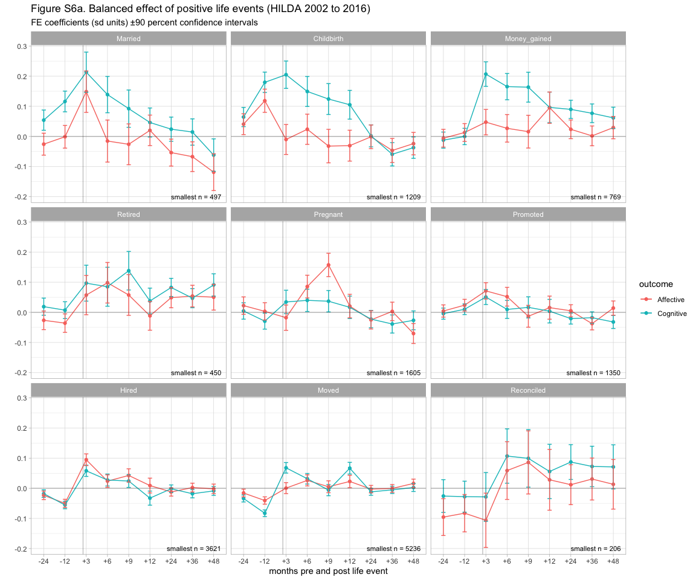<!-- -->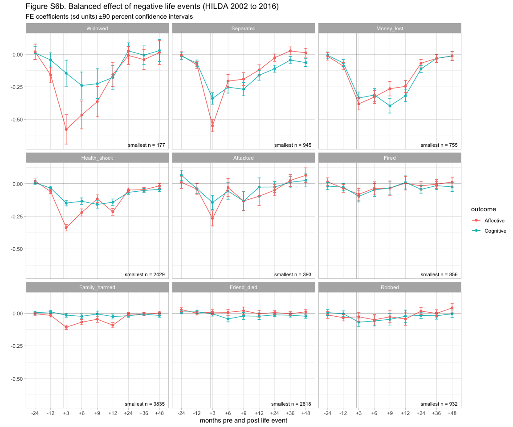<!-- -->

The balanced model results remain consistent with the general pattern
observed in Figures 1 & 2, despite the relatively restricted sample.

#### Uncontaminated Models

Up until this point, we have been assuming that unlabelled time points
do not contain life events (i.e., our implicit imputation is that
missing = zero). This might not be true, and unreported life events may
be producing changes we are not modelling, and so result in biased
estimates. We can omit waves in which there is missing life event data
within the time window we are studying (7 years). This will even further
restrict our *n* (as well as increase our exposure to potential
selection effects), but the remaining observations should be
uncontaminated by unobserved events. In Figure S7 below we plot the
results of an uncontaminated model, with all the same covariates as
before, and restricted to a balanced and uncontaminated sample. There is
no obvious change in the patterns of level or duration of impact of each
life
event.

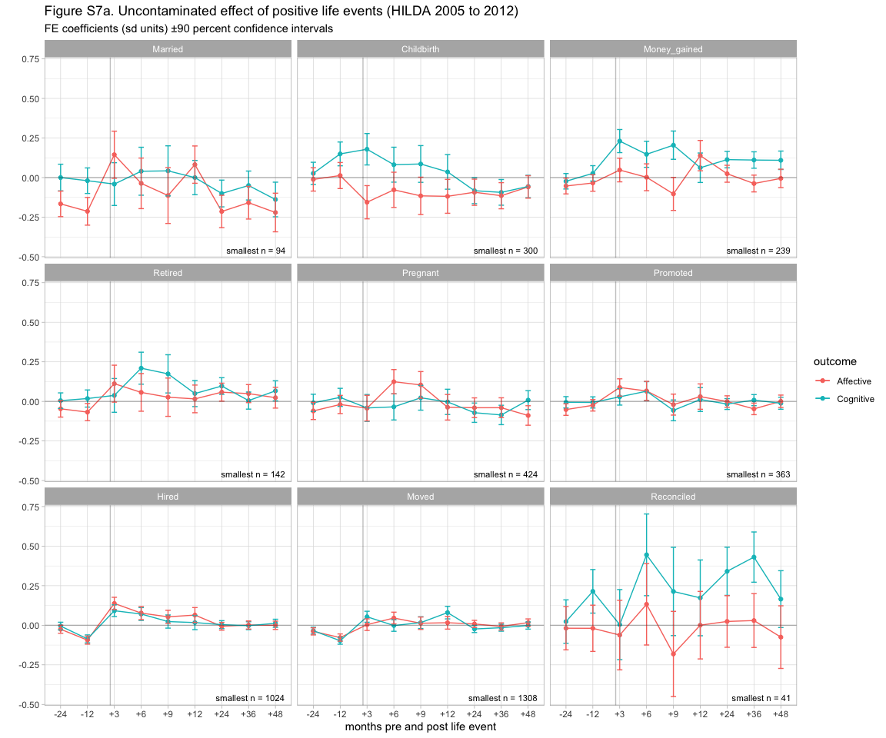<!-- -->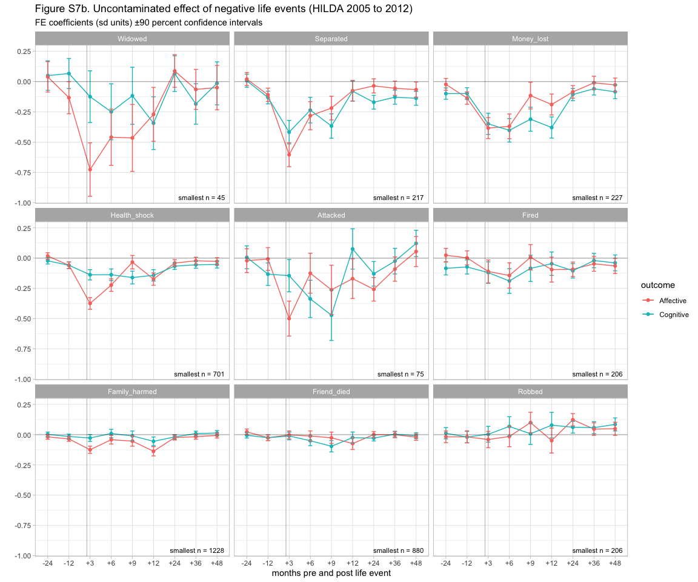<!-- -->

Comparing the uncontaminated effect of the same events to our earlier
results (e.g., Figure 2), we can see many of the observations we made
earlier cannot be generalized. The reduction in available sample (n) has
reduced our ability to see clear differences in the size of the effect
between different events in this restricted dataset.

## Residual analysis

We plot model residual values against the predicted (fitted) values in
order to check for unexplained effects. Each figure was generated by the
“full effect” model (Figure 1), with no additional covariates apart from
year. Each of the plots below is well-behaved: there is little or no
observable structure or patterns between the residual and fitted value.
Moreover, the residual values form a horizontal band around the 0 line,
indicating the variances of the error terms are equal. Finally, no
outliers are visible in any of the plots.

#### Cognitive wellbeing unconditional model residuals

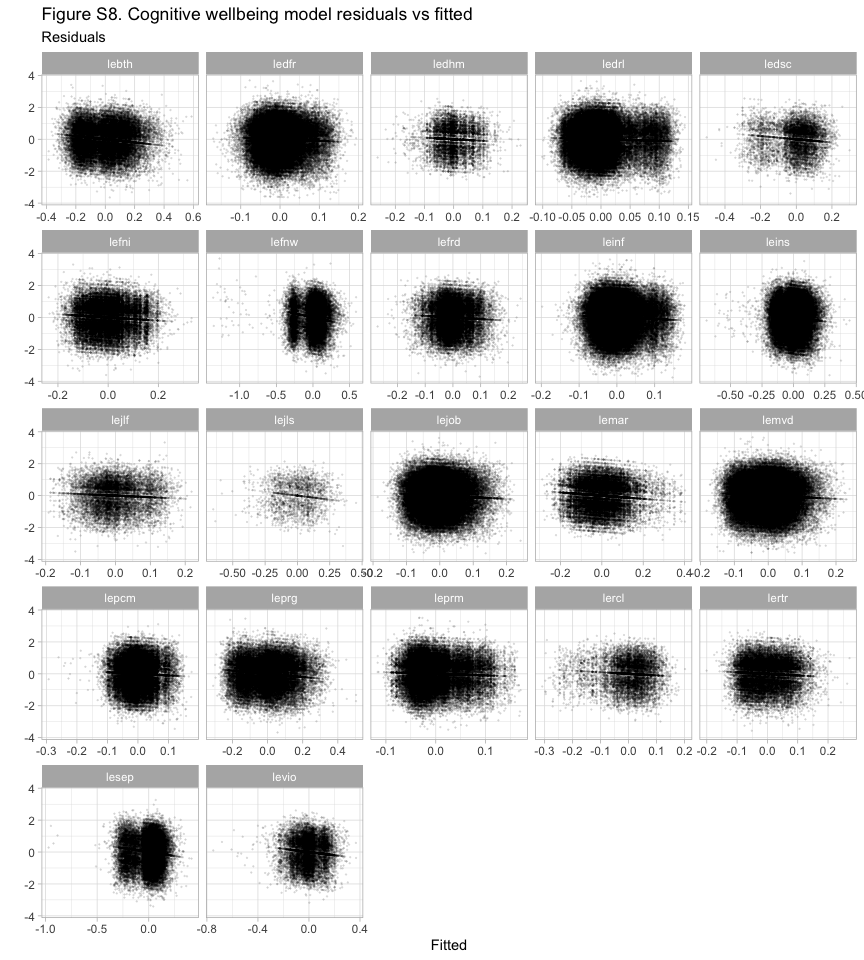<!-- -->

  

#### Affective wellbeing unconditional model residuals

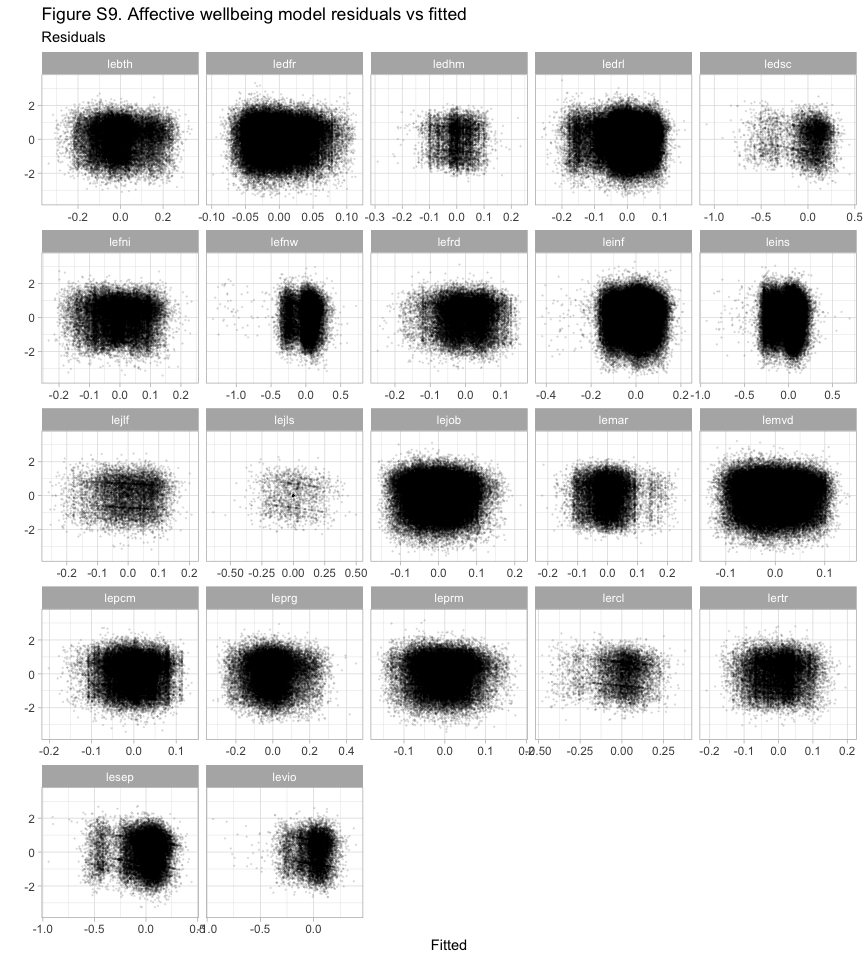<!-- -->
